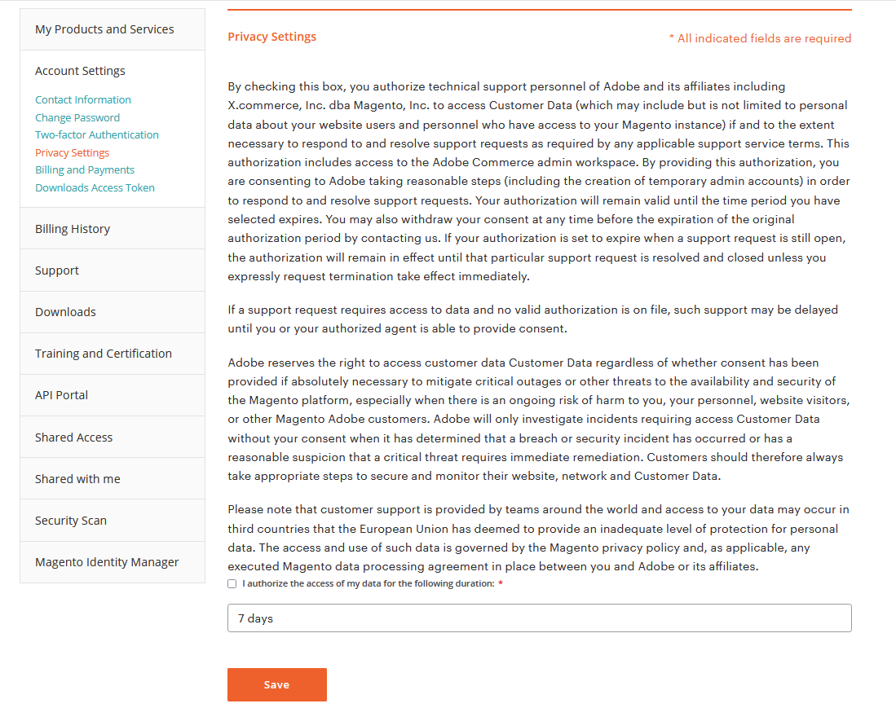

# Adobeは、顧客データのアクセスとプライバシーをサポートします

Adobeのテクニカルサポートでは、サポートを提供するために、Adobe Commerce関連のデータへのアクセスが必要になる場合があります。 認証は、Adobe Commerce アカウントのプライバシー設定で、プライマリ Adobe Commerce アカウント所有者が選択した場合にのみ提供できます。 サポートリクエストを作成する前にこのアクセスを許可すると、問題を適切に調査したり、解決を迅速にしたりできます。 Adobe Commerce Cloud プロジェクトの「プロジェクトオーナー」は、Adobe Commerceの主要なアカウント所有者ではない可能性があることに注意してください。

>[!NOTE]
>
>「プライバシー設定」タブは、有料/購入された製品に関連付けられたサポート使用権限を持つユーザーと、プライマリ MageID であり、直接権限を持つユーザーのみが使用/表示できます。このタブは、共有アクセスを使用して別のユーザーに委任することはできません。 アクセス権を付与した後、すべての内部Adobeシステムが更新されるまで 5～10 分かかる場合があります。 チケットの送信前にアクセス権が付与されなかった場合、プライマリアカウントの所有者は、明示的なデータアクセス同意でチケットを更新する必要があります。

アクセスを認証するには：

1. [ログイン](https://account.magento.com/customer/account/login) プライマリユーザーという資格を持つサポートとして。
1. 日 **[!UICONTROL My Account]** ページ > **[!UICONTROL Account Settings]**&#x200B;を作成します。が完了していることを確認してください [アカウントプロファイル](https://account.magento.com/customer/account/edit) をクリックして、 **[!UICONTROL Save]**.
1. 日 **[!UICONTROL My Account]** ページ > **[!UICONTROL Account Settings]** > **[!UICONTROL Privacy Settings]**. Adobeのテクニカルサポート担当者にデータへのアクセスを許可するための同意フォームが表示されます。
1. プライバシー設定に関する情報を確認したら、の横にあるチェックボックスをオンにするかどうかを選択します **私は以下の期間、自分のデータへのアクセスを許可します。**.
1. 期間ドロップダウンで、Adobeのテクニカルサポート担当者がカスタマーデータにアクセスできる期間を選択します。 7 日、30 日、1 年または無期限を選択できます。
1. クリック **[!UICONTROL Save]**. これにより、の下のページの下部にある開始日と終了日が更新されます **次の期間に同意しました** （スクリーンショット）。 同意が得られると、権限を持つプライマリユーザーには、画面の下部に同意を取り消すオプションが表示されます。
   

次のいずれかをクリックできます。 **同意を撤回** Adobeサポート担当者がお客様のデータにアクセスすることに対するお客様の同意を取り消す場合は、いつでも可能です。
