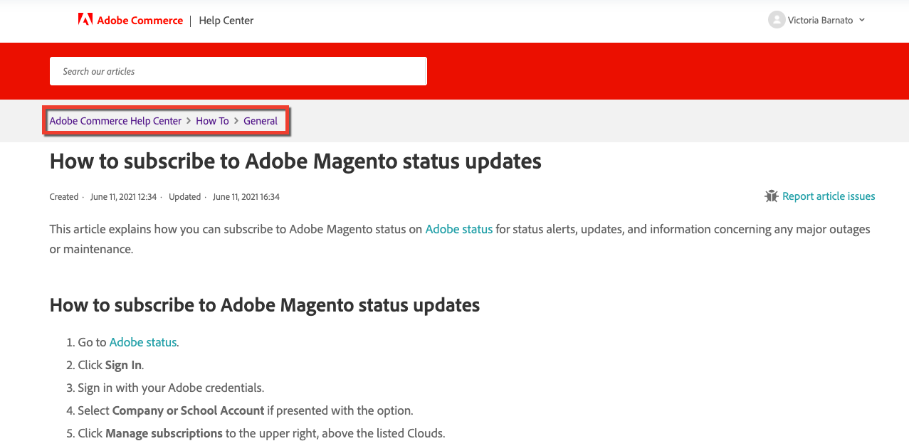

# Adobe Commerce サポートナレッジベースがコントリビューションの受け入れを開始

6 月 15 日（PT）から、Adobe Commerce Adobe Commerce サポートナレッジベースチームは、 [magento/knowledge-base](https://github.com/magento/knowledge-base) GitHub リポジトリ

記事の 1 つに誤字があるか、トラブルシューティング手順が不完全です。
これで、自分で修正して投稿ポイントを獲得できます。

## 参加

軽微な誤字修正から完全なトラブルシューティング記事まで、あらゆる種類の投稿を歓迎します。 このリポジトリに投稿すると、Adobe Commerce コードや開発者向けドキュメントに投稿するのと同様に、報酬ポイントを取得できます。 参照： [貢献報酬ポイント](https://github.com/magento/knowledge-base/blob/main/docs/contribution-points.md) を参照してください。

### 一般的な貢献度フロー

1. このリポジトリをフォークします。
1. フォークされたリポジトリで編集を行います。
1. このリポジトリにプルリクエスト（PR）を送信します。
1. テストが実行されます。
   * AdobeCLA - Adobeのオープンソース投稿者使用許諾契約に署名していることを確認します。
   * Markdown リンティングテスト - markdown 構文が正しいことを確認します。
   * ファイル構造検証テスト – に従ってコミットが行われていることを確認します。 [必要なファイル構造](https://github.com/magento/knowledge-base/blob/main/.github/CONTRIBUTING.md#file_structure).
1. PR 承認フロー：
   1. サポートナレッジベース（KB）ライターは、数日以内に PR を確認し、ラベルを追加します。
   1. KB ライターは変更を承認/拒否/要求できます。
   1. 承認されると、ナレッジライターは PR で提供された入力レベルに対応するラベルを追加し、社内の対象分野のエキスパート（SME）は PR をレビューします。
   1. SME は、変更を承認/拒否/リクエストできます。
1. すべての修正が完了し（要求がある場合）、ナレッジライターと SME の両方が PR を承認すると、ナレッジライターはコンテンツを内部リポジトリに読み込み、内部で結合します。
1. この [magento/knowledge-base](https://github.com/magento/knowledge-base) リポジトリは、20 分で内部のリポジトリと同期します。
1. リポジトリが同期されると、PR はクローズされ、次の情報が得られます [貢献度ポイント](#contribution-points).

コントリビューションフローについて詳しくは、 [投稿者ガイド](https://github.com/magento/knowledge-base/blob/main/.github/CONTRIBUTING.md).
テンプレート、スタイルガイド、書式設定のガイドラインについては、を参照してください。 [マニュアル](https://github.com/magento/knowledge-base/tree/main/docs).

### Github でサポート技術情報の記事ファイルを見つける

サポート技術情報（KB）では、記事はセクションに整理され、カテゴリの下にネストされています。

例： [AdobeMagentoステータスのアップデートを購読する方法](/help/how-to/general/how-to-subscribe-to-adobe-magento-status-updates.md) 記事は、How To カテゴリの General セクションに属しています。

記事ページのパンくずリストのパスに、セクションとカテゴリ名が表示されます。次の画像を参照してください。

記事ファイルは、内で同じ方法で整理されます [magento/knowledge-base](https://github.com/magento/knowledge-base) リポジトリ
すべてのコンテンツは次に保存されます。 `src` フォルダー（カテゴリはフォルダー、セクションはネストされたフォルダー）。ファイル名は、記事のタイトルと一致するか、類似しています。

サポート技術情報の記事のテキストを検索文字列として使用して、リポジトリ内で検索を使用することもできます。 この文字列を含むファイルが検索結果に返されたら、必ず適切なセクションとカテゴリに属するファイルを選択してください。

### 貢献度ポイント

この [magento/knowledge-base](https://github.com/magento/knowledge-base) のリポジトリは、Magentoのコミュニティエンジニアリングと統合されて、コントリビューションポイントとサポートを提供します。

を参照してください。 [貢献度ポイント](https://github.com/magento/knowledge-base/blob/main/docs/contribution-points.md) ポイントの報奨方法を確認するためにドキュメント化します。
