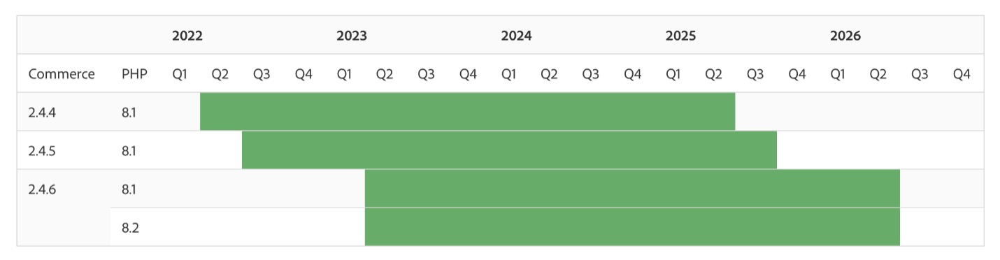

# 2024年および2023年のAdobe Commerce リリース戦略とライフサイクルポリシーに関するFAQ

## 2024および2023年リリース戦略と更新されたライフサイクルポリシー

### Adobe Commerceのソフトウェアライフサイクルポリシーは、2023年と2024年にどのように変化しますか？

Adobe Commerceのお客様のミッションクリティカルなニーズを満たすために、Adobe Commerce 2.4.4以降のバージョンのサポートウィンドウを、バージョン [!DNL GA]日&#x200B;**から** 3年に拡大しています。 サポートには、**セキュリティパッチと品質パッチの両方**&#x200B;が含まれます。

### これらの変更は顧客にどのようなメリットをもたらしますか？

サポートウィンドウが長いほど、世界中の複数のサイトの運用が複雑であることを認識でき、各展開からより多くの価値を得ることができます。 顧客は、リリースを長時間待つことができ、総所有コストを削減し、リソースを解放して、新しい機能の追加や購買体験のカスタマイズに集中させ、より迅速な成長を実現できます。

### 現在のライフサイクルポリシーはどこで確認できますか？

[Adobe Commerce Software Lifecycle Policy](https://www.adobe.com/content/dam/cc/en/legal/terms/enterprise/pdfs/Adobe-Commerce-Software-Lifecycle-Policy.pdf)はオンラインで利用できます。

### 2.4.4、2.4.5、2.4.6、および2.4.7のお客様は、この新しいポリシーに基づいて、いつサポート終了に達しますか？

Adobe Commerce 2.4.4以降をご利用のお客様は、以下のタイムラインに示すように、バージョン [!DNL GA]日から3年間のセキュリティおよび品質修正を受け取ります。 特定のサポート終了日については、[!DNL Experience League]の[ リリースバージョン ](https://experienceleague.adobe.com/docs/commerce-operations/release/versions.html) ページを参照してください。

### Adobe Commerceのリリーススケジュールはどのように変更されますか？

イノベーションを加速し、総所有コストを削減するために、毎年1つのコアアプリケーションパッチがリリースされ、いつでも追加できる構成可能な[!DNL SaaS] サービスとして提供される新機能がリリースされます。

### 新しいリリーススケジュールはお客様にどのようなメリットをもたらしますか？

構成可能な[!DNL SaaS] サービスとして新しい機能を提供すると、顧客は新しいツールに迅速にアクセスできるようになり、売上の増加に役立ちます。 機能は、コア Adobe Commerce アプリケーションをアップグレードすることなく、いつでも導入できます。 また、これらのサービスはAdobeで継続的に更新できるため、機能とパフォーマンスに関する最新のイノベーションを実現できます。 年に1回のコアアプリケーションパッチリリースをリリースすることで、アップグレードコストを削減し、アップグレードの計画を容易にし、コマースエクスペリエンスのカスタマイズと最適化により多くの時間を割くことができます。 追加の軽量セキュリティパッチは、顧客がより安全に保つのに役立ちます。

### プレリリースアクセスとは何ですか？

2023年には、一般公開の約2週間前にAdobe Commerce パッチリリースにアクセスできます。

2024年以降、Adobeではパッチへの「プレリリース」アクセスが提供されなくなりました。 代わりに、2.4.7以降では、お客様は[ ベータリリース ](https://experienceleague.adobe.com/docs/commerce-operations/release/beta.html)を使用して、テストと開発のために一般化前の可用性コードにアクセスできます。 プレリリース版へのアクセスは、引き続き次の2023 リリースでスケジュールされています。

* 2023年8月8日プレリリース版へのアクセスは2023年7月25日（PT）です
* 2023年10月10日プレリリースへのアクセスは2023年9月26日（PT）です

### Adobe Commerceのリリーススケジュールはどこに掲載されますか？

詳しくは、[!DNL Experience League]の[Adobe Commerce リリーススケジュール ](https://experienceleague.adobe.com/docs/commerce-operations/release/planning/schedule.html)を参照してください。

### スケジュールに含まれるリリースにはどのような種類がありますか？

* **コアアプリケーションパッチリリース**：セキュリティ、パフォーマンス、優先度の高い品質の修正を含むコアアプリケーションのアップグレード。
* **[!DNL Beta]バージョンのパッチリリース**：セキュリティ、コンプライアンス、パフォーマンス、優先度の高い修正が含まれる、コア Adobe Commerce アプリケーションの非[!DNL General Availability] コードの更新。 パッチリリース [!DNL GA]の前に、コードと影響を受けるコンポーネントのレビューに時間を追加できます。
* **拡張性、インフラストラクチャ、およびサービスのリリース**：パッチリリースとは別に、構成可能なサービスとして配信される新機能および機能アップデートのリリース。 例としては、[!DNL Product Recommendations]や[!DNL Live Search]などのサービス、[!DNL PWA Studio]や[!DNL Inventory Management] （MSI）などの独立モジュール、クラウドサービスやインフラストラクチャのアップデートなどがあります。
* **セキュリティパッチリリース**：顧客のセキュリティとコンプライアンスを維持するために、コアアプリケーションに対するセキュリティのみのアップデートがリリースされました。

### 顧客は質の高いパッチを入手するためにどこへ行きますか？

品質パッチは、個々の品質の問題に対する修正を配布する方法です。 お客様は、Adobe サポートにお問い合わせいただくか、[[!DNL Quality Patch Tool]](https://experienceleague.adobe.com/en/docs/commerce-operations/tools/quality-patches-tool/quality-patches-tool-to-self-serve-quality-patches)を使用して高品質なパッチを検索できます。

### プランニング、予算編成、一般的なアップグレードに役立つリソースにはどのようなものがありますか？

利用可能なリソースには、包括的な2.4 アップグレードガイド、テクニカルアップグレードワークショップの録画、および[!DNL Upgrade Compatibility Tool]が含まれます。 リソースの包括的なリストについては、[Experience League](https://experienceleague.adobe.com/docs/commerce-operations/upgrade-guide/resources/recommended-reading.html)を参照してください。

### Managed Servicesのお客様として、Customer Engineeringは2.4.4へのアップグレードでどのように役立ちますか+?

Managed Servicesのお客様は、分析、クラウドサービスのアップグレード、品質およびユーザー受け入れテスト（[!DNL QA]および[!DNL UAT]）、実稼動環境の立ち上げなど、アップグレードプロセスのいくつかのコンポーネントについて、アドビのカスタマーエンジニアリングチームと連携してサポートを受けることができます。

<table style="table-layout:auto">
<thead>
  <tr>
    <th colspan="1"></th>
    <th colspan="4">2022</th>
    <th colspan="4">2023</th>
    <th colspan="4">2024</th>
    <th colspan="4">2025</th>
    <th colspan="4">2026</th>
    <th colspan="4">2027</th>
  </tr>
</thead>
<tbody>
  <tr>
    <td>Commerce</td>
    <td>Q1</td>
    <td>Q2</td>
    <td>Q3</td>
    <td>Q4</td>
    <td>Q1</td>
    <td>Q2</td>
    <td>Q3</td>
    <td>Q4</td>
    <td>Q1</td>
    <td>Q2</td>
    <td>Q3</td>
    <td>Q4</td>
    <td>Q1</td>
    <td>Q2</td>
    <td>Q3</td>
    <td>Q4</td>
    <td>Q1</td>
    <td>Q2</td>
    <td>Q3</td>
    <td>Q4</td>
    <td>Q1</td>
    <td>Q2</td>
    <td>Q3</td>
    <td>Q4</td>
  </tr>
  <tr>
    <td>2.4.4</td>
    <td></td>
    <td colspan="13" style="background-color:#67ac68;"></td>
    <td colspan="4" style="background-color:#ffd700;"></td>
    <td colspan="6"></td>
  </tr>
  <tr>
    <td>2.4.5</td>
    <td colspan="2"></td>
    <td colspan="13" style="background-color:#67ac68;"></td>
    <td colspan="4" style="background-color:#ffd700;"></td>
    <td colspan="6"></td>
  </tr>
  <tr>
    <td>2.4.6</td>
    <td colspan="4"></td>
    <td colspan="15" style="background-color:#67ac68;"></td>
    <td colspan="8"></td>
  </tr>
  <tr>
    <td>2.4.7</td>
    <td colspan="9"></td>
    <td colspan="13" style="background-color:#67ac68;"></td>
    <td colspan="2"></td>
  </tr>
</tbody>
</table>

**キー**

<table style="table-layout:auto">
 <tbody>
  <tr>
   <td style="background-color:#67ac68;"></td>
   <td>定期的なサポート</td>
  </tr>
  <tr>
   <td style="background-color:#ffd700;"></td>
   <td>拡張サポート</td>
  </tr>
 </tbody>
</table>

## 拡張サポートオプション

### バージョン 2.4.4および2.4.5のお客様には、拡張サポートオプションはありますか？

お客様には、できるだけ早くアップグレードすることをお勧めしますが、アップグレード計画をビジネスニーズに合わせてより柔軟に調整できるよう、バージョン 2.4.4および2.4.5のすべてのAdobe Commerceのお客様には、追加費用なしで1年間のサポート拡張機能が提供されます。

これらの計画には、コアアプリケーションの品質とセキュリティパッチの両方が最大1年間含まれます。

<table style="height: 144px; width: 632.2px;">
<tbody>
<tr>
<td class="wysiwyg-text-align-center" style="width: 132px;"><strong>リリースバージョン</strong></td>
<td class="wysiwyg-text-align-center" style="width: 96px;"><strong>リリース日</strong></td>
<td class="wysiwyg-text-align-center" style="width: 144px;"><strong>Sourceの定期的およびオープンなサポート終了</strong></td>
<td class="wysiwyg-text-align-center" style="width: 140.2px;"><strong>拡張サポートの終了</strong></td>
</tr>
<tr>
<td class="wysiwyg-text-align-center" style="width: 132px;">2.4.4</td>
<td style="width: 96px;">2022年4月12日（PT）</td>
<td style="width: 144px;">2025年4月8日（PT）</td>
<td style="width: 140.2px;">2026年4月14日（PT）</td>
</tr>
<tr>
<td class="wysiwyg-text-align-center" style="width: 132px;">2.4.5</td>
<td style="width: 96px;">2022年8月9日（PT）</td>
<td style="width: 144px;">2025年8月12日（PT）</td>
<td style="width: 140.2px;">2026年8月11日（PT）</td>
</tr>
</tbody>
</table>

### 拡張サポートは[!DNL PCI]への準拠を保証しますか？

拡張サポートの下で、当社のカスタマーエンジニアリングチームは引き続き、スコープの低下なしに、通常と同じ品質およびセキュリティパッチを提供します。 ただし、[!DNL MariaDB]などの基盤となるサードパーティ製テクノロジーがサポート終了に達した場合は、お客様が[!DNL PCI]への準拠を維持するために追加の対策を講じる必要があります。

Adobeでは、サポート終了に達したサードパーティ製テクノロジのサポートは提供していません。 Adobeでは、コンプライアンスを確保するために、お客様が[[!DNL PCI] 評価者](https://www.pcisecuritystandards.org/assessors_and_solutions/qualified_security_assessors/)と協力することをお勧めします。 テスト済みのサポート対象のサードパーティテクノロジの完全な一覧については、[Adobe Commerceの必要システム構成](https://experienceleague.adobe.com/en/docs/commerce-operations/installation-guide/system-requirements)を参照してください。

<table style="height: 444px; width: 632.2px;">
<tbody>
<tr>
<td class="wysiwyg-text-align-center" style="width: 48px;"><strong>バージョン</strong></td>
<td class="wysiwyg-text-align-center" style="width: 72px;"><strong>サポートされている[!DNL PHP] バージョン、EOS</strong></td>
<td class="wysiwyg-text-align-center" style="width: 96px;"><strong>サポートされている[!DNL MariaDB] バージョン、EOS</strong></td>
<td class="wysiwyg-text-align-center" style="width: 108px;"><strong>サポートされている[!DNL Composer] バージョン、EOS</strong></td>
<td class="wysiwyg-text-align-center" style="width: 126px;"><strong>サポートされている[!DNL OpenSearch] バージョン、EOS</strong></td>
<td class="wysiwyg-text-align-center" style="width: 86.2px;"><strong>サポートされている[!DNL Redis] バージョン、EOS</strong></td>
<td class="wysiwyg-text-align-center" style="width: 96px;"><strong>サポートされている[!DNL RabbitMQ] バージョン、EOS</strong></td>
</tr>
<tr>
<td class="wysiwyg-text-align-center" style="width: 48px;"><strong>2.4.4</strong></td>
<td style="width: 72px;">[!DNL PHP] 8.1、EOS - <strong>2025年12月31日1</strong></td>
<td style="width: 96px;">[!DNL MariaDB] 10.6、EOS - 2026年7月2</td>
<td style="width: 108px;">[!DNL Composer] 2.8、EOS - 2026年に予定3</td>
<td style="width: 126px;">[!DNL OpenSearch] 1.3、EOSは2025年に予想 – [!DNL OpenSearch] 2、EOSは2026年に予想4</td>
<td style="width: 86.2px;">[!DNL Redis] 7.2、EOS - 2026年に予定</td>
<td style="width: 96px;">[!DNL RabbitMQ] 3.9、EOL</td>
</tr>
<tr>
<td class="wysiwyg-text-align-center" style="width: 48px;"><strong>2.4.5</strong></td>
<td style="width: 72px;">[!DNL PHP] 8.1、EOS - <strong>2025年12月31日1</strong></td>
<td style="width: 96px;">[!DNL MariaDB] 10.6、EOS - 2026年7月2</td>
<td style="width: 108px;">[!DNL Composer] 2.8、EOS - 2026年に予定3</td>
<td style="width: 126px;">[!DNL OpenSearch] 1.3、EOSは2025年に予想 – [!DNL OpenSearch] 2、EOSは2026年に予想4</td>
<td style="width: 86.2px;">[!DNL Redis] 7.2、EOS - 2026年に予定</td>
<td style="width: 96px;">[!DNL RabbitMQ] 3.13 EOS - 2027年12月30日（PT）</td>
</tr>
</tbody>
</table>

* 1 Adobe Commerce 2.4.4および2.4.5 Cloudのお客様は、拡張サポート中に[!DNL PHP] 8.1のEOS日の影響を受けません。Adobeは、お客様のインフラストラクチャにライフタイムサポート [!DNL PHP] 8.1のセキュリティ修正を自動的に適用します。 Adobe Commerce 2.4.4および2.4.5 オンプレミスのお客様は、必要に応じて、[!DNL PHP] 8.1生涯サポートのセキュリティパッチを必要とするために、Adobe サポートにお問い合わせください。
* 2 Adobe Commerce 2.4.4および2.4.5の[!DNL MariaDB] 10.6との互換性は、2025年4月のセキュリティのみのパッチでリリースされる予定です。
* 3 Adobe Commerce 2.4.4および2.4.5の[!DNL Composer] 2.8との互換性は、2025年4月のセキュリティのみのパッチでリリースされる予定です。
* 4 Adobe Commerce 2.4.4および2.4.5の[!DNL OpenSearch] 2との互換性は、2025年4月のセキュリティのみのパッチでリリースされる予定です。
