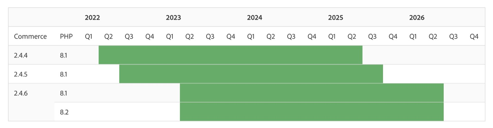

# 2024 年および 2023 年Adobe Commerce リリース戦略およびライフサイクルポリシーに関する FAQ

## 2024 年と 2023 年のリリース戦略とライフサイクルポリシーの更新

### 2023 年と 2024 年、Adobe Commerceのソフトウェアライフサイクルポリシーはどのように変わりますか？

Adobe Commerceのお客様のミッションクリティカルなニーズを満たすために、Adobe Commerce 2.4.4 以降のバージョンのサポートウィンドウをバージョン [!DNL GA] 日から **3 年** に拡大しています。 サポートには、**セキュリティパッチとクオリティパッチの両方** が含まれます。

### これらの変更は、お客様にどのようなメリットをもたらしますか。

サポートウィンドウが長いほど、顧客は世界中で複数のサイトを運用することが複雑になり、各デプロイメントからより多くの価値を得ることができます。 お客様は長期間リリースを継続できるため、総所有コストが削減され、リソースを新しい機能の追加や購入エクスペリエンスのカスタマイズに集中させて成長を促進できます。

### 現在のライフサイクルポリシーについて、お客様はどこで確認できますか？

[Adobe Commerce ソフトウェア ライフサイクル ポリシー &#x200B;](https://www.adobe.com/content/dam/cc/en/legal/terms/enterprise/pdfs/Adobe-Commerce-Software-Lifecycle-Policy.pdf) はオンラインで利用できます。

### 2.4.4、2.4.5、2.4.6 および 2.4.7 のお客様が、この新しいポリシーのサポート終了に到達するのはいつですか。

Adobe Commerce 2.4.4 以降のお客様は、以下のタイムラインに示すように、バージョン [!DNL GA] 日から 3 年間、セキュリティと品質の修正を受け取ります。 特定のサポート終了日については、[!DNL Experience League] の [&#x200B; リリース済みバージョン &#x200B;](https://experienceleague.adobe.com/docs/commerce-operations/release/versions.html?lang=ja) ページを参照してください。

### Adobe Commerceのリリーススケジュールはどのように変更されますか？

イノベーションを促進し、総所有コストを削減するために、年に 1 回、コアアプリケーションパッチがリリースされます。新機能は、いつでも追加できる構成可能な [!DNL SaaS] サービスとして提供されます。

### 新しいリリーススケジュールは、お客様にどのようなメリットがありますか？

構成可能な [!DNL SaaS] サービスとして新しい機能を提供することで、お客様は新しいツールへの迅速なアクセスが可能になり、売上の増加に役立ちます。 機能は、コア Adobe Commerce アプリケーションをアップグレードしなくても、いつでも採用できます。 また、これらのサービスは、Adobeで継続的に更新され、機能とパフォーマンスに最新の技術を提供できます。 コアアプリケーションのパッチリリースが年に 1 回あると、アップグレードコストの削減、アップグレードの計画の容易化、コマースエクスペリエンスのカスタマイズと最適化の時間の増加に役立ちます。 その他の軽量なセキュリティパッチにより、お客様のセキュリティを維持できます。

### プレリリースアクセスとは

2023 年には、一般公開の約 2 週間前にAdobe Commerce パッチリリースにアクセスできます。

2024 年以降、Adobeでは、パッチへの「プレリリース」アクセスを提供しなくなりました。 代わりに、2.4.7 以降では、[&#x200B; ベータリリース &#x200B;](https://experienceleague.adobe.com/docs/commerce-operations/release/beta.html?lang=ja) を使用して、テストや開発の目的で一般提供より前のコードにアクセスできます。 次の 2023 リリースでも、プレリリースへのアクセスが引き続きスケジュールされています。

* 2023 年 8 月 8 日（PT）プレリリースアクセスは 2023 年 7 月 25 日（PT）です
* 2023 年 10 月 10 日（PT）プレリリースアクセスは 2023 年 9 月 26 日（PT）です

### Adobe Commerce リリーススケジュールはどこに投稿されますか？

詳しくは、[!DNL Experience League] の [Adobe Commerce リリーススケジュール &#x200B;](https://experienceleague.adobe.com/docs/commerce-operations/release/planning/schedule.html?lang=ja) を参照してください。

### スケジュールに含まれるリリースには、どのようなタイプがありますか？

* **コアアプリケーションのパッチリリース**：セキュリティ、パフォーマンス、優先度の高い品質修正を含むコアアプリケーションのアップグレード。
* **[!DNL Beta]バージョンのパッチリリース**：セキュリティ、コンプライアンス、パフォーマンス、優先度の高い品質修正など、Adobe Commerceのコアアプリケーションに対する [!DNL General Availability] 以外のコードのアップデート。 これにより、パッチリリース [!DNL GA] ートの前に、コードと影響を受けるコンポーネントを確認する時間を追加できます。
* **拡張機能、インフラストラクチャおよびサービスリリース**：パッチリリースとは別に、構成可能なサービスとして提供される新機能と機能アップデートのリリース。 例えば、[!DNL Product Recommendations] や [!DNL Live Search] などのサービス、[!DNL PWA Studio] や [!DNL Inventory Management] （MSI）などの独立したモジュール、クラウドサービスやインフラストラクチャのアップデートなどがあります。
* **セキュリティパッチリリース**：お客様のセキュリティとコンプライアンスを確保するためにリリースされた、コアアプリケーションのセキュリティ専用アップデート。

### お客様は品質向上パッチを入手するにはどうしたらよいでしょうか。

品質向上パッチは、個々の品質問題に対する修正を配布する方法です。 お客様は、Adobe サポートに問い合わせるか、[[!DNL Quality Patch Tool]](https://experienceleague.adobe.com/ja/docs/commerce-operations/tools/quality-patches-tool/quality-patches-tool-to-self-serve-quality-patches) を使用して高品質のパッチを見つけることができます。

### 一般的な計画、予算、アップグレードに役立つリソースにはどのようなものがありますか？

利用可能なリソースには、包括的な 2.4 アップグレードガイド、テクニカルアップグレードワークショップの録画、[!DNL Upgrade Compatibility Tool] が含まれます。 リソースの包括的なリストは、[Experience League](https://experienceleague.adobe.com/docs/commerce-operations/upgrade-guide/resources/recommended-reading.html?lang=ja) で入手できます。

### Managed Servicesをご利用のお客様は、カスタマーエンジニアリング部門は 2.4.4 へのアップグレードにどう役立つか+？教えてください。

Managed Servicesのお客様は、アップグレードプロセスのいくつかのコンポーネント（分析、クラウドサービスのアップグレード、品質とユーザー受け入れテスト（[!DNL QA] および [!DNL UAT]）、実稼動の立ち上げなど）で、アドビのカスタマーエンジニアリングチームと協力して支援を受けることができます。

<table style="table-layout:auto">
<thead>
  <tr>
    <th colspan="1"></th>
    <th colspan="4">2022</th>
    <th colspan="4">2023</th>
    <th colspan="4">2024</th>
    <th colspan="4">2025</th>
    <th colspan="4">2026</th>
    <th colspan="4">2027</th>
  </tr>
</thead>
<tbody>
  <tr>
    <td>Commerce</td>
    <td>Q1</td>
    <td>Q2</td>
    <td>Q3</td>
    <td>Q4</td>
    <td>Q1</td>
    <td>Q2</td>
    <td>Q3</td>
    <td>Q4</td>
    <td>Q1</td>
    <td>Q2</td>
    <td>Q3</td>
    <td>Q4</td>
    <td>Q1</td>
    <td>Q2</td>
    <td>Q3</td>
    <td>Q4</td>
    <td>Q1</td>
    <td>Q2</td>
    <td>Q3</td>
    <td>Q4</td>
    <td>Q1</td>
    <td>Q2</td>
    <td>Q3</td>
    <td>Q4</td>
  </tr>
  <tr>
    <td>2.4.4</td>
    <td></td>
    <td colspan="13" style="background-color:#67ac68;"></td>
    <td colspan="4" style="background-color:#ffd700;"></td>
    <td colspan="6"></td>
  </tr>
  <tr>
    <td>2.4.5</td>
    <td colspan="2"></td>
    <td colspan="13" style="background-color:#67ac68;"></td>
    <td colspan="4" style="background-color:#ffd700;"></td>
    <td colspan="6"></td>
  </tr>
  <tr>
    <td>2.4.6</td>
    <td colspan="4"></td>
    <td colspan="15" style="background-color:#67ac68;"></td>
    <td colspan="8"></td>
  </tr>
  <tr>
    <td>2.4.7</td>
    <td colspan="9"></td>
    <td colspan="13" style="background-color:#67ac68;"></td>
    <td colspan="2"></td>
  </tr>
</tbody>
</table>

**キー**

<table style="table-layout:auto">
 <tbody>
  <tr>
   <td style="background-color:#67ac68;"></td>
   <td>定期的なサポート</td>
  </tr>
  <tr>
   <td style="background-color:#ffd700;"></td>
   <td>拡張サポート</td>
  </tr>
 </tbody>
</table>

## 拡張サポートオプション

### バージョン 2.4.4 および 2.4.5 のお客様向けの拡張サポートオプションはありますか。

お客様には、できるだけ早くアップグレードを推奨しますが、バージョン 2.4.4 および 2.4.5 のすべてのAdobe Commerceのお客様に対して、1 年間のサポート延長が追加コストなしで提供され、アップグレードプランをビジネスニーズに合わせてより柔軟に調整できます。

これらの計画には、コアアプリケーションの品質パッチとセキュリティパッチの両方が最大 1 年間含まれています。

<table style="height: 144px; width: 632.2px;">
<tbody>
<tr>
<td class="wysiwyg-text-align-center" style="width: 132px;"><strong>リリースバージョン</strong></td>
<td class="wysiwyg-text-align-center" style="width: 96px;"><strong>リリース日</strong></td>
<td class="wysiwyg-text-align-center" style="width: 144px;"><strong>通常の Open Source サポートの終了</strong></td>
<td class="wysiwyg-text-align-center" style="width: 140.2px;"><strong>拡張サポートの終了</strong></td>
</tr>
<tr>
<td class="wysiwyg-text-align-center" style="width: 132px;">2.4.4</td>
<td style="width: 96px;">2022 年 4 月 12 日（Pt）</td>
<td style="width: 144px;">2025 年 4 月 8 日（Pt）</td>
<td style="width: 140.2px;">2026 年 4 月 14 日（Pt）</td>
</tr>
<tr>
<td class="wysiwyg-text-align-center" style="width: 132px;">2.4.5</td>
<td style="width: 96px;">2022 年 8 月 9 日（Pt）</td>
<td style="width: 144px;">2025 年 8 月 12 日（Pt）</td>
<td style="width: 140.2px;">2026 年 8 月 11 日（Pt）</td>
</tr>
</tbody>
</table>

### 拡張サポートによって [!DNL PCI] のコンプライアンスが保証されますか。

延長サポートの下、アドビのカスタマーエンジニアリングチームは、範囲を低下させることなく、引き続き通常と同じ品質およびセキュリティパッチを提供します。 ただし、[!DNL MariaDB] などの基盤となるサードパーティテクノロジーがサポート終了に達した場合に、[!DNL PCI] ーザーの準拠を維持するには、追加の対策を講じる必要があります。

Adobeは、サポート終了に達したサードパーティテクノロジーのサポートを提供していません。 Adobeでは、コンプライアンスを確保するために、お客様が [[!DNL PCI]  評価者 &#x200B;](https://www.pcisecuritystandards.org/assessors_and_solutions/qualified_security_assessors/) と協力することをお勧めします。 テスト済みおよびサポート済みのサードパーティテクノロジーの完全なリストについては、{0[&#128279;](https://experienceleague.adobe.com/ja/docs/commerce-operations/installation-guide/system-requirements)Adobe Commerceの必要システム構成 } を参照してください。

<table style="height: 444px; width: 632.2px;">
<tbody>
<tr>
<td class="wysiwyg-text-align-center" style="width: 48px;"><strong>バージョン</strong></td>
<td class="wysiwyg-text-align-center" style="width: 72px;"><strong>サポートされる [!DNL PHP] バージョン、EOS</strong></td>
<td class="wysiwyg-text-align-center" style="width: 96px;"><strong>サポートされる [!DNL MariaDB] バージョン、EOS</strong></td>
<td class="wysiwyg-text-align-center" style="width: 108px;"><strong>サポートされる [!DNL Composer] バージョン、EOS</strong></td>
<td class="wysiwyg-text-align-center" style="width: 126px;"><strong>サポートされる [!DNL OpenSearch] バージョン、EOS</strong></td>
<td class="wysiwyg-text-align-center" style="width: 86.2px;"><strong>サポートされる [!DNL Redis] バージョン、EOS</strong></td>
<td class="wysiwyg-text-align-center" style="width: 96px;"><strong>サポートされる [!DNL RabbitMQ] バージョン、EOS</strong></td>
</tr>
<tr>
<td class="wysiwyg-text-align-center" style="width: 48px;"><strong>2.4.4</strong></td>
<td style="width: 72px;">[!DNL PHP] 8.1、EOS - <strong>2025 年 12 月 31 日 1</strong></td>
<td style="width: 96px;">[!DNL MariaDB] 10.6、EOS - 20262 年 7 月 </td>
<td style="width: 108px;">[!DNL Composer] 2.8、EOS - 20263 で予定 </td>
<td style="width: 126px;">[!DNL OpenSearch] 1.3、2025 年の EOS は [!DNL OpenSearch]2、2026 年の EOS は 4</td>
<td style="width: 86.2px;">[!DNL Redis] 7.2、EOS - 2026 年に予定</td>
<td style="width: 96px;">[!DNL RabbitMQ] 3.9、提供終了</td>
</tr>
<tr>
<td class="wysiwyg-text-align-center" style="width: 48px;"><strong>2.4.5</strong></td>
<td style="width: 72px;">[!DNL PHP] 8.1、EOS - <strong>2025 年 12 月 31 日 1</strong></td>
<td style="width: 96px;">[!DNL MariaDB] 10.6、EOS - 20262 年 7 月 </td>
<td style="width: 108px;">[!DNL Composer] 2.8、EOS - 20263 で予定 </td>
<td style="width: 126px;">[!DNL OpenSearch] 1.3、2025 年の EOS は [!DNL OpenSearch]2、2026 年の EOS は 4</td>
<td style="width: 86.2px;">[!DNL Redis] 7.2、EOS - 2026 年に予定</td>
<td style="width: 96px;">[!DNL RabbitMQ] 3.13 EOS - 2027 年 12 月 30 日</td>
</tr>
</tbody>
</table>

* 1 Adobe Commerce 2.4.4 および 2.4.5 Cloud のお客様は、Adobeがインフラストラクチャに 8.1 のセキュリティ修正のライフタイムサポートを自動的に適用するので、延長サポート中に [!DNL PHP] 8.1 EOS の日付の影響を受 [!DNL PHP] ることはありません。 Adobe Commerce 2.4.4 および 2.4.5 オンプレミスのお客様は、必要に応じてAdobe サポートに連絡して、[!DNL PHP] 8.1 のライフタイムサポートセキュリティパッチを要求する必要があります。
* 2 Adobe Commerce 2.4.4 および 2.4.5 の [!DNL MariaDB] 10.6 との互換性は、2025 年 4 月のセキュリティ専用パッチの範囲内でリリースされる予定です。
* 3 Adobe Commerce 2.4.4 および 2.4.5 の [!DNL Composer] 2.8 との互換性は、2025 年 4 月のセキュリティ専用パッチの範囲内でリリースされる予定です。
* 4 Adobe Commerce 2.4.4 および 2.4.5 の [!DNL OpenSearch] 2 との互換性は、2025 年 4 月のセキュリティ専用パッチの範囲内でリリースされる予定です。
