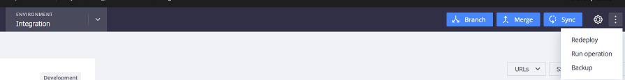

# クラウドでのバックアップ（スナップショット）:FAQ

この記事では、クラウドインフラストラクチャ上のAdobe Commerceでスナップショットを使用して環境をバックアップする方法について説明します。

## 影響を受ける製品とバージョン

* Adobe Commerce on cloud infrastructure 2.4.x
* アーキテクチャプラン：スタータープラン、プロレガシープラン、プロ版

## 環境スナップショット、プロプラン

### アップグレードの準備

アップグレードの準備のためにデータベースをバックアップする必要がある場合は、続行する前に独自のバックアップを作成および検証する責任があります。 災害復旧スナップショットは、アップグレードが失敗した場合のデータベースの復元のみを目的としており、アップグレード準備バックアップの代わりにはありません。

エラーにより独自のバックアップを作成できない場合は、[&#x200B; サポートにお問い合わせください](https://experienceleague.adobe.com/home?lang=ja&support-tab=home#support)。また、チケットにバックアップエラーの詳細を記載してください。

注意：災害復旧スナップショットは、以前にキャプチャしたシステム復旧ポイントであり、計画的なアップグレード用に手動で作成したバックアップではなく、オンデマンドで生成することはできません。 スナップショットが要求された場合、使用可能な最新のリカバリーポイントが提供されるため、そのポイント以降に行われた変更は復元できない場合があります。

### ステージング環境と実稼動環境

* Pro プランのステージング環境および実稼動環境では、手動スナップショットは使用できません。
* サイトのライブ状態&#x200B;**に関係なく、自動スナップショットが**&#x200B;作成されます（まだ起動されていないサイトのスナップショットも作成されます）。 自動バックアップは別のシステムに保存されているため、一般にアクセスできません。
Adobe Commerce サポートチケット [&#128279;](https://experienceleague.adobe.com/ja/docs/support-resources/adobe-support-tools-guide/adobe-commerce-support/adobe-commerce-help-center-user-guide)を送信して、特別なバックアップをリクエストしたり、チケットの日付、時刻、タイムゾーンを指定した特定のバックアップから復元したりできます。 インフラストラクチャチームがスナップショットを提供したら、最初に取得されたタイムスタンプを判断するために、スナップショットが配置された場所から次のコマンドを実行します。

  `cat /mnt/recovery/vol-<volume_id>/snap.time`

  出力例：

  <strong>2025-01-13 08:42:17.123000+00:00</strong>

* マウントは7日間使用可能になり、保持期間を延長することはできません。 この時間以降にスナップショットを保存する必要がある場合は、その時間内に別のフォルダーまたは外部サーバーにスナップショットをコピーする必要があります
* サポートは、手動スナップショットをオンデマンドで生成しません。 また、サポートはデータベースのロールバックや復元を実行しません。スナップショットは取得されますが、データベースは自分で復元する必要があります。
* サイトのライブ状態&#x200B;**に関係なく、自動スナップショットが**&#x200B;作成されます（まだ起動されていないサイトのスナップショットも作成されます）。 自動バックアップは別のシステムに保存され、一般の人はアクセスできません。
Adobe Commerce サポートチケット [&#128279;](https://experienceleague.adobe.com/ja/docs/support-resources/adobe-support-tools-guide/adobe-commerce-support/adobe-commerce-help-center-user-guide)を送信して、特別なバックアップをリクエストしたり、チケットの日付、時刻、タイムゾーンを指定した特定のバックアップから復元したりできます。 サポートは、手動スナップショットをオンデマンドで生成しません。
また、サポートはデータベースのロールバックや復元を実行しません。スナップショットは取得されますが、データベースは自分で復元する必要があります。
* バックアップは、**暗号化されたAmazon Web Services Elastic Block Store （AWS EBS）スナップショット**&#x200B;を使用して作成されます。
* 環境スナップショットには、システム全体（ファイルシステムとデータベース）が含まれます。
* 自動スナップショット **の保持時間が異なります**。スケジュール [&#128279;](https://experienceleague.adobe.com/ja/docs/commerce-on-cloud/user-guide/architecture/pro-architecture#backup-and-disaster-recovery)に続きます。

>[!NOTE]
>
>ステージング環境と実稼動環境では、Cloud Consoleに常に[!UICONTROL No backup]が表示されます。 統合環境からのみバックアップを取ることができます。 省略記号ドロップダウンメニューで「**[!UICONTROL Backup]**」を選択します。
>
>

### 統合（開発）環境

* [統合環境](https://experienceleague.adobe.com/ja/docs/experience-cloud-kcs/kbarticles/ka-27242)は&#x200B;**自動的にバックアップされていませんが**、スナップショットを&#x200B;**手動で作成できます**。
* 実店舗以外の統合環境の手動スナップショットを作成できます。
* 手動でトリガーされた&#x200B;**複数のスナップショット**&#x200B;がある可能性があります。
* 手動でトリガーされたスナップショットは7日間保存されます。 保存期間を超えてスナップショットを保存する必要がある場合は、その期間内に別のフォルダーまたは外部サーバーにスナップショットをコピーします。 後でスナップショットを復元するには、[&#x200B; データベース ダンプをサーバー](https://experienceleague.adobe.com/ja/docs/commerce-knowledge-base/kb/how-to/restore-a-db-snapshot-from-staging-or-production#meth3)から直接インポートするで説明されているプロセスに従います。

**開発者向けドキュメントの関連記事：**

* [バックアップと災害復旧](https://experienceleague.adobe.com/ja/docs/commerce-on-cloud/user-guide/architecture/pro-architecture#backup-and-disaster-recovery)
* [スナップショットの作成](https://experienceleague.adobe.com/ja/docs/commerce-on-cloud/user-guide/develop/storage/snapshots)

## 環境スナップショット、スタータープラン

* すべてのタイプの環境（統合、ステージング、実稼動環境） **は自動的にバックアップされませんが**、手動でスナップショットを作成できます。
* サイトのライブ状態&#x200B;**に関係なく、手動スナップショット**&#x200B;を作成できます（まだ起動されていないサイトのスナップショットも作成されます）。
* 手動でトリガーされたスナップショットは、**7日間**&#x200B;保存されます。 保存期間を超えてスナップショットを保存する必要がある場合は、その期間内に別のフォルダーまたは外部サーバーにスナップショットをコピーします。 後でスナップショットを復元するには、[&#x200B; データベース ダンプをサーバー](https://experienceleague.adobe.com/ja/docs/commerce-knowledge-base/kb/how-to/restore-a-db-snapshot-from-staging-or-production#meth3)から直接インポートするで説明されているプロセスに従います。

## 環境スナップショットの復元

既存のスナップショットを復元するには（サポート対象の環境：統合、ステージング、実稼動環境のスタータープランまたは実稼動環境のプロプラン）、「[&#x200B; バックアップ管理：手動バックアップの復元](https://experienceleague.adobe.com/ja/docs/commerce-cloud-service/user-guide/develop/storage/snapshots#restore-a-manual-backup)」の手順に従います。詳しくは、Commerce on Cloud Infrastructure ガイドを参照してください。

## データベース（DB）バックアップ

DB バックアップは、クラウドスナップショットの一部です。

スナップショットは、実行中のすべてのサービス（例：**MySQL データベース**、Redisなど）のすべての永続的なデータと、マウントされたボリュームに保存されているすべてのファイルを含む環境の完全なバックアップです。

>[!NOTE]
>
>マウントされたボリュームには、[書き込み可能なマウント &#x200B;](https://experienceleague.adobe.com/ja/docs/commerce-on-cloud/user-guide/configure/app/properties/properties#mounts)のみが含まれます。また、`/app` ディレクトリの一部も含まれません。 他のファイルについては、[&#x200B; ビルドおよびデプロイメントプロセス &#x200B;](https://experienceleague.adobe.com/ja/docs/commerce-on-cloud/user-guide/architecture/pro-develop-deploy-workflow#deployment-workflow)によって作成/生成され、Git リポジトリから残りのファイルもチェックアウトする必要があります。

開発者ドキュメントの[&#x200B; スナップショットとバックアップ管理](https://experienceleague.adobe.com/ja/docs/commerce-on-cloud/user-guide/develop/storage/snapshots)。

Only submit a [support request](https://experienceleague.adobe.com/ja/docs/support-resources/adobe-support-tools-guide/adobe-commerce-support/adobe-commerce-help-center-user-guide) for a DB snapshot from Pro Production and Staging if you need the DB from a specific point in time. If you need a current backup of your DB only (on any environment), see the knowledge base article: [Generate database dumps on Cloud](/help/how-to/general/create-database-dump-on-cloud.md).
