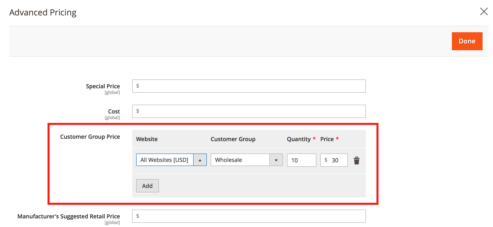

# 共有カタログの価格に対してコンテンツのステージングの更新をスケジュールすることはできますか？

Adobe Commerceには、価格更新をスケジュールする機能はありません（[コンテンツのステージング](https://experienceleague.adobe.com/docs/commerce-admin/content-design/staging/content-staging.html)）を選択します。

つまり、 **価格と構造の設定** Commerce管理パネルのメニュー（ありません） **新しい更新をスケジュール** このメニューのボタン）。

それでも、別の方法を使用して、次の項目の価格アップデートをスケジュールすることができます。

* 顧客グループ
* 製品の基本価格

## 顧客グループの価格更新をスケジュール

1. 開始 [新しい製品アップデートのスケジュール設定](https://experienceleague.adobe.com/docs/commerce-admin/content-design/staging/content-staging-scheduled-update.html).
1. にスクロール ダウンします。 **価格** フィールドでクリック **詳細価格**.

   {width="600"}

1. が含まれる **顧客グループ価格セクション**&#x200B;を選択し、必要な顧客グループを選択して、更新された価格を設定します。

   {width="700"}

1. 通常どおり更新のスケジュールを完了します。

このワークフローでは、1 つの製品の価格のみを更新できます。一括価格更新はできません。

注意：共有カタログは、顧客グループの価格を利用します。

**関連ドキュメント**

* [更新のスケジュール設定（コンテンツのステージング）](https://experienceleague.adobe.com/docs/commerce-admin/content-design/staging/content-staging-scheduled-update.html) を参照してください。
* [詳細価格](https://experienceleague.adobe.com/docs/commerce-admin/catalog/products/pricing/pricing-advanced.html) を参照してください。

## 基本価格の予定価格更新

関連する記事： [基本価格の変更は共有カタログ価格にどのような影響を与えますか？](/help/faq/general/base-price-change-affect-on-shared-catalog-price.md) サポートナレッジベースで。
