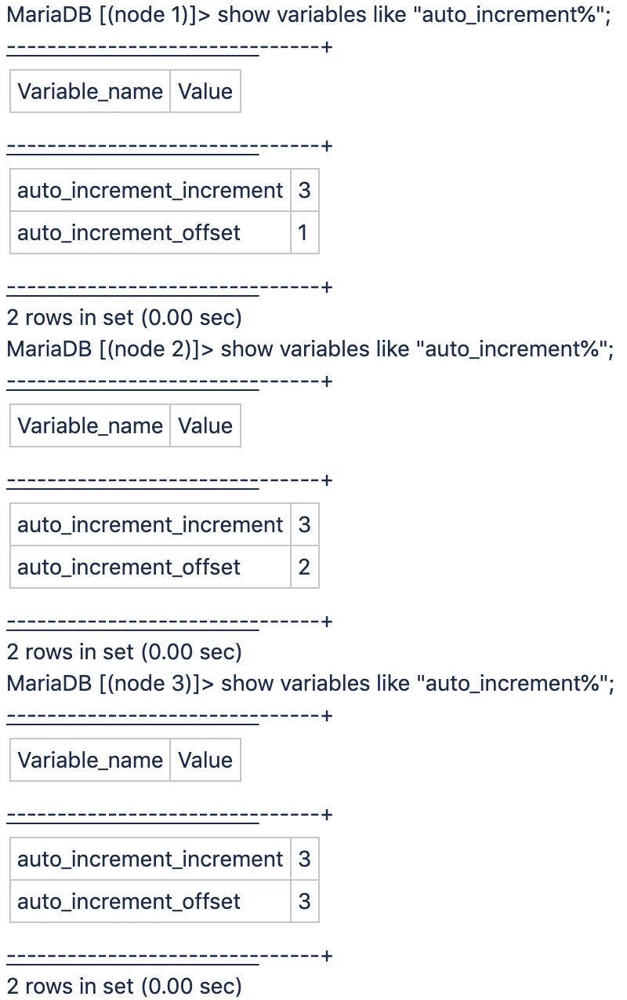

# Cloud pro アーキテクチャで、データベース auto_increment increment 変数を「3」Adobe Commerceに設定する

これは、3 ノードアーキテクチャが原因のクラウドインフラストラクチャー上のAdobe Commerce Pro プランアーキテクチャソリューションで期待される動作であり、変更できません。

Galera データベース・クラスタが使用されます。これは、各ノードに 1 つの MariaDB MySQL データベースを持つデータベース・クラスタで、各データベースの一意の ID に対して自動インクリメント設定は 3 です。

<u>Pro クラスターで使用される増分 ID が常に 3 で区切られたり増分されたりしないのはなぜですか？</u>

クラスターで使用される増分 ID は、Galera の動作の理由から、常に 3 で区切られるとは限りません。

3 台のサーバーはそれぞれ独自の ID 領域を管理します。使用される増分は、相対負荷に応じて、MySQL メインデータベースサーバーが何であるかによって異なります。したがって、ギャップが異なります。
各ノードに SSH で接続し、そのノードで実行されているローカル MySQL インスタンスに（標準ポート 3306 の「main」にプロキシ化されるのではなく）ポート 3307 を使用して接続する場合、次の図のようになります。

例えば、選択されたメインがノード 1 で、`auto_increment_offset = 1` の場合、ID は 1 増分されます。 その後、新しいメインノードが後で選択された場合（例えば、`auto_increment_offset = 3` の場合はノード 3）、代わりに 3 ずつ増加します。

## 役に立つリンク

詳しくは、開発者向けドキュメントを参照してください。

* [Cloud for Adobe Commerce/Pro アーキテクチャ/バックアップと災害復旧 &#x200B;](https://experienceleague.adobe.com/ja/docs/commerce-cloud-service/user-guide/architecture/pro-architecture#backup-and-disaster-recovery)
* [Cloud for Adobe Commerce/インストールの前提条件：database](https://experienceleague.adobe.com/ja/docs/commerce-cloud-service/user-guide/develop/overview)
