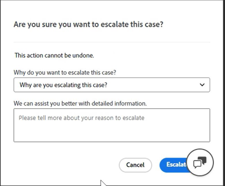

# Adobe CommerceのExperience Leagueサポートユーザーガイド

このガイドでは、[Experience Leagueサポートにサポートチケットを送信し ](https://experienceleague.adobe.com/home#support)Adobe Commerce アカウントへの共有アクセスを提供する方法について説明します。

>[!NOTE]
>
>Adobe Commerceのサポートは、Adobe Commerce ヘルプセンターからExperience Leagueに移行されました。 [ こちら ](#what-is-experience-support) で説明しているExperience Leagueケースのフォームフローを使用して、サポートケースを送信します。

>[!NOTE]
>
>この時点で、以前にAdobe Commerce ヘルプセンターで送信したケースを表示するには、https://support.magento.com/hc/en-us/requestsに移動する必要があります。これらのケースは新しいサポートチケットシステムに移行されていないからです。 ヘルプセンターは読み取り専用になりました。元の問題のサポートを引き続き受けるには、[Experience Leagueサポート ](https://experienceleague.adobe.com/home#support) にフォローアップチケットを送信する必要があります。

>[!NOTE]
>
>Adobe Commerce ヘルプセンターのナレッジベース部分がAdobe Experience League ポータルに移行されました。 サポートチケットを作成すると、関連するナレッジベース記事が、Adobe Experience Leagueのその他の関連するAdobe Commerce ドキュメントと共に提案されます。

**主要更新：** 2024 年 7 月 29 日

**[EXPERIENCE LEAGUEサポートとは](#what-is-experience-support)**

**[サポートケース](#support-cases)**

* [Experience Leagueサポートへのログイン](#sign-in-experience-support)
* [サポートケースの送信](#submit-case)

   * [Adobe Experience League開始ページ](#experience-league-start-page)
   * [Adobe Commerce アカウントページ](#submit-case-adobe-commerce-account-page)
   * [*メールアドレスを確認してください*](#verify-email-address-error)

* [サポートケースのトラッキング](#track-support-cases)
* [あなたのケースのコメント](#comments-in-your-case)
* [ケースを閉じる](#close-case)
* [ケースを再度開きます](#reopen-case)
* [Cloud Console を使用してチケットを送信](#cloud-console)
* [Adobe Commerce P1 ホットライン](#P1-hotline)
* [Adobe Commerceの共通責任運用モデル](#shared-responsibility-operational-model)

**[共有アクセス：自分のアカウントにアクセスするための権限を他のユーザーに付与します](#shared-access)**

* [共有アクセスを提供できるユーザー](#who-can-provide-shared-access)
* [共有アクセスを提供](#provide-shared-access)
* [共有アクセスの失効（削除）](#revoke-shared-access)

   * [クラウドプロジェクトを介して共有アクセス権を付与されたユーザーを削除する方法を教えてください。](#remove-cloud-shared-access-users)

* [共有アカウントへのアクセス （アカウントの切り替え）](#switch-accounts)
* [共有アクセスのトラブルシューティング](#troubleshooting-shared-access)

**[ADOBE COMMERCEの請求に関する FAQ](#billing-faq)**

## Experience Leagueサポートとは {#what-is-experience-support}

Experience Leagueサポートは、Adobe Commerceの正規のお客様がサポートチケットを送信および管理できるAdobe用のサポートポータルです。 また、トラブルシューティング記事を確認することもできます。

## サポートケース {#support-cases}

Adobe Experience League サポートケース管理を使用すると、サポート事例を通じてサポートを活用し、Adobe Commerceを含むAdobe製品を使用中に発生した特定の問題を、契約中のすべてのAdobe Commerce製品に対して解決できます。

## Experience Leagueサポートへのログイン {#sign-in-experience-support}

ログインすると、サポートチケットに関するエージェントからの質問を送信、更新、回答できます。

Adobe Experience League サポートにログインするには、次の手順に従います。

1. [experienceleague.adobe.com](https://experienceleague.adobe.com/) に移動します。
1. Adobeログイン資格情報を使用してログインします。

### サポートケースの送信 {#support-case}

アカウントオーナーまたは Shared Access ユーザーとして正常にログインしたら、Adobe Experience Leagueのホームページ、Adobe Commerceのアカウントページ、Adobe Commerce Cloudのアカウントページを使用して、サポートケースを送信できます。

>[!NOTE]
>
>Adobe Commerce Marketplace チームのサポートリクエストは、Experience Leagueを通じて送信することはできません。サポートシステムが、Experience Leagueと統合されていない別のプラットフォームで動作するからです。
>
>次のステートメントが当てはまる場合、サポートケースを送信することができます。
>
>* 問題の組織の名前が左の列で、末尾に（[!DNL Commerce]）が付いています。 イシューは、その組織または関連付けられたアカウントに関連しています。
>* お客様の問題は、Marketplace アカウントにログインできないこと、または拡張機能のデプロイに関して質問があることです。
>* 問題は、Marketplace での購入に対する払い戻しのリクエストだけではありません。
>
>拡張機能の公開、[Adobe Commerce Marketplace](https://commercemarketplace.adobe.com/) での購入、払い戻しの請求に関する問題については、https://commercemarketplace.adobe.com/に直接 [!DNL Commerce Marketplace] チームにお問い合わせください。 ページの下部に移動して「**[!UICONTROL Contact Us]**」をクリックすると、Marketplace サポートチケットを送信するためのフォームが開きます。

#### Adobe Experience League開始ページ {#experience-league-start-page}

Adobe Experience Leagueの「スタート」ページを使用して新しいサポートケースを送信するには、次の手順に従います。

>[!INFO]
>
>1. ケースを送信するには、適切な製品（Adobe Commerce、Adobe Commerce Intelligence、Experience Platformなど）のサポートを受ける資格を有している必要があります。 サポートを受ける資格がない場合は、組織内でサポートを受ける資格のあるユーザーではないことを示すバーがページ上部に表示されます。
>1. 複数の組織に属している場合や、似た名前を持つ複数の組織がある場合（それぞれが、組織が購読している他のAdobe商品を表します）、「（Commerce）」で終わる左側の列のドロップダウンから適切な組織を最初に選択する必要があります。
>1. ケースを提出するには、適切な商品（Adobe Commerce、Adobe Commerce レポート、Adobe Commerce支払いサービス、Experience Platformなど）のサポートを受ける資格を有している必要があります。 サポートを受ける資格がない場合は、組織内でサポートを受ける資格のあるユーザーではないことを示すバーがページ上部に表示されます。 Commerce関連の問題のケースを送信するには、まず *[!DNL (Commerce)]* で終わる適切な組織名を選択する必要があります。
>1. 複数の組織に属している場合や、似た名前を持つ複数の組織がある場合（それぞれが、組織が購読している他のAdobe商品を表します）、最初にドロップダウンから適切な組織を選択する必要があります。
>1. [!UICONTROL Select a product] ドロップダウンに「Adobe Commerce」が表示されない場合は、まずCommerce アカウントオーナーから [ 共有アクセス ](#shared-access) を取得する必要があります。 共有アクセスが付与されたら、ケースを送信する前に、プロセスを完了するために [ アカウントを同期 ](#switch-accounts) する必要があります。

>[!NOTE]
>
>ケースを送信する前に正しい組織を選択していること、および選択した組織が、サポートをリクエストする製品に適した資格を持っていることを確認します。 例えば、イシューがAdobe Commerceに関係しているものの、商品としてExperience Platformを選択していて、ケースが正常に送信された場合、ケースのルーティング間違いや応答時間の遅延につながる可能性があります。
>
>また、ケースの送信時に間違った組織が選択された場合、チームは適切または正しい組織の [!UICONTROL My Cases] でケースを表示できません。 Adobe Commerce サポートチームには、ケースに関連付けられた組織を変更する機能はありません。この問題に対処するには、既存のケースをクローズし、提供/選択された適切な詳細で新しいケースを送信する必要があります。

1. ヘッダーの **サポート** をクリックします。 サポートホームページが開きます。

   

1. サポートの取り込みプロセスを開始するには、（表示されている場合は）組織ドロップダウンリストから適切な組織が選択されていることを確認します。 Adobe Commerceのケースを送信するには、末尾が *[!DNL Commerce]* の組織の名前を選択します。

   

1. 左側のメニューの **[!UICONTROL Open Ticket]** をクリックするか、カードの **[!UICONTROL Get Started]** をクリック *[!UICONTROL Open a support ticket]* ます。

   

1. ドロップダウンメニューから製品を選択し、ケースのタイトルと説明を入力します。 メモ：ドロップダウンに商品が表示されない場合や、Commerceが使用できない場合は、左側の列の「組織」を切り替えて、もう一度確認します。

   

1. Adobe Experience Leagueは、お客様の問題を解決するのに役立つ記事やベストプラクティスを提案します。 それでも直接サポートが必要な場合は、ケースを送信する前に追加情報を提供する必要があります。

   

1. 必要な情報をすべて入力したら、「**[!UICONTROL Submit case]**」をクリックします。

>[!IMPORTANT]
>
>experienceleague.adobe.comにログインしたときに、組織のドロップダウンメニューに組織が表示されない場合は、サポートをリクエストする前または既存のサポートケースを管理する前に、プロファイルをaccounts.magento.comと同期する必要がある場合があります。   
>
>1. accounts.magento.comに移動し、Adobe Experience Leagueでサポートケースを管理するために使用するのと同じプロファイル（企業、学校、個人）を使用してログインします。 
>1. accounts.magento.com プロファイルに正常にログインしたら、experienceleague.adobe.comに戻ってログインします。 
>1. 組織ドロップダウンメニューから組織を選択します。 
>1. それでも組織が表示されない場合は、Commerce管理者に問い合わせて、サポート委任権限を取得してください。 詳しくは、[Commerce アカウント共有 ](https://experienceleague.adobe.com/en/docs/commerce-admin/start/commerce-account/commerce-account-share) のヘルプ記事を参照してください。 

>[!NOTE]
>
>組織/製品が重要な理由
>
>**例 A**:1 つの会社に対してのみ共有アクセスがあり、その会社は 2 つのAdobe製品（Product1 および Product2）の権限を持っています。
>1. 各組織は 1 つの製品を表すので、ドロップダウンには「OrgA-Product1」と「OrgB-Product2」という 2 つの組織が表示されます。
>1. Product = Product1 を選択した場合、問題が Product2 に関係しているときは、ケースは Product2 サポートにルーティングされ、ケースを Product1 サポートに転送する際に遅延が生じます。
>1. OrgA-Product1 のケースを発行し、今後その組織の [!UICONTROL My Cases] をレビューする場合、組織として OrgA-Product2 を選択すると表示されません（例 B と比較して、その他の組織を選択する必要があります）。
>
>**例 B**:2 つの会社に対して共有アクセス権があり、各会社はAdobe Commerceの使用権限のみを持っています。
>1. 組織 A に対してケースを送信したが、その問題が実際に組織 B に影響を与えている場合、組織 B のメンバーは将来、[!UICONTROL My Cases] の下でこのケースを表示することはできません。
>1. さらに、OrgA のメンバーは、実際には OrgB 向けの [!UICONTROL My Cases] のケースを確認できるので、プライバシーの問題が発生する可能性があります。

サポートケースを送信するには、Experience Leagueにログインするためのアカウントがhttps://account.adobe.comとhttps://account.magento.comの両方に必要です。 サインインするまでサポート ケースを送信できません。

>[!NOTE]
>
>既にhttps://account.magento.comにアカウントを持っているがログインできない場合、2022 年 8 月からhttps://account.adobe.comにアカウントを登録する必要が生じている可能性があります。
>
>これを解決するには：
>1. MAG ID と同じメールアドレスを使用して、https://account.adobe.comでアカウントを作成します。
>1. https://account.magento.comに移動して、Adobe IDと MAG ID をリンクします。

#### Adobe Commerce アカウントページ {#submit-case-adobe-commerce-account-page}

Adobe Commerce アカウントのページを使用して新しいサポートチケットを送信するには、次の手順に従います。

1. Adobe Commerce アカウントにログインします。 ユーザーガイドの [ 詳細な手順 ](https://experienceleague.adobe.com/docs/commerce-admin/start/commerce-account/commerce-account-create.html?lang=en#create-a-commerce-account) を参照してください。
1. 「**サポート**」タブをクリックします。

   {width="800"}

1. Adobe Experience League サポートページが読み込まれます。
1. 左側のメニューから **[!UICONTROL Open Ticket]** を選択します。
1. フィールドに入力します。
1. **送信** をクリックします。

#### *メールアドレスを確認してください* エラーが発生しました（Adobe Commerce アカウントページ） {#verify-email-address-error}

[Adobe Commerce アカウント ](https://account.magento.com/) ページの以下に示すような「メールアドレスを確認してください」エラーが発生した場合は、サポートチケットを送信できません。

### サポートケースのトラッキング {#track-support-case}

サポートケースは、次のような場合です。

* 直接提出しています。
* は、CC （カーボンコピー）を通じて監視者としてに追加されました。

#### ケースを表示

左側のメニューで「**[!UICONTROL My Cases]**」をクリックすると、自分が送信したケースを表示できます。 「（Commerce）」で終わる正しい組織を選択していることを確認してください。

#### Adobe Commerce ヘルプセンターで過去の事例を確認する

Adobe Commerce ナレッジベースにあるAdobe Commerce ヘルプセンター **Adobe Commerce ヘルプセンターの廃止措置** から [ 過去のケースを表示 ](https://experienceleague.adobe.com/en/docs/commerce-knowledge-base/kb/announcements/news/decommissioning-of-adobe-commerce-help-center) する方法について詳しく説明します。

#### 監視ケースの表示

左側のメニューで「**[!UICONTROL My organization's cases]**」をクリックすると、*ウォッチャーとして追加* したケースを表示できます。

<!-- TODO: Add image here -->

#### ケースの検索

ケースを見つけるには、「*[!UICONTROL Search]*」フィールドに検索クエリを入力し、キーボードの *Enter* キーを押します。

#### ケースのエスカレーション

さらに注意が必要で、最初の応答時間が経過したと感じた場合は、ケースをエスカレーションできます。 これを行うには、

1. 画面の右側にある *[!UICONTROL Case Detail]* パネルの右下にある「**[!UICONTROL Escalate to management]**」をクリックします。

   

1. クリックすると、ポップアップフォームが表示されます。 フォームに入力し、「**[!UICONTROL Escalate]**」をクリックします。

   

   *エスカレーションの理由には、エージェントのコミュニケーションスキル、エージェントの技術的知識、コールバック/更新待ち、イシューの緊急性の変化、解決が期待に応えなかったこと、解決までの時間などが含まれます*。

#### サポートケースに対するウォッチャーの追加

ウォッチャーを追加すると、組織のメンバーから送信されたケースをサポートできます。 新しいケースが送信されたとき、または既存のケースが更新されたときに、ウォッチャーにメール通知が届きます。

1. 既存のケースにウォッチャーを追加するには、ケースを開き、画面の右側にあるケースの詳細パネルの「ウォッチャー」の横にある鉛筆アイコンをクリックします。

   

1. 鉛筆をクリックすると、リストからウォッチャーを追加または削除できます。

   

### あなたのケースのコメント {#comments-in-your-case}

ケースのコメントには、お客様またはAdobe Commerce サポートチームが作成したすべてのコメントが含まれています。 コメントは、最新（上）から最も古い（下）順に表示されます。
コメントを追加するには、次の手順に従います。

1. チケットの一番下までスクロールします。
1. **[!UICONTROL Comments]** フィールドにコメントを書き込み、「**[!UICONTROL Add comments]**」をクリックします。

### ケースを閉じる {#close-case}

ケースを閉じるには、*[!UICONTROL Case Detail]* パネルの右下にある「**[!UICONTROL Close case]**」をクリックします。

### ケースを再度開きます {#reopen-case}

ケースを再度開くには、そのケースに関連する当社のサポートシステムからのメールに返信し、エージェントに再オープンを要求します。 ケースが終了してから 14 日以内に行った場合、エージェントはケースを再オープンすることができます。 ただし、14 日後の場合、エージェントは新しいケースを作成する必要があります。

### Cloud Console を使用してチケットを送信 {#cloud-console}

Cloud Console を使用して新しいサポートチケットを送信するには、次の手順に従います。

1. [Cloud Console](https://console.adobecommerce.com) にログインします。
1. ユーザーメニューで「**[!UICONTROL Support]**」を選択します。
1. **[!UICONTROL My Tickets]** ページが読み込まれます。
1. 右上隅の「**[!UICONTROL Submit a ticket]**」をクリックします。
1. フィールドに入力します。
1. **送信** をクリックします。
1. 「**[!UICONTROL Submit]**」をクリックします。

### Adobe Commerce P1 ホットライン {#P1-hotline}

[Adobe Commerce P1 ホットライン ](https://experienceleague.adobe.com/docs/commerce-knowledge-base/kb/how-to/adobe-commerce-p1-notification-hotline.html) の記事には、P1 インシデント発生時のAdobe Commerceの P1 ホットライン番号と、提供する情報が記載されています。

### Adobe Commerceの共通責任運用モデル {#shared-responsibility-operational-model}

[Adobe Commerceの共有責任運用モデル ](https://experienceleague.adobe.com/en/docs/commerce-operations/security-and-compliance/shared-responsibility#operational-responsibilities-summary) の記事を参照してください。
これは、当社の Pro インフラストラクチャ製品のみの運用上の責任を明確にすることを目的としています。

### フォローアップチケットを開く {#follow-up}

フォローアップチケットを開くと、元のイシューが継続性のためにフォローアップチケットにリンクされます。

フォローアップチケットを開くには、フォローアップチケットを作成するチケットの下部にある「*フォローアップを作成*」リンクをクリックします。

## 共有アクセス：自分のアカウントにアクセスするための権限を他のユーザーに付与します {#shared-access}

お客様は、お客様のアカウントに対し、他のAdobe Commerce アカウント所有者による限定的なアクセスを許可することができます。 特に、**共有アクセス** 機能を使用すると、信頼できる従業員とサービスプロバイダーにヘルプセンターアカウントを使用するための権限を付与して、サポートチケットを操作できるようにすることができます。

[https://account.magento.com](https://account.magento.com/) のAdobe Commerce アカウントページを使用して、共有アクセスを提供および管理できます。

### 共有アクセスを提供できるユーザー {#who-can-provide-shared-access}

従った権限を持つアカウント所有者（プライマリアカウント所有者）のみが、他のユーザーに共有アクセスを提供できます。

ユーザーとそのアクセスの管理は、特に共有アクセスの観点から、顧客の責任です。 そのため、Adobe Commerce サポートチームは、お客様の代わりにAdobe Commerce アカウントに共有アクセスを提供することはできません。 お客様は、[Adobe Commerce アカウントのページ ](https://account.magento.com/) を使用して、自身が共有アクセスを持つユーザーを追加することをお勧めします。

共有アクセス権が付与されたユーザーは、そのアクセス権を他のユーザーに転送または付与することはできません。

### 共有アクセスを提供 {#provide-shared-access}

共有アカウントの設定手順について詳しくは、『Adobe Commerce入門ガイド』の [Commerce アカウントの共有 ](https://experienceleague.adobe.com/en/docs/commerce-admin/start/commerce-account/commerce-account-share) の節を参照してください。

新しいユーザーに共有アクセスを提供すると、Adobe Commerce アカウントページの **共有アクセス**/**権限の管理** で関連情報を利用できます。

### 共有アクセスの失効（削除） {#revoke-shared-access}

1. Adobe Commerce アカウント（[https://account.magento.com](https://account.magento.com/)）にログインします。
1. 左側のパネルの「共有アクセス」で、「**権限の管理**」を選択します。
1. 共有アクセスを取り消すユーザーを見つけ、ユーザーの行（{width="25"} 列）にある **削除アイコン** をクリックします。
1. **ユーザーを削除** をクリックしてアクセスを取り消すか、左上隅の「X」をクリックして取り消しをキャンセルします。

   {width="800"}

   **編集** メニューを使用して共有アクセスを取り消すこともできます。

1. Adobe Commerce アカウント（[https://account.magento.com](https://account.magento.com/)）にログインします。
1. 左側のパネルの「共有アクセス」で、「**権限の管理**」を選択します。
1. 共有アクセスを取り消すユーザーを見つけ、ユーザーの行（**アクション** 列）の「**編集**」をクリックします。
1. ページ下部の **このユーザーを削除** をクリックします。
1. 確認のポップアップで、「**ユーザーを削除**」をクリックしてアクセスを取り消すか、左上隅の「X」をクリックして取り消しをキャンセルします。

### クラウドプロジェクトを介して共有アクセス権を付与されたユーザーを削除する方法を教えてください。 {#remove-cloud-shared-access-users}

<u> 影響を受ける製品とバージョン </u>

* Adobe Commerce Cloud（すべてのバージョン）

<u> 原因 </u>

Adobe Commerce Cloud プロジェクトがあり、ユーザーをプロジェクトに追加した場合は、プロジェクト所有者の画像 ID に対する共有アクセスが自動的に付与される可能性があります。 これは通常、**[!UICONTROL Share Name]** の列に *MAG[XYZ からのクラウド共有アクセス]* と表示されます。

>[!NOTE]
>
>DELETEリンクが見つからない場合は、Commerce Cloudを通じて Shared Access が自動的に付与されたことを意味します。

<u> 解決策 </u>

共有アクセスが追加/付与されていない場合、共有名が *Cloud Shared Access である共有アクセスユーザーのリストを MAG[XYZ]* から削除することはできません [ このページ ](https://account.magento.com/grantor/manage/)。 これらは、情報/監査目的で保持されます。

ただし、それらの共有アクセスユーザーに対する権限を取り消すと、そのユーザーはアクセスできなくなります。

1. Adobe Commerce アカウント（[https://account.magento.com](https://account.magento.com/)）にログインします。
1. 左側のパネルの *[!UICONTROL Shared Access]* の下で、「**[!UICONTROL Manage Permissions]**」を選択します。
1. 共有アクセスを取り消すユーザーを見つけ、ユーザーの行（*[!UICONTROL Actions]* 列）の **[!UICONTROL Edit]** をクリックします。
1. 「*[!UICONTROL Grant Account Permissions]*」の下のすべてのリソースをオフにします。

{width="800"}

詳しくは、Cloud Infrastructure ガイドのCommerceにある [ ユーザーアクセスの管理 ](https://experienceleague.adobe.com/docs/commerce-cloud-service/user-guide/project/user-access.html#manage-users-from-the-project-web-interface) ドキュメントを参照してください。

### 共有アカウントへのアクセス （アカウントの切り替え） {#switch-accounts}

提供された共有アクセスを使用するには、次の手順に従います。

1. Adobe Commerce アカウント（[https://account.magento.com](https://account.magento.com/)）にログインします。
1. **アカウントを切り替え** メニューをクリックし、アカウントを選択します。

   {width="800"}

現在使用しているアカウント（独自のネイティブアカウントまたは共有アクセス）を確認するには、**アカウントの切り替え** メニューを参照してください。このメニューには、アクティブなアカウントが表示されます。

### 共有アクセスのトラブルシューティング {#troubleshooting-shared-access}

サポートナレッジベースの [ 共有アクセスのトラブルシューティングの記事 ](/help/troubleshooting/miscellaneous/shared-access-troubleshooting.md) を参照してください。

## Adobe Commerceの請求に関する FAQ {#billing-faq}

マーチャントは、通常、クレジットカード（CC）でサービスの支払いを行います。この [Adobe Commerce向け請求に関する FAQ](/help/faq/general/billing-faq-for-adobe-commerce.md) は、請求書を支払う際に役立つリソースです。

