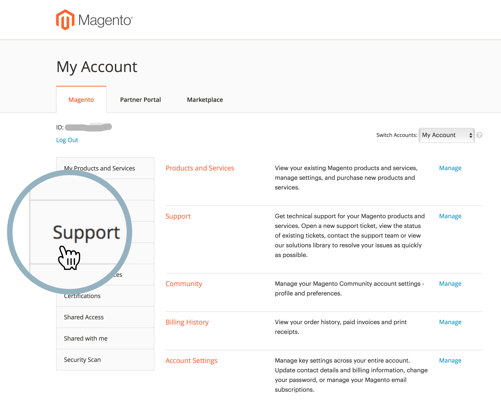
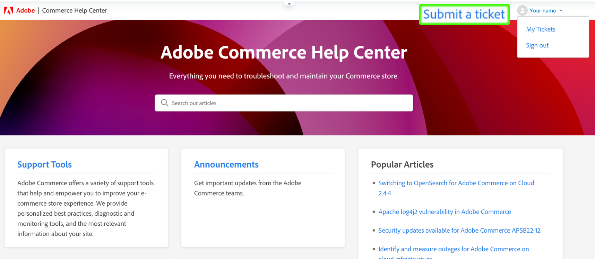

# Adobe Commerce ヘルプセンターユーザーガイド

このガイドでは、[Adobe Commerce ヘルプセンターにサポートチケットを送信し ](https://support.magento.com/hc/en-us)Adobe Commerce アカウントへの共有アクセスを提供する方法について説明します。

>[!NOTE]
>
>Adobe Commerceのサポートは、Adobe Commerce ヘルプセンターからExperience Leagueへと移行しています。 アクセス権が付与されたことが通知された場合は、[ こちら ](#what-is-experience-support) に記載されているExperience Leagueケースのフォームフローを使用します。 通知が届いていない場合は、[Adobe Commerce ヘルプセンターのケースフロー ](#what-is-adobe-commerce-help-center) を引き続き使用します。

>[!NOTE]
>
>Adobe Commerce ヘルプセンターのナレッジベース部分がAdobe Experience League ポータルに移行されました。 サポートチケットを作成すると、関連するナレッジベース記事が、Adobe Experience Leagueのその他の関連するAdobe Commerce ドキュメントと共に提案されます。

**主要更新：** 2024 年 7 月 8 日

**[EXPERIENCE LEAGUEサポートとは](#what-is-experience-support)**

**[サポートケース](#support-cases)**

* [Experience Leagueサポートへのログイン](#sign-in-experience-support)
* [サポートケースの送信](#submit-case)

   * [Adobe Experience League開始ページ](#experience-league-start-page)
   * [Adobe Commerce アカウントページ](#submit-case-adobe-commerce-account-page)
   * [*メールアドレスを確認してください*](#verify-email-address-error)

* [サポートケースのトラッキング](#track-support-cases)
* [あなたのケースのコメント](#comments-in-your-case)
* [ケースを閉じる](#close-case)

**[ADOBE COMMERCE ヘルプセンターとは](#what-is-adobe-commerce-help-center)**

**[サポートチケット](#support-tickets)**

* [ヘルプセンターへのログイン](#login)
* [サポートチケットを送信](#submit-ticket)

   * [ヘルプセンターの開始ページ](#submit-ticket-help-center-start-page)
   * [Magentoアカウントページ](#submit-ticket-magento-account-page)
   * [クラウドコンソール](#submit-ticket-magento-cloud-account-page)
   * [サポートチケットの情報](#info-in-support-ticket)
   * [Adobe Commerce ヘルプセンターの開始ページに「チケットを送信」リンクが表示されない](#no-submit-link)
   * [*「メールアドレスを確認してください」*](#verify-email-address)
   * [チケット送信フォーム：組織ドロップダウンにマーチャントが表示されない](#merchant-not-displayed)

* [チケットの追跡](#track-tickets)
* [Adobe Commerce P1 ホットライン （ログインが必要）](#P1-hotline)
* [Adobe Commerceの共有責任の運用モデル （ログインが必要）](#shared-responsibility-operational-model)
* [サポートチケットフィールドの説明](#ticket-fields-explained)
* [チケットステータス：リクエストの処理方法](#ticket-status)
* [チケット内の会話](#conversation-in-ticket)
* [チケットを解決](#resolve-ticket)
* [フォローアップチケットを開く](#follow-up)

**[共有アクセス：自分のアカウントにアクセスするための権限を他のユーザーに付与します](#shared-access)**

* [共有アクセスを提供できるユーザー](#who-can-provide-shared-access)
* [共有アクセスを提供](#provide-shared-access)
* [共有アクセスの失効（削除）](#revoke-shared-access)

   * [クラウドプロジェクトを介して共有アクセス権を付与されたユーザーを削除する方法を教えてください。](#remove-cloud-shared-access-users)

* [共有アカウントへのアクセス （アカウントの切り替え）](#switch-accounts)
* [共有アクセスのトラブルシューティング](#troubleshooting-shared-access)

**[ADOBE COMMERCEの請求に関する FAQ](#billing-faq)**

**[MAGENTOU は現在、ADOBE デジタル ラーニング サービスの一部です](#magento-u)**

>[!NOTE]
>
>通知がない限り、[Adobe Commerce ヘルプセンターのケースフロー ](#what-is-adobe-commerce-help-center) を引き続き使用します。 アクセス権を持つコホートに属していると通知された場合は、以下に説明するExperience Leagueケース フォームフローに従ってください [ 以下 ](#what-is-experience-league-support)。

## Experience Leagueサポートとは {#what-is-experience-support}

Experience Leagueサポートは、Adobe Commerceの正規のお客様がサポートチケットを送信および管理できるAdobe用のサポートポータルです。 また、トラブルシューティング記事を確認することもできます。

## サポートケース {#support-cases}

Adobe Experience League サポートケース管理を使用すると、サポート事例を通じてサポートを活用し、Adobe Commerceを含むAdobe製品を使用中に発生した特定の問題を、契約中のすべてのAdobe Commerce製品に対して解決できます。

## Experience Leagueサポートへのログイン {#sign-in-experience-support}

ログインすると、サポートチケットに関するエージェントからの質問を送信、更新、回答できます。

Adobe Experience League サポートにログインするには、次の手順に従います。

1. [experienceleague.adobe.com](https://experienceleague.adobe.com/) に移動します。
1. Adobeログイン資格情報を使用してログインします。

### サポートケースの送信 {#support-case}

正常にログインしたら、Adobe Experience Leagueのホームページ、Adobe Commerceのアカウントページ、Adobe Commerce Cloudのアカウントページを使用して、サポートケースを送信できます。

* アカウント所有者の場合は、次の手順に従います。
* 共有アクセスのユーザーの場合、最初にアカウントを切り替える必要があります。 [ 共有アカウントへのアクセス（アカウントの切り替え） ](https://experienceleague.adobe.com/en/docs/commerce-knowledge-base/kb/help-center-guide/magento-help-center-user-guide#switch-accounts) を参照してください。次の手順に進むことができます。

#### Adobe Experience League開始ページ {#experience-league-start-page}

Adobe Experience Leagueの「スタート」ページを使用して新しいサポートケースを送信するには、次の手順に従います。

>[!NOTE]
>
>1. 複数の組織に属している場合は、ドロップダウンから適切な組織を選択する必要があります。
>1. ケースを提出するには、サポートを受ける資格が必要です。 追加されていない場合は、組織でサポート資格を持つユーザーではないことを示すバーがページ上部に表示されます。

1. ヘッダーの **サポート** をクリックします。 サポートのホームページが開きます。

   

1. サポートの取り込みプロセスを開始するには、左側のメニューの **[!UICONTROL Open Ticket]** をクリックするか、カードの **[!UICONTROL Get Started]** をクリック *[!UICONTROL Open a support ticket]* ます。

   

1. ドロップダウンメニューから製品を選択し、ケースのタイトルと説明を入力します。

   

1. Adobe Experience Leagueは、お客様の問題を解決するのに役立つ記事やベストプラクティスを提案します。 それでも直接サポートが必要な場合は、ケースを送信する前に追加情報を提供する必要があります。

   

1. 必要な情報をすべて入力したら、「**[!UICONTROL Submit case]**」をクリックします。

サポートケースを送信するには、Experience Leagueにログインするためのアカウントがhttps://account.adobe.comとhttps://account.magento.comの両方に必要です。 サインインするまでサポート ケースを送信できません。

>[!NOTE]
>
>既にhttps://account.magento.comにアカウントを持っているがログインできない場合、2022 年 8 月からhttps://account.adobe.comにアカウントを登録する必要が生じている可能性があります。
>
>これを解決するには：
>1. MAG ID と同じメールアドレスを使用して、https://account.adobe.comでアカウントを作成します。
>1. https://account.magento.comに移動して、Adobe IDと MAG ID をリンクします。

#### Adobe Commerce アカウントページ {#submit-case-adobe-commerce-account-page}

Adobe Commerce アカウントのページを使用して新しいサポートチケットを送信するには、次の手順に従います。

1. Adobe Commerce アカウントにログインします。 ユーザーガイドの [ 詳細な手順 ](https://experienceleague.adobe.com/docs/commerce-admin/start/commerce-account/commerce-account-create.html?lang=en#create-a-commerce-account) を参照してください。
1. 「**サポート**」タブをクリックします。

   {width="800"}

1. Adobe Experience League サポートページが読み込まれます。
1. 左側のメニューから **[!UICONTROL Open Ticket]** を選択します。
1. フィールドに入力します。
1. **送信** をクリックします。

#### *メールアドレスを確認してください* エラーが発生しました（Adobe Commerce アカウントページ） {#verify-email-address-error}

[Adobe Commerce アカウント ](https://account.magento.com/) ページの以下に示すような「メールアドレスを確認してください」エラーが発生した場合は、サポートチケットを送信できません。

### サポートケースのトラッキング {#track-support-case}

サポートケースは、次のような場合です。

* 直接提出しています。
* は、CC （カーボンコピー）を通じて監視者としてに追加されました。

#### ケースを表示

左側のメニューで **[!UICONTROL My Cases]** をクリックすると、ケースを表示できます。

#### ケースの検索

ケースを見つけるには、「*[!UICONTROL Search]*」フィールドに検索クエリを入力し、キーボードの *Enter* キーを押します。

#### ケースのエスカレーション

さらに注意が必要で、最初の応答時間が経過したと感じた場合は、ケースをエスカレーションできます。 これを行うには、

1. 画面の右側にある *[!UICONTROL Case Detail]* パネルの右下にある「**[!UICONTROL Escalate to management]**」をクリックします。

   

1. クリックすると、ポップアップフォームが表示されます。 フォームに入力し、「**[!UICONTROL Escalate]**」をクリックします。

   

   *エスカレーションの理由には、エージェントのコミュニケーションスキル、エージェントの技術的知識、コールバック/更新待ち、イシューの緊急性の変化、解決が期待に応えなかったこと、解決までの時間などが含まれます*。

#### サポートケースに対するウォッチャーの追加

ウォッチャーを追加すると、組織のメンバーから送信されたケースをサポートできます。 新しいケースが送信されたとき、または既存のケースが更新されたときに、ウォッチャーにメール通知が届きます。

1. 既存のケースにウォッチャーを追加するには、ケースを開き、画面の右側にあるケースの詳細パネルの「ウォッチャー」の横にある鉛筆アイコンをクリックします。

   

1. 鉛筆をクリックすると、リストからウォッチャーを追加または削除できます。

   

### あなたのケースのコメント {#comments-in-your-case}

ケースのコメントには、お客様またはAdobe Commerce サポートチームが作成したすべてのコメントが含まれています。 コメントは、最新（上）から最も古い（下）順に表示されます。
コメントを追加するには、次の手順に従います。

1. チケットの一番下までスクロールします。
1. **[!UICONTROL Comments]** フィールドにコメントを書き込み、「**[!UICONTROL Add comments]**」をクリックします。

### ケースを閉じる {#close-case}

ケースを閉じるには、*[!UICONTROL Case Detail]* パネルの右下にある「**[!UICONTROL Close case]**」をクリックします。

>[!NOTE]
>
>チケットの送信と管理には、Adobe Commerce ヘルプセンターフォームフロー [ 以下 ](#what-is-adobe-commerce-help-center) を引き続き使用します。ただし、コホートに属し、以下で説明するExperience Leagueケースフォームフローへのアクセス権を持っていることが通知された場合は除きます [ こちら ](#what-is-experience-league-support)。

## Adobe Commerce ヘルプセンターとは {#what-is-adobe-commerce-help-center}

[Adobe Commerce ヘルプセンター ](https://support.magento.com/hc/en-us) は、資格のあるお客様がサポートチケットを送信および管理できるAdobe Commerceのサポートポータルです。 また、トラブルシューティング記事を確認することもできます。

## サポートチケット {#support-tickets}

Adobe Commerce チケットシステムを使用すると、Adobe Commerceの操作中に発生している特定の問題に対処するために、すべてのAdobe Commerce製品に対してサポートチケットを使用できます。

## ヘルプセンターへのログイン {#login}

ログインすると、サポートチケットに関するエージェントからの質問を送信、更新、回答できます。

Adobe Commerce ヘルプセンターにログインするには、次の手順に従います。

1. <https://support.magento.com> のヘルプセンターにアクセスします。
1. 右上隅の **ログイン** をクリックします。

Magentoアカウントの資格情報を使用してログインします。 詳細については、ユーザーガイドの [Magentoアカウント ](https://experienceleague.adobe.com/docs/commerce-admin/start/commerce-account/commerce-account-create.html) を参照してください。

### <strong> サポートチケットの送信 </strong> {#submit-ticket}

ログインに成功したら、ヘルプセンターの開始ページ、Magentoアカウントページ、Magentoクラウドアカウントページを使用して、サポートチケットを送信できます。

* **アカウント所有者** の場合は、次の手順に従います。
* **共有アクセス ユーザーの場合、最初にアカウントを切り替える必要があります**[ 共有アカウントへのアクセス （アカウントの切り替え） ](#switch-accounts) その後、以下の手順に進むことができます。

#### ヘルプセンターの開始ページ {#submit-ticket-help-center-start-page}

Adobe Commerce ヘルプセンターの開始ページを使用して新しいサポートチケットを送信するには、次の手順に従います。

1. [Adobe Commerce ヘルプセンター ](https://support.magento.com/hc/en-us) に移動します。
1. 右上隅にある **チケットを送信** をクリックします。

   {width="800"}

1. フィールドに入力します。
1. **送信** をクリックします。

サポートチケットを送信するには、https://account.adobe.comとhttps://account.magento.comの両方にアカウントを *持っている必要があります*。その後、Adobe Commerce アカウントを使用してヘルプセンターにログインします。 ログインするまで、[ チケットを送信 **ボタンは表示されません**](#no-submit-link)。

>[!NOTE]
>
>既にhttps://account.magento.comにアカウントを持っているがログインできない場合、2022 年 8 月からhttps://account.adobe.comにアカウントを登録する必要が生じている可能性があります。
>
>これを解決するには：
>
>1. MAG ID と同じメールアドレスを使用して、https://account.adobe.comでアカウントを作成します。
>1. https://account.magento.comに移動して、Adobe IDと MAG ID をリンクします。

#### Magentoアカウントページ {#submit-ticket-magento-account-page}

Magentoアカウントページを使用して新しいサポートチケットを送信するには、次の手順に従います。

1. Magentoアカウントにログインします。 ユーザーガイドの [ 詳細な手順 ](https://experienceleague.adobe.com/docs/commerce-admin/start/commerce-account/commerce-account-create.html?lang=en#create-a-commerce-account) を参照してください。
1. 「**サポート**」タブをクリックします。

   {width="800"}

1. ヘルプセンターの開始ページが読み込まれます。
1. 右上隅の **チケットを送信** をクリックします。
1. フィールドに入力します。
1. **送信** をクリックします。

#### クラウドコンソール {#submit-ticket-magento-cloud-account-page}

Cloud Console を使用して新しいサポートチケットを送信するには、次の手順に従います。

1. [Cloud Console](https://console.adobecommerce.com) にログインします。
1. ユーザーメニューで「**[!UICONTROL Support]**」を選択します。
1. **[!UICONTROL My Tickets]** ページが読み込まれます。
1. 右上隅の「**[!UICONTROL Submit a ticket]**」をクリックします。
1. フィールドに入力します。
1. **送信** をクリックします。
1. 「**[!UICONTROL Submit]**」をクリックします。

#### サポートチケットの情報 {#info-in-support-ticket}

赤いアスタリスク（**\***）が付いたフィールドは必須であり、入力する必要があります。 これらのフィールドを空のままにすると、チケットを送信できなくなります。

詳しくは、以下の [ チケットフィールドについて説明 ](#ticket-fields-explained) を参照してください。

### Adobe Commerce ヘルプセンターの開始ページに「チケットを送信」リンクが表示されない {#no-submit-link}

#### 問題

Adobe Commerce ヘルプセンターにアクセスしてサポートリクエストを送信したいが、ヘルプセンターの開始ページに **チケットを送信** リンクが表示されない。

#### 原因：

以下のいずれかが原因である可能性があります。

* ヘルプ センターにログインしていません。
* 共有アクセスを初めて使用する場合、Magento.comからの SSO 呼び出しを通じてAdobe Commerce ヘルプセンターが正しく設定されていることを確認するために必要な手順を実行していません。
* お使いのアカウントには、Adobe Commerce サポートを受ける権利がありません（例えば、お客様がCommerceの有料お客様ではない、または Open Sourceのお客様である）。

#### 解決策

[ ヘルプセンターにログインします ](/help/help-center-guide/help-center/magento-help-center-user-guide.md#provide-shared-access)。

**チケットを送信** リンクは、有効なサポート契約にリンクされたメールを送信したお客様に対してのみ表示されます。

#### 共有アクセスアカウントの使用

共有アクセスアカウントを使用してサポートチケットを送信できるようにするには、次の手順を実行する必要があります（この手順は 1 回だけ実行する必要があります）。

1. [ 共有アクセス ](https://support.magento.com/hc/en-us/articles/360052444712#who-can-provide-shared-access) を受け取ったら、magento.com web サイトの [Magentoアカウントにログインし ](https://account.magento.com/) す。
1. 右上隅の **アカウントの切り替え** ドロップダウンフィールドで、共有アクセスアカウントを選択します。
1. 左パネルの「**サポート**」タブをクリックします。 これにより、Magento.comからAdobe Commerce ヘルプセンターへの SSO 呼び出しを通じて、Adobe Commerce ヘルプセンターが正しく設定されます。

#### **チケットを送信** リンクがまだ表示されない

**アカウントの切り替え** ドロップダウンリストの **共有アカウント** がない場合、Adobe Commerce ライセンスを持つクライアントで作業しているときは、共有アクセスの付与を依頼してください。 詳しくは、[Magentoアカウントへの共有アクセスを提供 ](/help/help-center-guide/help-center/magento-help-center-user-guide.md#provide-shared-access) を確認してください。

Adobe Commerce ライセンスオーナーの場合は、**支払い保留中** ステータスの請求書がないことを確認してください。 サポート資格は、請求書の支払いステータスに応じて、自動的に付与または取り消されます。

 支払い状況の確認方法 :

1. [magento.com](https://support.magento.com/) にログインします。
1. 左側の **請求履歴** をクリックします。
1. **未払い** ステータスの請求書がある場合は、**** Adobeアカウントチームにお問い合わせください **お支払いの問題を解決してください。**

アドビは、Adobe Commerce ライセンスの所有者と、Adobe Commerce ライセンスを持つアカウントへの共有アクセス権を持つアカウントに対してのみ、サポートを提供します。 Magento Open Source版のサポートが必要な場合は、次のセルフヘルプのテクニカルリソースを利用してください。

* [Adobe Commerce ヘルプセンター ](https://support.magento.com/)
* [Adobe Commerce開発者向けドキュメント ](https://developer.adobe.com/commerce/docs/)
* [Adobe Commerceのドキュメントリソース ](https://experienceleague.adobe.com/docs/commerce.html)
* [Magentoフォーラム ](https://community.magento.com/?_ga=2.99592990.1084044056.1559046120-720752292.1551793747)

アカウントにログインする際に問題が発生した場合、または共有アクセスが正しく設定されていると思われる場合でも、**チケットを送信** ボタンが表示されません。[ ヘルプセンターのログインの問題 ](mailto:grp-magento-helpcenterloginissues@adobe.com) にメールを送信してください。アドビはアカウント設定とサポート資格を喜んで確認します。

>[!NOTE]
>
>クラウドプロジェクトへのアクセスで問題が発生した場合は、通常のチャネルを通じてこの問題のチケットを送信します。 チケットを送信できる場合は、メールを送信しないでください。

### Magentoアカウントページの「メールアドレスを確認してください」エラー {#verify-email-address}

*メールアドレスを確認してください* というエラーが表示される場合は、[Magentoアカウントページの以下のエラー ](https://account.magento.com/) を受け取っても、サポートチケットを送信できません。

{width="800"}

解決策は、メールアドレスを検証することです。

1. https://account.adobe.comにログインし、必要に応じてパスワードをリクエストします。
1. Adobeアカウントを確認します。

>[!NOTE]
>
>https://account.magento.com（Magentoアカウントページ）のメール認証リンクにのみ適用されます。

### チケット送信フォーム：組織ドロップダウンにマーチャントが表示されない {#merchant-not-displayed}

#### 問題

 前提条件 ：マーチャントから付与された共有アクセスアカウントがあります。

 再現手順 :

1. 共有アカウントを使用してヘルプセンターにログインします。
1. **チケットを送信** リンクをクリックします。 チケット送信フォームが開きます。
1. **組織** ドロップダウンフィールドを展開して、マーチャントを選択します。

 期待される結果 :

共有アカウントに対応するマーチャントは、「**組織** オプションに表示されます。

 実際の結果 :

使用されている共有アカウントに対応するマーチャントは、「組織 **オプションでは使用でき** せん。

#### 解決策

マーチャントからの共有アクセスが許可されたら、次の手順を実行する必要があります（1 回のみ）。

1. magento.com Web サイト ](https://account.magento.com/) で [Magentoアカウントにログインします。
1. 右上隅の **アカウントの切り替え** ドロップダウンフィールドで、共有アクセスアカウントを選択します。
1. 左パネルの「**サポート**」タブをクリックします。 これにより、Magento.comからAdobe Commerce ヘルプセンターへの SSO 呼び出しを通じて、Adobe Commerce ヘルプセンターが正しく設定されます。

既に行っている場合は、アカウントの「[[!UICONTROL Shared with me]」タブをクリックして、*複数のマーチャントからの共有アクセス* が付与されているかどうかを確認してください ](https://account.magento.com/grantor/manage/shared/)。
* リストに [!UICONTROL Share Name] が 1 つしか表示されない場合、つまり、1 人のマーチャントからのみ付与されている場合 *[!UICONTROL Organization] ドロップダウンは表示されません*。
* 複数の [!UICONTROL Share Names] がある場合、支払いの問題によりライセンスが以前に失効していたため、マーチャントのサポート資格が期限切れになった可能性があります。

### チケットの追跡 {#track-tickets}

チケットは次のユーザーのものです。

* 個人的に提出した
* は、CC （カーボンコピー）を通じて監視者としてに追加されました

#### チケットの表示

すべてのチケットをリストするには、ヘルプセンターの開始ページでプロファイルメニュー（右上隅）をクリックし、「**マイチケット**」を選択します。

{width-&quot;800&quot;}

チケットと CC で登録されているチケットを切り替えるには、対応するタブをクリックします。

* **私のチケット**
* **CC 済みのチケット**
* **組織チケット** （アカウントが複数の組織に関連付けられている場合に使用可能）

チケットを並べ替えるには、「**作成済み**」または **最後のアクティビティ** 列ヘッダーをクリックします。

#### チケットの検索

チケットを検索するには、**チケットを検索** フィールドに検索クエリを入力し、キーボードの *Enter* を押します。 追加のフィルターに [a ステータス ](#ticket-status) を選択します。

#### 組織のチケットをフォロー

組織のメンバーが提出したサポートチケットに従ってください。

組織のチケットをフォローする場合：

* **組織チケット** タブ内でチケットを表示できる
* 新しいチケットが送信されたとき、または既存のチケットが変更されたときに、メール通知を受け取る

組織のチケットをフォロー/フォロー解除するには：

1. **マイチケット**/**組織チケット** タブに移動します。
1. メニューで組織を選択し、「フォロー/フォロー解除 **をクリックし** す。

### Adobe Commerce P1 ホットライン {#P1-hotline}

**ログインが必要です** [Adobe Commerce P1 ホットライン ](https://experienceleague.adobe.com/docs/commerce-knowledge-base/kb/how-to/adobe-commerce-p1-notification-hotline.html) にアクセスするには、P1 インシデント発生時のAdobe Commerceの P1 ホットライン番号と、提供する情報を示す記事にアクセスします。

### Adobe Commerceの共通責任運用モデル {#shared-responsibility-operational-model}

[Adobe Commerceの共有責任運用モデル ](https://experienceleague.adobe.com/en/docs/commerce-operations/security-and-compliance/shared-responsibility#operational-responsibilities-summary) の記事を参照してください。
これは、当社の Pro インフラストラクチャ製品のみの運用上の責任を明確にすることを目的としています。

### サポートチケットフィールドの説明 {#ticket-fields-explained}

#### 影響を受ける URL

Adobe Commerce サポートチームが問題を確認できる環境へのリンク。 URL は必ず「http://」または「https://」で始めてください。

#### 添付

ログ、スクリーンショット、ビデオ録画、またはその他のメディアを添付して、問題を明確にします。

#### Backoffice URL （MOM のみ）

URL は「https://」で始める必要があります。 通常は、次の形式になります。商社名+&quot;.mcom.magento.com/admin/login&quot;、例：&quot;https://luma.mcom.magento.com/admin/login&quot;。

イシューに関連する直接リンクを配置することもできます。

#### CC

チケットをフォローする人のメール （*first@e.mail* など）。

Magentoアカウントまたは Zendesk アカウントを持たない人のメールを追加できます。これらの人は、引き続きチケットで会話に参加できます。

CC に複数のメールを追加するには：

>[!NOTE]
>
>CC：のユーザーは、https://account.magento.comに既存のアカウントがある必要があります。 そうでない場合は、まずhttps://account.adobe.comでアカウントを作成し、そのアカウントでhttps://account.magento.comにログインする必要があります。

1. メールを入力します。
1. キーボードの *スペース* を押して、入力したメールを保存します。 メールがグレーのフレームで表示されます。\
   
1. 次のメールを入力してください。
1. *スペース* を押して、他のすべてのメールを保存します。

CC からメールを削除するには：フレーム化されたメールの **x** をクリックします。

#### 製品

使用しているAdobe Commerce製品のタイプを選択します。

* Adobe Commerce：このオプションを選択すると、**[!UICONTROL Implementation Type]** フィールドが表示されます（詳しくは、以下を参照してください）
* Magento Order Management
* Adobe Commerce レポート：含まない [ 高度なレポート ](https://experienceleague.adobe.com/docs/commerce-admin/config/general/advanced-reporting.html)
* Adobe Commerce[ 支払いサービス ](https://experienceleague.adobe.com/docs/commerce-merchant-services/payment-services/overview.html)
* Adobe Commerce サービス：[Channel Manager](https://experienceleague.adobe.com/docs/commerce-channels/channel-manager/guide-overview.html) のみ

#### 実装タイプ

このフィールドは、**[!UICONTROL Product]** = *Adobe Commerce* を選択した後にのみ表示されます

デプロイ方法を指定してください：

* クラウド：クラウドインフラストラクチャー上でAdobe Commerceを使用している場合にのみ選択します
* オンプレミス：*すべてのセルフホストインスタンスと [AWS] クラウドベースのホスティング* （Adobe Commerce on Cloud を除く）

#### クラウドプロジェクト URL

Cloud Console プロジェクトの URL （例：`https://console.adobecommerce.com/<owner-user-name>/<project-ID>`）を指定してください。

プロジェクト URL を取得するもう 1 つの方法は次のとおりです。

1. [Cloud Console](https://console.adobecommerce.com) にログインします。
1. 適切なプロジェクトをクリックします。
1. URL をコピーします。

#### 連絡先の理由

お問い合わせの理由は製品によって異なります。 発生している症状に最も適した接触理由を選択します。 選択する必要がある連絡先の理由について詳しくは、[ サポートチケットの連絡先の理由の説明 ](/help/faq/general/support-ticket-contact-reason-descriptions.md) の記事を参照してください。

#### Adobe Commerce環境 ID

このフィールドは、{**[!UICONTROL Contact Reason]** = *Adobe Commerce Cloud アプリケーション*、**Adobe Commerce アプリケーションの連絡先の理由** = *[!DNL Live Search]* の順に選択した後でのみ表示されます。
**[!UICONTROL System]**/**[!UICONTROL Services]**/**[!UICONTROL Commerce Services Connector]**/**[!UICONTROL SaaS Identifier]** に移動し、*[!UICONTROL Data Space ID]* を指定します。

#### （Data）統合タイプ（Adobe Commerce レポートのみ）

Adobe Commerce レポート内の統合のタイプを選択します。 これにより、エンジニアが問題をより効率的に解決できるようになります。

#### 説明

問題の概要を、合理的に可能な限り多くの詳細と共に記載します。

正確な詳細、再現手順（別の [ 再現手順 ](#steps) フィールドがあるAdobe Commerce オンプレミスおよびクラウドインフラストラクチャを除く）、および問題またはリクエストの症状を指定してください。 影響を受ける SKU、関連するデータポイント、その他の関連リンクを必ず含めてください。

#### 環境（Adobe Commerce on cloud infrastructure、Adobe Commerce オンプレミス、Adobe Commerce Reporting and Shipping のみ）

問題が発生する **環境タイプ** を選択します。

* 開発（**統合ブランチ**）
* ステージング
* 実稼動

クラウドインフラストラクチャ環境でのAdobe Commerceについて詳しくは、[Pro アーキテクチャ ](https://experienceleague.adobe.com/docs/commerce-cloud-service/user-guide/architecture/pro-architecture.html) の記事を参照してください。

#### 影響を受けた注文の数（MOM のみ）

影響を受ける注文の範囲を選択します。

これはドロップダウンであり、Order Management製品にのみ適用されます。

#### 組織

複数の組織を操作する場合に備えて、チケットを関連付ける組織を指定します。

このフィールドは、アカウントが複数の組織に関連付けられている場合に表示されます。

>[!WARNING]
>
>正しい組織を選択していることを確認する必要があります。 組織と関係のないサードパーティは、誤った組織を選択した場合、機密性が高く所有権がある可能性のある情報を表示できます。

>[!NOTE]
>
>組織は、チケットの送信後に変更できます。 組織を変更するには、次の手順に従います。
>
>1. チケットの右列に移動します。
>1. 使用可能な組織のドロップダウンを見つけます。
>1. 適切な組織を選択します。
>
>

さらに、これにより、過去にこの組織に送信された類似/重複/関連チケットを素早く相互参照し、現在のチケットの調査と解決に役立つ手がかりを特定できます。

複数の組織への共有アクセス権はあるが、このフィールドが使用できない場合は、[ チケット送信フォーム：組織ドロップダウンにマーチャントが表示されない ](https://experienceleague.adobe.com/docs/commerce-knowledge-base/kb/help-center-guide/magento-help-center-user-guide.html#merchant-not-displayed) を参照してください。

#### パートナー名（商社名）

マーチャントの場合：**パートナー名** は、Adobe Commerce ストアの開発に携わる開発組織（Adobe Commerce[ テクノロジーパートナー ](https://partners.magento.com/portal/directory/?&amp;partner_type=6) または [ ソリューションパートナー ](https://partners.magento.com/portal/directory/?&amp;partner_type=1)）の名前です。

パートナーの場合：**マーチャント名** はお客様の名前です。

#### プロジェクト URL （Commerce Cloudのみ）

[ クラウドコンソール ](https://experienceleague.adobe.com/docs/commerce-cloud-service/user-guide/project/overview.html) にリンクします。

#### 再現手順（Adobe CommerceのオンプレミスおよびAdobe Commerceのクラウドインフラストラクチャのみ）

問題を再現するための、次のような正確な手順を説明します。

* レプリケートする手順
* 期待される結果
* 実際の結果

*推奨事項：* Adobe Commerceについて **何も** 知らないユーザーのために次の手順を記述しているとします。

* 単純で明白に思える場合でも、すべての手順について言及します
* 読者が自分の言いたいことを知っているという前提に頼ってはいけない

簡単な言語と短い文で書きなさい。

#### 件名

問題の概要を短く含めます（例：*すべてのページのエラー 404*）。

**推奨記事：** 検索語句を入力すると、問題に関連する可能性のあるAdobe Commerce ドキュメント記事のリストが表示されます。 リスト内の記事をクリックして開きます。

*提案：* 提案された記事を慎重に検討してください。提案された記事には、Adobe Commerce サポートチームから受け取る予定のソリューションが含まれている可能性があります。

#### バージョン （Adobe Commerce オンプレミス、Adobe Commerce on cloud infrastructure および出荷専用）

ヘルプをリクエストするAdobe Commerceのバージョンを選択してください。 サポートされているAdobe Commerceのすべてのバージョンが上部に一覧表示されます。 サポートされていないバージョンは、末尾にかっこで囲まれて表示されます。 移行中の場合は、サポートを確実に行うために最新バージョンを選択してください。

Adobe Commerce（クラウドインフラストラクチャ）のバージョンを見つけるには、[Cloud Console](https://experienceleague.adobe.com/docs/commerce-cloud-service/user-guide/project/overview.html) ページを下にスクロールし、ウィンドウの下部中央を確認します。

[ Elasticsearch](https://experienceleague.adobe.com/docs/commerce-operations/installation-guide/prerequisites/search-engine/overview.html) または [OpenSearch](https://experienceleague.adobe.com/docs/commerce-operations/installation-guide/prerequisites/search-engine/aws-opensearch.html) を使用している場合は、このオプションを選択しないでください。

この情報を取得するには、Adobe Commerce管理者で **マーケティング**/**ライブ検索**/**GraphQL Playground** に移動し、ページの下部までスクロールダウンして **HTTP ヘッダー** をクリックします。

### チケットステータス：チケットの処理方法 {#ticket-status}

チケットには、次の 3 つのステータスのいずれかが含まれている可能性があります。

#### **1.開く**

チケットは解決されず、Adobe Commerce サポートチームによって処理されています。 会話の特定の手順でユーザーから期待されるすべての情報を提供し、次の手順をAdobe Commerce サポートが実行する必要がある場合、チケットのステータスは **オープン** になります。

#### **2。 返信待ち**

Adobe Commerce サポートは、あなたからの情報を期待しています。

お返事には、問題の技術的な詳細を明記したり、エスカレーションの詳細を入力したり、Adobe Commerce サポートが提供するソリューションがお客様の問題に役立ったことが証明されたかどうかを伝えたりすることができます。 Adobe Commerce サポートはチケットが「返信待ち **ステータスの間はチケットの処理を進めることができないため、できるだけ早く返信を** ってください。

タイミングと通知ポリシーの詳細については、[Adobe Commerce サポートチケットライフサイクルポリシーの更新 ](/help/help-center-guide/help-center/magento-support-ticket-lifecycle-policy-update.md) に関する記事を参照してください。

#### **3。 解決済**

Adobe Commerce サポートがお客様の問題に対する解決策を提供し、役に立つことに同意していただけました。 チケットに **解決済み** のマークを付けるのは君です。 修正された問題が再び発生した場合は、チケットのステータスを戻す **オープン** に設定して、チケットを再オープンできます。

### チケット内の会話 {#conversation-in-ticket}

チケット内の会話には、お客様またはAdobe Commerce サポートチームが書いたすべてのコメントが統合されます。 コメントは、最新（上）から最も古い（下）順に表示されます。

会話にコメントを追加するには、次の手順に従います。

1. チケットの一番下までスクロールします。
1. 「**会話に追加**」フィールドをクリックして書き込みを開始します。

   

1. コメントにユーザーを追加するには、「コメント」フィールドの **CC** フィールドにメールを指定します。

   >[!NOTE]
   >
   >CC：のユーザーは、https://account.magento.comに既存のアカウントがある必要があります。 そうでない場合は、まずhttps://account.adobe.comでアカウントを作成し、そのアカウントでhttps://account.magento.comにログインする必要があります。

   

1. コメントの入力が完了したら、「**送信**」をクリックします。

### チケットを解決 {#resolve-ticket}

チケットを解決するには、チケットの下部にある **解決済みとしてマーク** をクリックします。

### フォローアップチケットを開く {#follow-up}

フォローアップチケットを開くと、元のイシューが継続性のためにフォローアップチケットにリンクされます。

フォローアップチケットを開くには、フォローアップチケットを作成するチケットの下部にある「*フォローアップを作成*」リンクをクリックします。

## 共有アクセス：自分のアカウントにアクセスするための権限を他のユーザーに付与します {#shared-access}

お客様は、お客様のアカウントに対し、他のAdobe Commerce アカウント所有者による限定的なアクセスを許可することができます。 特に、**共有アクセス** 機能を使用すると、信頼できる従業員とサービスプロバイダーにヘルプセンターアカウントを使用するための権限を付与して、サポートチケットを操作できるようにすることができます。

[https://account.magento.com](https://account.magento.com/) のAdobe Commerce アカウントページを使用して、共有アクセスを提供および管理できます。

### 共有アクセスを提供できるユーザー {#who-can-provide-shared-access}

従った権限を持つアカウント所有者（プライマリアカウント所有者）のみが、他のユーザーに共有アクセスを提供できます。

ユーザーとそのアクセスの管理は、特に共有アクセスの観点から、顧客の責任です。 そのため、Adobe Commerce サポートチームは、お客様の代わりにAdobe Commerce アカウントに共有アクセスを提供することはできません。 お客様は、[Adobe Commerce アカウントのページ ](https://account.magento.com/) を使用して、自身が共有アクセスを持つユーザーを追加することをお勧めします。

共有アクセス権が付与されたユーザーは、そのアクセス権を他のユーザーに転送または付与することはできません。

### 共有アクセスを提供 {#provide-shared-access}

共有アカウントの設定手順について詳しくは、『Adobe Commerce入門ガイド』の [Commerce アカウントの共有 ](https://experienceleague.adobe.com/en/docs/commerce-admin/start/commerce-account/commerce-account-share) の節を参照してください。

新しいユーザーに共有アクセスを提供すると、Adobe Commerce アカウントページの **共有アクセス**/**権限の管理** で関連情報を利用できます。

### 共有アクセスの失効（削除） {#revoke-shared-access}

1. Adobe Commerce アカウント（[https://account.magento.com](https://account.magento.com/)）にログインします。
1. 左側のパネルの「共有アクセス」で、「**権限の管理**」を選択します。
1. 共有アクセスを取り消すユーザーを見つけ、ユーザーの行（{width="25"} 列）にある **削除アイコン** をクリックします。
1. **ユーザーを削除** をクリックしてアクセスを取り消すか、左上隅の「X」をクリックして取り消しをキャンセルします。

   {width="800"}

   **編集** メニューを使用して共有アクセスを取り消すこともできます。

1. Adobe Commerce アカウント（[https://account.magento.com](https://account.magento.com/)）にログインします。
1. 左側のパネルの「共有アクセス」で、「**権限の管理**」を選択します。
1. 共有アクセスを取り消すユーザーを見つけ、ユーザーの行（**アクション** 列）の「**編集**」をクリックします。
1. ページ下部の **このユーザーを削除** をクリックします。
1. 確認のポップアップで、「**ユーザーを削除**」をクリックしてアクセスを取り消すか、左上隅の「X」をクリックして取り消しをキャンセルします。

### クラウドプロジェクトを介して共有アクセス権を付与されたユーザーを削除する方法を教えてください。 {#remove-cloud-shared-access-users}

<u> 影響を受ける製品とバージョン </u>

* Adobe Commerce Cloud（すべてのバージョン）

<u> 原因 </u>

Adobe Commerce Cloud プロジェクトを持っていて、そのプロジェクトにユーザーを追加した場合、プロジェクト所有者の画像 ID に対する共有アクセスが自動的に付与されます。 これは通常、**[!UICONTROL Share Name]** の列に *MAG[XYZ からのクラウド共有アクセス]* と表示されます。

DELETEリンクが見つからない場合は、Commerce Cloudを通じて Shared Access が自動的に付与されたことを意味します。

<u> 解決策 </u>

このページで共有アクセスが追加/付与されていない場合、MAG[XYZ から *Cloud Shared Access]* という共有名を持つ共有アクセスユーザーのリストを削除することはできません。 これらは、情報/監査目的で保持されます。

ただし、それらの共有アクセスユーザーに対する権限を取り消すと、そのユーザーはアクセスできなくなります。

1. Adobe Commerce アカウント（[https://account.magento.com](https://account.magento.com/)）にログインします。
1. 左側のパネルの *[!UICONTROL Shared Access]* の下で、「**[!UICONTROL Manage Permissions]**」を選択します。
1. 共有アクセスを取り消すユーザーを見つけ、ユーザーの行（*[!UICONTROL Actions]* 列）の **[!UICONTROL Edit]** をクリックします。
1. 「*[!UICONTROL Grant Account Permissions]*」の下のすべてのリソースをオフにします。

{width="800"}

詳しくは、Cloud Infrastructure ガイドのCommerceにある [ ユーザーアクセスの管理 ](https://experienceleague.adobe.com/docs/commerce-cloud-service/user-guide/project/user-access.html#manage-users-from-the-project-web-interface) ドキュメントを参照してください。

### 共有アカウントへのアクセス （アカウントの切り替え） {#switch-accounts}

提供された共有アクセスを使用するには、次の手順に従います。

1. Adobe Commerce アカウント（[https://account.magento.com](https://account.magento.com/)）にログインします。
1. **アカウントを切り替え** メニューをクリックし、アカウントを選択します。

   {width="800"}

現在使用しているアカウント（独自のネイティブアカウントまたは共有アクセス）を確認するには、**アカウントの切り替え** メニューを参照してください。このメニューには、アクティブなアカウントが表示されます。

### 共有アクセスのトラブルシューティング {#troubleshooting-shared-access}

サポートナレッジベースの [ 共有アクセスのトラブルシューティングの記事 ](/help/troubleshooting/miscellaneous/shared-access-troubleshooting.md) を参照してください。

## Adobe Commerceの請求に関する FAQ {#billing-faq}

マーチャントは、通常、クレジットカード（CC）でサービスの支払いを行います。この [Adobe Commerce向け請求に関する FAQ](/help/faq/general/billing-faq-for-adobe-commerce.md) は、請求書を支払う際に役立つリソースです。

## MAGENTOU は、ADOBEデジタルラーニングサービスの一部になりました {#magento-u}

MagentoU は [Adobeデジタル学習サービス （ADLS） ](https://learning.adobe.com/) と統合されました。

