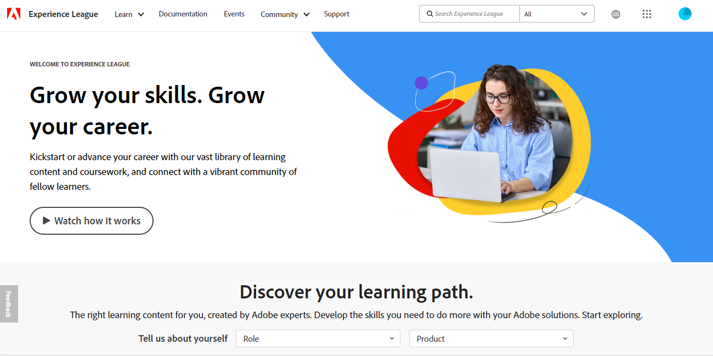

# Adobe Commerce ヘルプセンターユーザーガイド

このガイドでは、サポートチケットをに送信する方法を説明します [Adobe Commerceヘルプセンター](https://support.magento.com/hc/en-us) を設定して、Adobe Commerce アカウントへの共有アクセスを提供します。

>[!NOTE]
>
>Adobe Commerceのサポートは、Adobe Commerce ヘルプセンターからExperience Leagueへと移行しています。 アクセス権があることを通知された場合は、記載されているExperience Leagueケース フォームフローを使用します [こちら](#what-is-experience-support). 通知されていない場合は、引き続きを使用します [Adobe Commerceヘルプセンターのケースフロー](#what-is-adobe-commerce-help-center).

>[!NOTE]
>
>Adobe Commerce ヘルプセンターのナレッジベース部分がAdobe Experience League ポータルに移行されました。 サポートチケットを作成すると、関連するナレッジベース記事が、Adobe Experience Leagueのその他の関連するAdobe Commerce ドキュメントと共に提案されます。

**メジャーアップデート：** 2024 年 7 月 8 日（Pt）

**[Experience Leagueサポートとは](#what-is-experience-support)**

**[サポートケース](#support-cases)**

* [Experience Leagueサポートへのログイン](#sign-in-experience-support)
* [サポートケースの送信](#submit-case)

   * [Adobe Experience League開始ページ](#experience-league-start-page)
   * [Adobe Commerce アカウントページ](#submit-case-adobe-commerce-account-page)
   * [*メールアドレスを確認してください*](#verify-email-address-error)

* [サポートケースのトラッキング](#track-support-cases)
* [あなたのケースのコメント](#comments-in-your-case)
* [ケースを閉じる](#close-case)

**[Adobe Commerce ヘルプセンターとは](#what-is-adobe-commerce-help-center)**

**[サポートチケット](#support-tickets)**

* [ヘルプセンターへのログイン](#login)
* [サポートチケットを送信](#submit-ticket)

   * [ヘルプセンターの開始ページ](#submit-ticket-help-center-start-page)
   * [Magentoアカウントページ](#submit-ticket-magento-account-page)
   * [クラウドコンソール](#submit-ticket-magento-cloud-account-page)
   * [サポートチケットの情報](#info-in-support-ticket)
   * [Adobe Commerce ヘルプセンターの開始ページに「チケットを送信」リンクが表示されない](#no-submit-link)
   * [*「メールアドレスを確認してください」*](#verify-email-address)
   * [チケット送信フォーム：組織ドロップダウンにマーチャントが表示されない](#merchant-not-displayed)

* [チケットの追跡](#track-tickets)
* [Adobe Commerce P1 ホットライン （ログインが必要）](#P1-hotline)
* [Adobe Commerceの共有責任の運用モデル （ログインが必要）](#shared-responsibility-operational-model)
* [サポートチケットフィールドの説明](#ticket-fields-explained)
* [チケットステータス：リクエストの処理方法](#ticket-status)
* [チケット内の会話](#conversation-in-ticket)
* [チケットを解決](#resolve-ticket)
* [フォローアップチケットを開く](#follow-up)

**[共有アクセス：自分のアカウントにアクセスするための権限を他のユーザーに付与します](#shared-access)**

* [共有アクセスを提供できるユーザー](#who-can-provide-shared-access)
* [共有アクセスを提供](#provide-shared-access)
* [共有アクセスの失効（削除）](#revoke-shared-access)

   * [クラウドプロジェクトを介して共有アクセス権を付与されたユーザーを削除する方法を教えてください。](#remove-cloud-shared-access-users)

* [共有アカウントへのアクセス （アカウントの切り替え）](#switch-accounts)
* [共有アクセスのトラブルシューティング](#troubleshooting-shared-access)

**[Adobe Commerceの請求に関する FAQ](#billing-faq)**

**[MAGENTOU は、ADOBEデジタルラーニングサービスの一部になりました](#magento-u)**

>[!NOTE]
>
>通知されない限り、を引き続き使用します [Adobe Commerceヘルプセンターのケースフロー](#what-is-adobe-commerce-help-center). アクセス権を持つコホートに属していると通知された場合は、以下に説明するExperience Leagueケース フォームフローに従います [下](#what-is-experience-league-support).

## Experience Leagueサポートとは {#what-is-experience-support}

Experience Leagueサポートは、Adobe Commerceの正規のお客様がサポートチケットを送信および管理できるAdobe用のサポートポータルです。 また、トラブルシューティング記事を確認することもできます。

## サポートケース {#support-cases}

Adobe Experience League サポートケース管理を使用すると、サポート事例を通じてサポートを活用し、Adobe Commerceを含むAdobe製品を使用中に発生した特定の問題を、契約中のすべてのAdobe Commerce製品に対して解決できます。

## Experience Leagueサポートへのログイン {#sign-in-experience-support}

ログインすると、サポートチケットに関するエージェントからの質問を送信、更新、回答できます。

Adobe Experience League サポートにログインするには、次の手順に従います。

1. に移動します。 [experienceleague.adobe.com](https://experienceleague.adobe.com/).
1. Adobeログイン資格情報を使用してログインします。

### サポートケースの送信 {#support-case}

正常にログインしたら、Adobe Experience Leagueのホームページ、Adobe Commerceのアカウントページ、Adobe Commerce Cloudのアカウントページを使用して、サポートケースを送信できます。

* アカウント所有者の場合は、次の手順に従います。
* 共有アクセスのユーザーの場合、最初にアカウントを切り替える必要があります。 参照： [共有アカウントへのアクセス （アカウントの切り替え）](https://experienceleague.adobe.com/en/docs/commerce-knowledge-base/kb/help-center-guide/magento-help-center-user-guide#switch-accounts)次の手順に進むことができます。

#### Adobe Experience League開始ページ {#experience-league-start-page}

Adobe Experience Leagueの「スタート」ページを使用して新しいサポートケースを送信するには、次の手順に従います。

>[!NOTE]
>
>1. 複数の組織に属している場合は、ドロップダウンから適切な組織を選択する必要があります。
>1. ケースを提出するには、サポートを受ける資格が必要です。 追加されていない場合は、組織でサポート資格を持つユーザーではないことを示すバーがページ上部に表示されます。

1. クリックする **サポート** ヘッダーで。 サポートのホームページが開きます。

   

1. サポートの取り込みプロセスを開始するには、 **[!UICONTROL Open Ticket]** 左側のメニューで、または **[!UICONTROL Get Started]** 。対象： *[!UICONTROL Open a support ticket]* カード。

   

1. ドロップダウンメニューから製品を選択し、ケースのタイトルと説明を入力します。

   

1. Adobe Experience Leagueは、お客様の問題を解決するのに役立つ記事やベストプラクティスを提案します。 それでも直接サポートが必要な場合は、ケースを送信する前に追加情報を提供する必要があります。

   

1. 必要な情報をすべて入力したら、をクリックします。 **[!UICONTROL Submit case]**.

サポートケースを送信するには、Experience Leagueにログインするためのアカウントがhttps://account.adobe.comとhttps://account.magento.comの両方に必要です。 サインインするまでサポート ケースを送信できません。

>[!NOTE]
>
>既にhttps://account.magento.comにアカウントを持っているがログインできない場合、2022 年 8 月からhttps://account.adobe.comにアカウントを登録する必要が生じている可能性があります。
>
>これを解決するには：
>1. MAG ID と同じメールアドレスを使用して、https://account.adobe.comでアカウントを作成します。
>1. https://account.magento.comに移動して、Adobe IDと MAG ID をリンクします。

#### Adobe Commerce アカウントページ {#submit-case-adobe-commerce-account-page}

Adobe Commerce アカウントのページを使用して新しいサポートチケットを送信するには、次の手順に従います。

1. Adobe Commerce アカウントにログインします。 参照： [詳細な手順](https://experienceleague.adobe.com/docs/commerce-admin/start/commerce-account/commerce-account-create.html?lang=en#create-a-commerce-account) を参照してください。
1. 「」をクリックします **サポート** タブ。

   {width="800"}

1. Adobe Experience League サポートページが読み込まれます。
1. を選択 **[!UICONTROL Open Ticket]** 左側のメニューから。
1. フィールドに入力します。
1. クリック **Submit**.

#### *メールアドレスを確認してください* Adobe Commerce アカウントページでエラーが発生しました {#verify-email-address-error}

以下に示すメールアドレスを確認してくださいエラーが表示された場合は、サポートチケットを送信できません。 [Adobe Commerce アカウント](https://account.magento.com/) ページ。

### サポートケースのトラッキング {#track-support-case}

サポートケースは、次のような場合です。

* 直接提出しています。
* は、CC （カーボンコピー）を通じて監視者としてに追加されました。

#### ケースを表示

以下をクリックすると、ケースを表示できます **[!UICONTROL My Cases]** 左側のメニューで、次の操作を行います。

#### ケースの検索

ケースを見つけるには、に検索クエリを入力してください *[!UICONTROL Search]* フィールドとプレス *enter* キーボードの

#### ケースのエスカレーション

さらに注意が必要で、最初の応答時間が経過したと感じた場合は、ケースをエスカレーションできます。 これを行うには、

1. クリックする **[!UICONTROL Escalate to management]** の右下に *[!UICONTROL Case Detail]* 画面の右側にあるパネル。

   

1. クリックすると、ポップアップフォームが表示されます。 フォームに入力し、 **[!UICONTROL Escalate]**.

   

   *エスカレーションの理由には、次のものが含まれます*：エージェントのコミュニケーションスキル、エージェントの技術的知識、コールバック/更新待ち、問題の緊急性の変更、解決が期待に応えなかったこと、解決までの時間。

#### サポートケースに対するウォッチャーの追加

ウォッチャーを追加すると、組織のメンバーから送信されたケースをサポートできます。 新しいケースが送信されたとき、または既存のケースが更新されたときに、ウォッチャーにメール通知が届きます。

1. 既存のケースにウォッチャーを追加するには、ケースを開き、画面の右側にあるケースの詳細パネルの「ウォッチャー」の横にある鉛筆アイコンをクリックします。

   

1. 鉛筆をクリックすると、リストからウォッチャーを追加または削除できます。

   

### あなたのケースのコメント {#comments-in-your-case}

ケースのコメントには、お客様またはAdobe Commerce サポートチームが作成したすべてのコメントが含まれています。 コメントは、最新（上）から最も古い（下）順に表示されます。
コメントを追加するには、次の手順に従います。

1. チケットの一番下までスクロールします。
1. コメントをに書き込みます **[!UICONTROL Comments]** フィールドでクリック **[!UICONTROL Add comments]**.

### ケースを閉じる {#close-case}

ケースを閉じるには、 **[!UICONTROL Close case]** の右下に *[!UICONTROL Case Detail]* パネル。

>[!NOTE]
>
>Adobe Commerce ヘルプセンターのフォームフローを引き続き使用する [下](#what-is-adobe-commerce-help-center) チケットの送信および管理（記載されたExperience Leagueケースフォームフローへのアクセス権を持つコホートに入っていることが通知されていない場合） [こちら](#what-is-experience-league-support).

## Adobe Commerce ヘルプセンターとは {#what-is-adobe-commerce-help-center}

この [Adobe Commerceヘルプセンター](https://support.magento.com/hc/en-us) はAdobe Commerceのサポートポータルで、対象のお客様はサポートチケットを送信および管理できます。 また、トラブルシューティング記事を確認することもできます。

## サポートチケット {#support-tickets}

Adobe Commerce チケットシステムを使用すると、Adobe Commerceの操作中に発生している特定の問題に対処するために、すべてのAdobe Commerce製品に対してサポートチケットを使用できます。

## ヘルプセンターへのログイン {#login}

ログインすると、サポートチケットに関するエージェントからの質問を送信、更新、回答できます。

Adobe Commerce ヘルプセンターにログインするには、次の手順に従います。

1. ヘルプセンター（）にアクセスします。 <https://support.magento.com>.
1. クリック **ログイン** 右上隅

Magentoアカウントの資格情報を使用してログインします。 詳しくは、を参照してください [Magentoアカウント](https://experienceleague.adobe.com/docs/commerce-admin/start/commerce-account/commerce-account-create.html) を参照してください。

### <strong>サポートチケットを送信</strong> {#submit-ticket}

ログインに成功したら、ヘルプセンターの開始ページ、Magentoアカウントページ、Magentoクラウドアカウントページを使用して、サポートチケットを送信できます。

* 次のような場合： **アカウント所有者** 次の手順に従います。
* 次の場合： **共有アクセス ユーザー。最初にアカウントを切り替える必要があります** [共有アカウントへのアクセス （アカウントの切り替え）](#switch-accounts)次の手順に進むことができます。

#### ヘルプセンターの開始ページ {#submit-ticket-help-center-start-page}

Adobe Commerce ヘルプセンターの開始ページを使用して新しいサポートチケットを送信するには、次の手順に従います。

1. に移動 [Adobe Commerceヘルプセンター](https://support.magento.com/hc/en-us).
1. クリック **チケットの送信** 右上隅にあります。

   {width="800"}

1. フィールドに入力します。
1. クリック **Submit**.

あなた *に要件があります* https://account.adobe.comとhttps://account.magento.comの両方のアカウントを使用し、Adobe Commerce アカウントを使用してヘルプセンターにログインして、サポートチケットを送信します。 ログインするまで、 [この **チケットの送信** ボタンが表示されません](#no-submit-link).

>[!NOTE]
>
>既にhttps://account.magento.comにアカウントを持っているがログインできない場合、2022 年 8 月からhttps://account.adobe.comにアカウントを登録する必要が生じている可能性があります。
>
>これを解決するには：
>
>1. MAG ID と同じメールアドレスを使用して、https://account.adobe.comでアカウントを作成します。
>1. https://account.magento.comに移動して、Adobe IDと MAG ID をリンクします。

#### Magentoアカウントページ {#submit-ticket-magento-account-page}

Magentoアカウントページを使用して新しいサポートチケットを送信するには、次の手順に従います。

1. Magentoアカウントにログインします。 参照： [詳細な手順](https://experienceleague.adobe.com/docs/commerce-admin/start/commerce-account/commerce-account-create.html?lang=en#create-a-commerce-account) を参照してください。
1. 「」をクリックします **サポート** タブ。

   {width="800"}

1. ヘルプセンターの開始ページが読み込まれます。
1. クリック **チケットの送信** 右上隅
1. フィールドに入力します。
1. クリック **Submit**.

#### クラウドコンソール {#submit-ticket-magento-cloud-account-page}

Cloud Console を使用して新しいサポートチケットを送信するには、次の手順に従います。

1. にログインします [クラウドコンソール](https://console.adobecommerce.com).
1. を選択 **[!UICONTROL Support]** （ユーザーメニューの場合）。
1. この **[!UICONTROL My Tickets]** ページが読み込まれます。
1. クリック **[!UICONTROL Submit a ticket]** 右上隅
1. フィールドに入力します。
1. クリック **Submit**.
1. クリック **[!UICONTROL Submit]**.

#### サポートチケットの情報 {#info-in-support-ticket}

赤いアスタリスク（ **\*** ）以外の値を入力する必要があります。 これらのフィールドを空のままにすると、チケットを送信できなくなります。

参照： [チケットフィールドの説明](#ticket-fields-explained) 詳しくは、以下を参照してください。

### Adobe Commerce ヘルプセンターの開始ページに「チケットを送信」リンクが表示されない {#no-submit-link}

#### 問題

Adobe Commerce ヘルプセンターにアクセスしてサポートリクエストを送信する場合、 **チケットの送信** ヘルプセンターの開始ページにリンクが表示されません。

#### 原因：

以下のいずれかが原因である可能性があります。

* ヘルプ センターにログインしていません。
* 共有アクセスを初めて使用する場合、Magento.comからの SSO 呼び出しを通じてAdobe Commerce ヘルプセンターが正しく設定されていることを確認するために必要な手順を実行していません。
* お使いのアカウントには、Adobe Commerce サポートを受ける権利がありません（例えば、お客様がCommerceの有料お客様ではない、または Open Sourceのお客様である）。

#### 解決策

[ヘルプセンターにログインします](/help/help-center-guide/help-center/magento-help-center-user-guide.md#provide-shared-access).

この **チケットの送信** リンクは、有効なサポート契約にリンクしたメールを送信したお客様に対してのみ表示されます。

#### 共有アクセスアカウントの使用

共有アクセスアカウントを使用してサポートチケットを送信できるようにするには、次の手順を実行する必要があります（この手順は 1 回だけ実行する必要があります）。

1. 受信後 [共有アクセス](https://support.magento.com/hc/en-us/articles/360052444712#who-can-provide-shared-access)にログインします [magento.com web サイトのMagentoアカウント](https://account.magento.com/).
1. が含まれる **アカウントの切り替え** 右上隅のドロップダウンフィールドで、共有アクセスアカウントを選択します。
1. 「」をクリック **サポート** 左パネルの「」タブ。 これにより、Magento.comからAdobe Commerce ヘルプセンターへの SSO 呼び出しを通じて、Adobe Commerce ヘルプセンターが正しく設定されます。

#### がまだを表示していません **チケットの送信** リンク

持っていない場合 **共有アカウント** の下 **アカウントの切り替え** ドロップダウンリストが表示されますが、現在Adobe Commerce ライセンスを持つクライアントで作業しています。共有アクセスの付与を依頼してください。 詳しくは、を参照してください。 [Magentoアカウントへの共有アクセスを提供](/help/help-center-guide/help-center/magento-help-center-user-guide.md#provide-shared-access).

Adobe Commerce ライセンスオーナーの場合は、で請求書を持っていないことを確認してください **保留中の支払い** ステータス。 サポート資格は、請求書の支払いステータスに応じて、自動的に付与または取り消されます。

お支払い状況の確認方法:

1. へのログイン [magento.com](https://support.magento.com/).
1. クリックする **請求履歴** 左側。
1. 次の場合： **実行** 請求書を持っている **保留中の支払い** ステータス、 **Adobeアカウントチームにお問い合わせください** 支払の問題を解決する。

アドビは、Adobe Commerce ライセンスの所有者と、Adobe Commerce ライセンスを持つアカウントへの共有アクセス権を持つアカウントに対してのみ、サポートを提供します。 Magento Open Source版のサポートが必要な場合は、次のセルフヘルプのテクニカルリソースを利用してください。

* [Adobe Commerceヘルプセンター](https://support.magento.com/)
* [Adobe Commerce開発者向けドキュメント](https://developer.adobe.com/commerce/docs/)
* [Adobe Commerce ドキュメントのリソース](https://experienceleague.adobe.com/docs/commerce.html)
* [Magentoフォーラム](https://community.magento.com/?_ga=2.99592990.1084044056.1559046120-720752292.1551793747)

アカウントにログインする際に問題が発生した場合、または共有アクセスが正しく設定されていると思われるが、表示できない場合 **チケットの送信** ボタンです。E メールを送信してください [ヘルプセンターのログインの問題](mailto:grp-magento-helpcenterloginissues@adobe.com)さらに、アカウント設定とサポート権限を喜んで確認します。

>[!NOTE]
>
>クラウドプロジェクトへのアクセスで問題が発生した場合は、通常のチャネルを通じてこの問題のチケットを送信します。 チケットを送信できる場合は、メールを送信しないでください。

### Magentoアカウントページの「メールアドレスを確認してください」エラー {#verify-email-address}

を受け取った場合、サポートチケットを送信することはできません。 *メールアドレスを確認してください* に関する以下のエラーに類似したエラー [Magentoアカウントページ](https://account.magento.com/).

{width="800"}

解決策は、メールアドレスを検証することです。

1. https://account.adobe.comにログインし、必要に応じてパスワードをリクエストします。
1. Adobeアカウントを確認します。

>[!NOTE]
>
>https://account.magento.com（Magentoアカウントページ）のメール認証リンクにのみ適用されます。

### チケット送信フォーム：組織ドロップダウンにマーチャントが表示されない {#merchant-not-displayed}

#### 問題

前提条件：マーチャントから付与された共有アクセスアカウントがあります。

再現手順:

1. 共有アカウントを使用してヘルプセンターにログインします。
1. 「」をクリックします **チケットの送信** リンク。 チケット送信フォームが開きます。
1. を展開します。 **組織** マーチャントを選択するためのドロップダウンフィールド。

期待される結果:

共有アカウントに対応するマーチャントは、 **組織** オプション。

実際の結果:

使用されている共有アカウントに対応するマーチャントは、 **組織** オプション。

#### 解決策

マーチャントからの共有アクセスが許可されたら、次の手順を実行する必要があります（1 回のみ）。

1. にログイン [magento.com web サイトのMagentoアカウント](https://account.magento.com/).
1. が含まれる **アカウントの切り替え** 右上隅のドロップダウンフィールドで、共有アクセスアカウントを選択します。
1. 「」をクリック **サポート** 左パネルの「」タブ。 これにより、Magento.comからAdobe Commerce ヘルプセンターへの SSO 呼び出しを通じて、Adobe Commerce ヘルプセンターが正しく設定されます。

既にこれを行っている場合は、付与されているかどうかを確認します *複数のマーチャントからの共有アクセス* をクリックする [[!UICONTROL Shared with me] アカウントのタブ](https://account.magento.com/grantor/manage/shared/):
* 1 つだけの場合 [!UICONTROL Share Name] がリストされます。つまり、1 人のマーチャントのみによって許可されています。 *この場合、 [!UICONTROL Organization] ドロップダウン*.
* 複数ある場合 [!UICONTROL Share Names]を選択した場合、支払いの問題が原因で以前にライセンスが取り消されたため、販売員のサポート資格が期限切れになった可能性があります。

### チケットの追跡 {#track-tickets}

チケットは次のユーザーのものです。

* 個人的に提出した
* は、CC （カーボンコピー）を通じて監視者としてに追加されました

#### チケットの表示

すべてのチケットをリストするには、ヘルプセンターの開始ページで自分のプロファイルメニュー（右上隅）をクリックし、 **自分のチケット**.

{width-&quot;800&quot;}

チケットと CC で登録されているチケットを切り替えるには、対応するタブをクリックします。

* **自分のチケット**
* **自分がコピーしたチケット**
* **組織のチケット** （アカウントが複数の組織に関連付けられている場合に使用可能）

チケットを並べ替えるには、 **作成日時** または **最後のアクティビティ** 列ヘッダー。

#### チケットの検索

チケットを検索するには、検索クエリを **チケットを検索** フィールドとプレス *Enter* キーボードの を選択 [ステータス](#ticket-status) 追加のフィルタリングの場合。

#### 組織のチケットをフォロー

組織のメンバーが提出したサポートチケットに従ってください。

組織のチケットをフォローする場合：

* 内でチケットを表示できる **組織のチケット** タブ
* 新しいチケットが送信されたとき、または既存のチケットが変更されたときに、メール通知を受け取る

組織のチケットをフォロー/フォロー解除するには：

1. に移動 **自分のチケット** > **組織のチケット** タブ。
1. メニューで組織を選択し、をクリックします **フォロー/フォロー解除**.

### Adobe Commerce P1 ホットライン {#P1-hotline}

**ログインが必要です** にアクセスする [Adobe Commerce P1 ホットライン](https://experienceleague.adobe.com/docs/commerce-knowledge-base/kb/how-to/adobe-commerce-p1-notification-hotline.html) p1 インシデント発生時のAdobe Commerceのサポートを求める際に P1 ホットライン番号を提供し、提供する情報を説明する記事。

### Adobe Commerceの共通責任運用モデル {#shared-responsibility-operational-model}

の記事を参照してください。 [Adobe Commerceの共通責任運用モデル](https://experienceleague.adobe.com/en/docs/commerce-operations/security-and-compliance/shared-responsibility#operational-responsibilities-summary)これは、当社の Pro インフラストラクチャ製品のみの運用上の責任を明確にすることを目的としています。

### サポートチケットフィールドの説明 {#ticket-fields-explained}

#### 影響を受ける URL

Adobe Commerce サポートチームが問題を確認できる環境へのリンク。 URL は必ず「http://」または「https://」で始めてください。

#### 添付

ログ、スクリーンショット、ビデオ録画、またはその他のメディアを添付して、問題を明確にします。

#### Backoffice URL （MOM のみ）

URL は「https://」で始める必要があります。 通常は、次の形式になります。商社名+&quot;.mcom.magento.com/admin/login&quot;、例：&quot;https://luma.mcom.magento.com/admin/login&quot;。

イシューに関連する直接リンクを配置することもできます。

#### CC

チケットをフォローする人物のメール（例： *first@e.mail*）に設定します。

Magentoアカウントまたは Zendesk アカウントを持たない人のメールを追加できます。これらの人は、引き続きチケットで会話に参加できます。

CC に複数のメールを追加するには：

>[!NOTE]
>
>CC：のユーザーは、https://account.magento.comに既存のアカウントがある必要があります。 そうでない場合は、まずhttps://account.adobe.comでアカウントを作成し、そのアカウントでhttps://account.magento.comにログインする必要があります。

1. メールを入力します。
1. 押す *スペース* キーボードで、入力したメールを保存します。 メールがグレーのフレームで表示されます。\
   
1. 次のメールを入力してください。
1. を押して、その他すべてのメールを保存 *スペース*.

CC からメールを削除するには、次のボタンをクリックします **x** 枠に囲まれたメール内。

#### 製品

使用しているAdobe Commerce製品のタイプを選択します。

* Adobe Commerce: **[!UICONTROL Implementation Type]** フィールドは、このオプションを選択した後に表示されます（詳しくは以下を参照）。
* Magento Order Management
* Adobe Commerce レポート：次を含まない [高度なレポート](https://experienceleague.adobe.com/docs/commerce-admin/config/general/advanced-reporting.html)
* Adobe Commerce [支払いサービス](https://experienceleague.adobe.com/docs/commerce-merchant-services/payment-services/overview.html)
* Adobe Commerce サービス： [チャネルマネージャー](https://experienceleague.adobe.com/docs/commerce-channels/channel-manager/guide-overview.html) のみ

#### 実装タイプ

このフィールドは、を選択した後にのみ表示されます **[!UICONTROL Product]** = *Adobe Commerce*

デプロイ方法を指定してください：

* クラウド：クラウドインフラストラクチャー上でAdobe Commerceを使用している場合にのみ選択します
* オンプレミス： *すべての自己ホストインスタンスと [AWS] クラウドベースのホスティング* （Adobe Commerce on Cloud を除く）

#### クラウドプロジェクト URL

Cloud Console プロジェクトの URL （例：）を指定してください。 `https://console.adobecommerce.com/<owner-user-name>/<project-ID>`.

プロジェクト URL を取得するもう 1 つの方法は次のとおりです。

1. にログインします [クラウドコンソール](https://console.adobecommerce.com).
1. 適切なプロジェクトをクリックします。
1. URL をコピーします。

#### 連絡先の理由

お問い合わせの理由は製品によって異なります。 発生している症状に最も適した接触理由を選択します。 を参照してください。 [サポートチケットの連絡理由の説明](/help/faq/general/support-ticket-contact-reason-descriptions.md) 選択する必要がある連絡先の理由の詳細については、記事を参照してください。

#### Adobe Commerce環境 ID

このフィールドは、を選択した後にのみ表示されます **[!UICONTROL Contact Reason]** = *Adobe Commerce Cloud アプリケーション*、続いて **Adobe Commerce アプリケーションの連絡理由** = *[!DNL Live Search]*.
に移動 **[!UICONTROL System]** > **[!UICONTROL Services]** > **[!UICONTROL Commerce Services Connector]** > **[!UICONTROL SaaS Identifier]**、およびを提供します *[!UICONTROL Data Space ID]*.

#### （Data）統合タイプ（Adobe Commerce レポートのみ）

Adobe Commerce レポート内の統合のタイプを選択します。 これにより、エンジニアが問題をより効率的に解決できるようになります。

#### 説明

問題の概要を、合理的に可能な限り多くの詳細と共に記載します。

正確な詳細と再現手順を指定してください（個別に設定されているAdobe Commerce オンプレミスおよびクラウドインフラストラクチャを除く） [再現手順](#steps) フィールド）、および問題やリクエストの症状。 影響を受ける SKU、関連するデータポイント、その他の関連リンクを必ず含めてください。

#### 環境（Adobe Commerce on cloud infrastructure、Adobe Commerce オンプレミス、Adobe Commerce Reporting and Shipping のみ）

「」を選択します **環境タイプ** 問題に直面している問題：

* 開発（**統合の分岐**）
* ステージング
* 実稼動

詳しくは、のクラウドインフラストラクチャー環境におけるAdobe Commerceを参照してください。 [Pro アーキテクチャ](https://experienceleague.adobe.com/docs/commerce-cloud-service/user-guide/architecture/pro-architecture.html) ユーザーガイドの記事。

#### 影響を受けた注文の数（MOM のみ）

影響を受ける注文の範囲を選択します。

これはドロップダウンであり、Order Management製品にのみ適用されます。

#### 組織

複数の組織を操作する場合に備えて、チケットを関連付ける組織を指定します。

このフィールドは、アカウントが複数の組織に関連付けられている場合に表示されます。

>[!WARNING]
>
>正しい組織を選択していることを確認する必要があります。 組織と関係のないサードパーティは、誤った組織を選択した場合、機密性が高く所有権がある可能性のある情報を表示できます。

>[!NOTE]
>
>組織は、チケットの送信後に変更できます。 組織を変更するには、次の手順に従います。
>
>1. チケットの右列に移動します。
>1. 使用可能な組織のドロップダウンを見つけます。
>1. 適切な組織を選択します。
>
>

さらに、これにより、過去にこの組織に送信された類似/重複/関連チケットを素早く相互参照し、現在のチケットの調査と解決に役立つ手がかりを特定できます。

複数の組織への共有アクセス権を持っているが、このフィールドを使用できない場合は、を参照してください [チケット送信フォーム：組織ドロップダウンにマーチャントが表示されない](https://experienceleague.adobe.com/docs/commerce-knowledge-base/kb/help-center-guide/magento-help-center-user-guide.html#merchant-not-displayed)

#### パートナー名（商社名）

マーチャントの場合： **パートナー名** は開発組織の名前（Adobe Commerce [技術パートナー](https://partners.magento.com/portal/directory/?&amp;partner_type=6) または [ソリューションパートナー](https://partners.magento.com/portal/directory/?&amp;partner_type=1)）を作成する必要があります。（Adobe Commerce ストアの開発に使用します。

パートナーの場合： **商社名** は顧客の名前です。

#### プロジェクト URL （Commerce Cloudのみ）

へのリンク [クラウドコンソール](https://experienceleague.adobe.com/docs/commerce-cloud-service/user-guide/project/overview.html).

#### 再現手順（Adobe CommerceのオンプレミスおよびAdobe Commerceのクラウドインフラストラクチャのみ）

問題を再現するための、次のような正確な手順を説明します。

* レプリケートする手順
* 期待される結果
* 実際の結果

*推奨事項：* を知っている人向けに、これらの手順を記述しているとします **なし** Adobe Commerceについて：

* 単純で明白に思える場合でも、すべての手順について言及します
* 読者が自分の言いたいことを知っているという前提に頼ってはいけない

簡単な言語と短い文で書きなさい。

#### 件名

問題の短い概要を含める（例： *すべてのページのエラー 404*）に設定します。

**提案記事：** 検索語句を入力すると、問題に関連する可能性のあるAdobe Commerce ドキュメント記事のリストが表示されます。 リスト内の記事をクリックして開きます。

*推奨事項：* 提案記事を慎重に検討してください。Adobe Commerce サポートチームから受け取る予定のソリューションが含まれている可能性があります。

#### バージョン （Adobe Commerce オンプレミス、Adobe Commerce on cloud infrastructure および出荷専用）

ヘルプをリクエストするAdobe Commerceのバージョンを選択してください。 サポートされているAdobe Commerceのすべてのバージョンが上部に一覧表示されます。 サポートされていないバージョンは、末尾にかっこで囲まれて表示されます。 移行中の場合は、サポートを確実に行うために最新バージョンを選択してください。

Adobe Commerce（クラウドインフラストラクチャ）のバージョンを見つけるには、下にスクロールします [クラウドコンソール](https://experienceleague.adobe.com/docs/commerce-cloud-service/user-guide/project/overview.html) ページを開いて、ウィンドウの下部中央を確認します。

を使用している場合 [Elasticsearch](https://experienceleague.adobe.com/docs/commerce-operations/installation-guide/prerequisites/search-engine/overview.html) または [OpenSearch](https://experienceleague.adobe.com/docs/commerce-operations/installation-guide/prerequisites/search-engine/aws-opensearch.html)ただし、このオプションは選択しないでください。

この情報を取得するには、Adobe Commerce Admin で次の URL に移動します。 **Marketing** > **Live Search** > **GraphQLプレイグラウンド**&#x200B;をクリックし、ページの下部までスクロールダウンしてから、 **HTTP ヘッダー**.

### チケットステータス：チケットの処理方法 {#ticket-status}

チケットには、次の 3 つのステータスのいずれかが含まれている可能性があります。

#### **1.開く**

チケットは解決されず、Adobe Commerce サポートチームによって処理されています。 会話の特定の手順で求められる情報をすべて指定し、次の手順をAdobe Commerce サポートが実行する必要がある場合、チケットに含まれるは **開く** ステータス。

#### **2. 返信待ち**

Adobe Commerce サポートは、あなたからの情報を期待しています。

お返事には、問題の技術的な詳細を明記したり、エスカレーションの詳細を入力したり、Adobe Commerce サポートが提供するソリューションがお客様の問題に役立ったことが証明されたかどうかを伝えたりすることができます。 Adobe Commerce サポートはチケットがにある間はチケットの処理を進めることができないので、できるだけ早く返信してください **返信待ち** ステータス。

を参照 [Adobe Commerce サポートチケットのライフサイクルポリシーの更新](/help/help-center-guide/help-center/magento-support-ticket-lifecycle-policy-update.md) タイミングと通知ポリシーの詳細に関する記事。

#### **3. 解決**

Adobe Commerce サポートがお客様の問題に対する解決策を提供し、役に立つことに同意していただけました。 チケットに次のマークを付けるのは君です **解決**. 修正された問題が再び発生した場合は、チケットのステータスを「back」に設定して、チケットを再度開くことができます **開く**.

### チケット内の会話 {#conversation-in-ticket}

チケット内の会話には、お客様またはAdobe Commerce サポートチームが書いたすべてのコメントが統合されます。 コメントは、最新（上）から最も古い（下）順に表示されます。

会話にコメントを追加するには、次の手順に従います。

1. チケットの一番下までスクロールします。
1. 「」をクリックします **会話に追加** 書き込みを開始するフィールド。

   

1. コメントにユーザーを追加するには、電子メールを **CC** コメントフィールドのフィールド。

   >[!NOTE]
   >
   >CC：のユーザーは、https://account.magento.comに既存のアカウントがある必要があります。 そうでない場合は、まずhttps://account.adobe.comでアカウントを作成し、そのアカウントでhttps://account.magento.comにログインする必要があります。

   

1. コメントの入力が完了したら、 **Submit**.

### チケットを解決 {#resolve-ticket}

チケットを解決するには、 **解決済みとしてマーク** チケットの一番下

### フォローアップチケットを開く {#follow-up}

フォローアップチケットを開くと、元のイシューが継続性のためにフォローアップチケットにリンクされます。

フォローアップチケットを開くには、「*フォローアップの作成*」リンクをクリックします。このリンクは、フォローアップを作成するチケットの下部にあります。

## 共有アクセス：自分のアカウントにアクセスするための権限を他のユーザーに付与します {#shared-access}

お客様は、お客様のアカウントに対し、他のAdobe Commerce アカウント所有者による限定的なアクセスを許可することができます。 特に、 **共有アクセス** 機能として、信頼できる従業員やサービスプロバイダーにヘルプセンターアカウントを使用するための権限を付与し、サポートチケットを操作できるようにすることができます。

共有アクセスを提供および管理するには、次のAdobe Commerce アカウントページを使用します。 [https://account.magento.com](https://account.magento.com/).

### 共有アクセスを提供できるユーザー {#who-can-provide-shared-access}

従った権限を持つアカウント所有者（プライマリアカウント所有者）のみが、他のユーザーに共有アクセスを提供できます。

ユーザーとそのアクセスの管理は、特に共有アクセスの観点から、顧客の責任です。 そのため、Adobe Commerce サポートチームは、お客様の代わりにAdobe Commerce アカウントに共有アクセスを提供することはできません。 お客様は、を使用して、自身を共有アクセスでユーザーを追加することをお勧めします [Adobe Commerce アカウントページ](https://account.magento.com/).

共有アクセス権が付与されたユーザーは、そのアクセス権を他のユーザーに転送または付与することはできません。

### 共有アクセスを提供 {#provide-shared-access}

を参照してください。 [Commerce アカウントの共有](https://experienceleague.adobe.com/en/docs/commerce-admin/start/commerce-account/commerce-account-share) 共有アカウントの設定手順について詳しくは、Adobe Commerce入門ガイドの節を参照してください。

新しいユーザーに共有アクセスを提供すると、関連情報をで利用できるようになります。 **共有アクセス** > **権限の管理** （Adobe Commerce アカウントページ）。

### 共有アクセスの失効（削除） {#revoke-shared-access}

1. Adobe Commerce アカウント（）にログインします [https://account.magento.com](https://account.magento.com/).
1. 左側のパネルの「共有アクセス」で、次を選択します **権限の管理。**
1. 共有アクセスを取り消すユーザーを見つけて、クリックします {width="25"} ユーザーの行（**アクション** 列）に含まれます。
1. クリック **ユーザーの削除** をクリックしてアクセスを取り消すか、左上隅の X をクリックして取り消しをキャンセルします。

   {width="800"}

   共有アクセスは、を使用して取り消すこともできます **編集** メニュー：

1. Adobe Commerce アカウント（）にログインします [https://account.magento.com](https://account.magento.com/).
1. 左側のパネルの「共有アクセス」で、次を選択します **権限の管理。**
1. 共有アクセスを取り消すユーザーを見つけて、クリックします **編集** ユーザーの行（**アクション** 列）に含まれます。
1. クリック **このユーザーを削除** ページの下部
1. 確認のポップアップで、 **ユーザーの削除** をクリックしてアクセスを取り消すか、左上隅の X をクリックして取り消しをキャンセルします。

### クラウドプロジェクトを介して共有アクセス権を付与されたユーザーを削除する方法を教えてください。 {#remove-cloud-shared-access-users}

<u>影響を受ける製品とバージョン</u>

* Adobe Commerce Cloud（すべてのバージョン）

<u>原因：</u>

Adobe Commerce Cloud プロジェクトを持っていて、そのプロジェクトにユーザーを追加した場合、プロジェクト所有者の画像 ID に対する共有アクセスが自動的に付与されます。 これは通常、で示されます **[!UICONTROL Share Name]** 列、表示 *MAG からのクラウド共有アクセス[XYZ]*.

DELETEリンクが見つからない場合は、Commerce Cloudを通じて Shared Access が自動的に付与されたことを意味します。

<u>解決策</u>

共有名がの共有アクセスユーザーのリストは削除できません *MAG からのクラウド共有アクセス[XYZ]* このページで共有アクセスが追加/指定されていない場合。 これらは、情報/監査目的で保持されます。

ただし、それらの共有アクセスユーザーに対する権限を取り消すと、そのユーザーはアクセスできなくなります。

1. Adobe Commerce アカウント（）にログインします [https://account.magento.com](https://account.magento.com/).
1. 左側のパネルの下の *[!UICONTROL Shared Access]*、を選択 **[!UICONTROL Manage Permissions]**.
1. 共有アクセスを取り消すユーザーを見つけて、クリックします **[!UICONTROL Edit]** ユーザーの行（*[!UICONTROL Actions]* 列）に含まれます。
1. 以下にあるすべてのリソースのチェックを解除 *[!UICONTROL Grant Account Permissions]*.

{width="800"}

詳しくは、を参照してください。 [ユーザーアクセスの管理](https://experienceleague.adobe.com/docs/commerce-cloud-service/user-guide/project/user-access.html#manage-users-from-the-project-web-interface) クラウドインフラストラクチャーに関するCommerceガイドのドキュメント。

### 共有アカウントへのアクセス （アカウントの切り替え） {#switch-accounts}

提供された共有アクセスを使用するには、次の手順に従います。

1. Adobe Commerce アカウント（）にログインします [https://account.magento.com](https://account.magento.com/).
1. 「」をクリックします **アカウントの切り替え** メニューとアカウントを選択します。

   {width="800"}

現在使用しているアカウント（独自のネイティブアカウントまたは共有アクセス）を調べるには、 **アカウントの切り替え** メニュー：アクティブなアカウントが表示されます。

### 共有アクセスのトラブルシューティング {#troubleshooting-shared-access}

を参照してください [共有アクセスのトラブルシューティング記事](/help/troubleshooting/miscellaneous/shared-access-troubleshooting.md) サポートナレッジベースで。

## Adobe Commerceの請求に関する FAQ {#billing-faq}

加盟店は通常、サービスの代金をクレジットカード（CC）で支払います。以下に例を示します。 [Adobe Commerceの請求に関する FAQ](/help/faq/general/billing-faq-for-adobe-commerce.md) は、お客様が支払いを行う際に役立つリソースです。

## MAGENTOU は、ADOBEデジタルラーニングサービスの一部になりました {#magento-u}

MagentoU はと統合されました [Adobeデジタルラーニングサービス（ADLS）](https://learning.adobe.com/).

