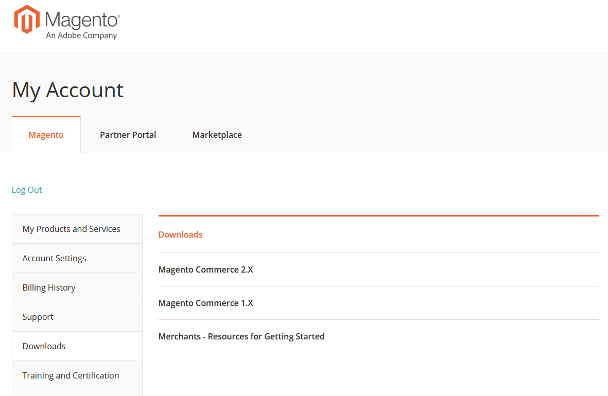

# Adobe Commerce カスタマーサポートガイドへのアクセス

Adobe Commerce カスタマーサポートガイドでは、カスタマーサポートサービスとその利用方法について説明しています。 これには、サポート関係に関するベストプラクティス、診断に必要な情報の収集、カスタマーサポートの優先度、サポートリクエストの送信、リソースへのリンクが含まれます。 このガイドには、Magentoアカウントページの「ダウンロード」セクションからアクセスできます。 アクセスする手順：

1. Magento[ アカウントログインページ ](https://account.magento.com/customer/account/login) に移動します。
1. Magentoのユーザー名とパスワードを使用してログインします。
1. 左側のナビゲーションバーで、「**ダウンロード**」をクリックします。
1. 右側のウィンドウで、[**マーチャント – はじめに用のリソース**] をクリックします。  
