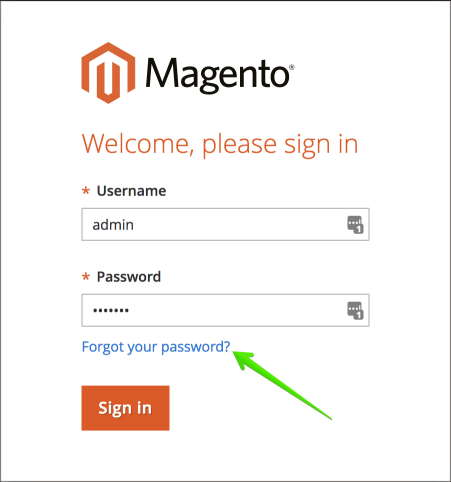

# クラウドインフラストラクチャ上のAdobe Commerceの管理者パスワードの変更

## 方法1：パスワードを忘れた（電子メールでリセット）

ユーザーガイドの「[管理者ログインのパスワードをリセットする](https://experienceleague.adobe.com/docs/commerce-admin/start/admin/admin-signin.html?lang=ja#admin-sign-in)」の手順をご覧ください。

以下は、重要な使用上の注意です。

### 送信メールを有効にする

**パスワードを忘れた** フォームを使用する前に、[Cloud Console](https://experienceleague.adobe.com/docs/commerce-cloud-service/user-guide/project/overview.html?lang=ja)を使用して[送信メール &#x200B;](https://experienceleague.adobe.com/docs/commerce-cloud-service/user-guide/project/outgoing-emails.html?lang=ja)を有効にしてください。 これは、統合環境とサンドボックスプロジェクトにのみ適用されます。

Pro実稼動環境またはステージング環境で送信メールが本当に無効になっている場合（SendGridで電子メールが取得されていないことを意味する場合）、「[&#x200B; クラウドコンソールで電子メールを有効にする](https://experienceleague.adobe.com/ja/docs/commerce-on-cloud/user-guide/project/outgoing-emails#enable-emails-in-the-cli)」をオンにすることで、これを確認できます。 問題が解決しない場合は、Adobe [&#x200B; サポートチケット &#x200B;](https://experienceleague.adobe.com/ja/docs/commerce-knowledge-base/kb/help-center-guide/magento-help-center-user-guide)を送信できます。

### 迷惑メールフォルダーを確認する

パスワードをリセット リンクしたメッセージが見つからない場合は、*迷惑メール* フォルダーを確認してください。 電子メールの名前は、管理者ユーザー名&#x200B;*の* パスワードリセット確認です。

## 方法2：新しい管理者ユーザーを追加する

既存のユーザーのパスワードを復元またはリセットできない場合は、新しい管理者ユーザーを作成し、このユーザーのパスワードを設定できます。 これを行うには、次の手順を実行します。

1. [SSHを使用して、リモート環境](https://experienceleague.adobe.com/docs/commerce-cloud-service/user-guide/develop/secure-connections.html?lang=ja)にログインします。
1. 次のコマンドを実行します：`bin/magento admin:user:create   --admin-user=%user_name% --admin-password=%your_password% --admin-email=%your_email% --admin-firstname=%admin_user_first_name% --admin-lastname=%admin_user_last_name%`
