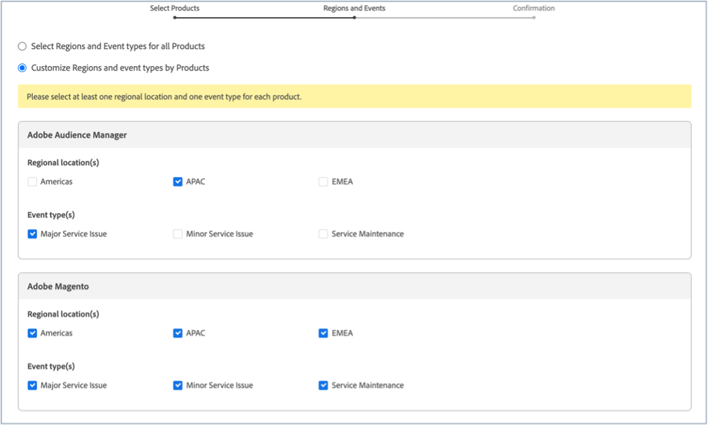

# Adobe Commerceのステータス更新の購読方法

## Adobe Magentoのステータス更新を購読する方法

1. [Adobe ステータス &#x200B;](https://status.adobe.com/ja-jp)に移動します。
1. 「**ログイン**」をクリックします。
1. Adobeの資格情報でログインします。
1. オプションが表示されている場合は、**会社または学校アカウント**&#x200B;を選択します。
1. リストされたクラウドの上の右上にある「**サブスクリプションを管理**」をクリックします。

   
1. 「**サブスクリプションを作成**」をクリックします。

   
1. 製品の通知を選択できるウィンドウが表示されます。 プロファイルに基づいて一部のサブスクリプションが事前選択されている場合や、既に一部のサブスクリプションを設定している場合があるので、次のスクリーンショットとは異なる場合があります。 Experience Cloudの下の&#x200B;**Adobe Magento**&#x200B;をクリックします。 すべてのAdobe Magento サービスに関する通知を受け取りたい場合は、「Adobe Magento」チェックボックスをオンにします。 これにより、Adobe Magento セクションが展開されるときに表示されるすべてのAdobe Magento サービスが自動的に選択されます（スクリーンショットを参照）。

   

   または、1つのAdobe Magento サービスを選択するには、他のAdobe Magento サービスのチェックボックスをオフにします。 例えば、Order Management（MOM）の通知のみを受け取りたい場合は、他のサービスのチェックを外して、Adobe Magento チェックボックスとOrder Management（MOM）チェックボックスのみがオンになります（スクリーンショットを参照）。

   
1. 選択した地域とイベントの製品に関する通知を選択できるウィンドウが表示されます。 すべての製品について同じ地域とイベントタイプの通知を受け取りたい場合は、「**すべての製品の地域とイベントタイプを選択**」チェックボックスをオンにします（スクリーンショットを参照）。

   

   または、複数の製品（Adobe Magento以外）を購読しており、各製品に異なる地域とイベントタイプの通知を設定する場合は、「**製品ごとに地域とイベントタイプをカスタマイズ**」チェックボックスをオンにします（スクリーンショットを参照）。

   
1. **続行**&#x200B;をクリックします。
1. 「**サブスクリプション設定を確認する**」ウィンドウが表示されます。 通知に目的が反映されていることを確認します。 「**完了**」をクリックします。

「**完了**」をクリックすると、製品のサブスクリプションとイベントのサブスクリプションの概要が表示され、Adobeから「ステータスに関するメール通知の購読」というタイトルのメールが届きます。 購読解除や通知設定の変更を行う場合は、手順1～9を繰り返します。
