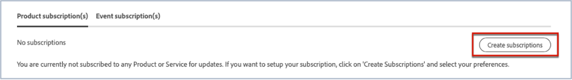
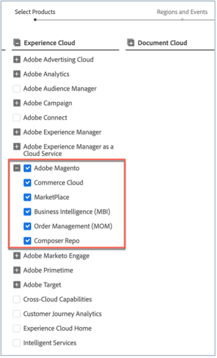

# Adobe Commerce ステータスのアップデートを購読する方法

## AdobeMagentoステータスのアップデートを購読する方法

1. に移動 [Adobeステータス](https://status.adobe.com).
1. クリック **ログイン**.
1. Adobeの資格情報を使用してログインします。
1. を選択 **会社または学校アカウント** オプションが表示されている場合。
1. クリック **購読の管理** 右上に、リストされている雲の上。

   
1. クリック **購読の作成**.

   
1. 製品の通知を選択できるウィンドウが表示されます。 プロファイルに基づいて一部の購読が事前に選択されている場合や、一部の購読が既に設定されている場合があるので、次のスクリーンショットとは異なる場合があります。 クリックする **AdobeMagento** Experience Cloudの下。 すべてのAdobeMagentoサービスに関する通知を受け取りたい場合は、「AdobeMagento」チェックボックスをオンにします。 これにより、AdobeMagentoセクションが展開されたときに表示されるすべてのAdobeMagentoサービスが自動的に選択されます（スクリーンショット参照）。

   

   または、1 つのAdobeMagentoサービスを選択するには、他のAdobeMagentoサービスのチェックボックスをオフにします。 したがって、例えば、Order Management （MOM）の通知のみを受け取りたい場合は、他のサービスのチェックを外して、「AdobeMagento」チェックボックスと「Order Management （MOM）」チェックボックスのみをチェックします（スクリーンショットを参照）。

   
1. 選択した地域およびイベントに関する製品の通知を選択できるウィンドウが表示されます。 すべての製品で同じ地域およびイベントタイプの通知を受信する場合は、 **すべての製品の地域とイベントタイプを選択** チェックボックス（スクリーンショットを参照）。

   

   または、複数の商品（AdobeMagentoだけでなく）を購読しており、各商品に異なるリージョンやイベントタイプの通知を含めたい場合は、 **製品別の地域とイベントタイプのカスタマイズ** チェックボックス（スクリーンショットを参照）。

   
1. クリック **続行**.
1. この **購読設定を確認** ウィンドウが表示されます。 通知に目的が反映されていることを確認します。 クリック **完了**.

クリックした後 **完了** 商品のサブスクリプションとイベントのサブスクリプションの概要が表示され、Adobeから「ステータスメール通知のサブスクリプション」というタイトルのメールが届きます。 通知設定を登録解除または変更する場合は、手順 1 ～ 9 を繰り返します。
