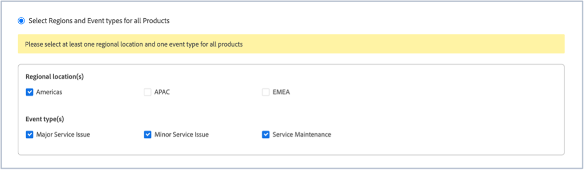

# Adobe Commerce ステータスのアップデートを購読する方法

## AdobeMagentoステータスのアップデートを購読する方法

1. [Adobeの状態 &#x200B;](https://status.adobe.com) に移動します。
1. **ログイン** をクリックします。
1. Adobeの資格情報を使用してログインします。
1. オプションが表示されている場合は、「**会社または学校アカウント**」を選択します。
1. 一覧表示されているクラウドの右上にある **購読を管理** をクリックします。

   
1. **購読を作成** をクリックします。

   
1. 製品の通知を選択できるウィンドウが表示されます。 プロファイルに基づいて一部の購読が事前に選択されている場合や、一部の購読が既に設定されている場合があるので、次のスクリーンショットとは異なる場合があります。 Experience Cloudの下の **AdobeMagento** をクリックします。 すべてのAdobeMagentoサービスに関する通知を受け取りたい場合は、「AdobeMagento」チェックボックスをオンにします。 これにより、AdobeMagentoセクションが展開されたときに表示されるすべてのAdobeMagentoサービスが自動的に選択されます（スクリーンショット参照）。

   

   または、1 つのAdobeMagentoサービスを選択するには、他のAdobeMagentoサービスのチェックボックスをオフにします。 例えば、Order Management（MOM）の通知のみを受け取りたい場合は、他のサービスのチェックボックスをオフにして、AdobeMagentoとOrder Management（MOM）のチェックボックスのみをオンにします（スクリーンショットを参照）。

   
1. 選択した地域およびイベントに関する製品の通知を選択できるウィンドウが表示されます。 すべての製品で同じリージョンとイベント タイプの通知を受信する場合は、[**すべての製品のリージョンとイベント タイプを選択**] チェックボックスをオンにします（スクリーンショットを参照）。

   

   また、複数の商品（AdobeMagentoだけでなく）を購読しており、各商品に異なる地域とイベントタイプの通知を表示したい場合は、**商品ごとに地域とイベントタイプをカスタマイズ** チェックボックスをオンにします（スクリーンショットを参照）。

   
1. **続行** をクリックします。
1. **購読設定を確認** ウィンドウが表示されます。 通知に目的が反映されていることを確認します。 「**完了**」をクリックします。

**完了** をクリックすると、商品のサブスクリプションとイベントのサブスクリプションの概要が表示され、Adobeから「ステータスメール通知のサブスクリプション」というタイトルのメールが届きます。 通知設定を登録解除または変更する場合は、手順 1 ～ 9 を繰り返します。
