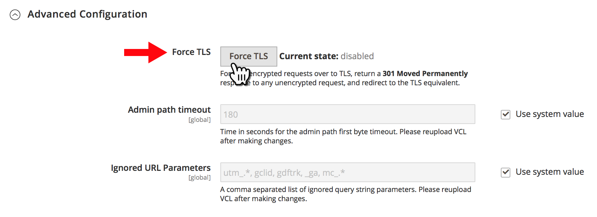

# クラウドインフラストラクチャー上のAdobe Commerceのすべてのページに対する HTTP の HTTPS へのリダイレクト（TLS を強制）

Fastly のをアクティブ化 **TLS を強制** Commerce管理者の機能を使用すると、クラウドインフラストラクチャストア上のAdobe Commerceのすべてのページに対して、グローバル HTTP から HTTPS へのリダイレクトを有効にできます。

この記事では詳細を説明します [手順](#steps):TLS を強制機能の概要、影響を受けるバージョン、関連ドキュメントへのリンク。

## 手順 {#steps}

### 手順 1：セキュア URL を設定 {#step-1-configure-secure-urls}

この手順では、ストアのセキュア URL を定義します。 既に完了している場合は、に移動します [手順 2:Force TLS を有効にする](#step-2-enable-force-tls).

1. Commerce Admin にログインします。
1. に移動します。 **ストア** > **設定** > **一般** > **Web**.
1. を展開します。 **ベース URL （セキュア）** セクション。    
1. が含まれる **セキュアなベース URL** フィールドに、ストアの HTTPS URL を指定します。
1. を **ストアフロントでセキュアな URL を使用** および **管理者にセキュア URL を使用** 設定 **はい**.    
1. クリック **設定を保存** をクリックし、変更を適用します。

**ユーザーガイドの関連ドキュメント：**   [URL を格納](https://docs.magento.com/m2/ee/user_guide/stores/store-urls.html).

### 手順 2:Force TLS を有効にする {#step-2-enable-force-tls}

1. Commerce Admin で、に移動します。 **ストア** > **設定** > **詳細** > **システム**.
1. を展開します。 **フルページキャッシュ** セクション、次に **Fastly 設定**、次に **詳細設定**.
1. 「」をクリックします **TLS を強制** ボタン。    
1. 表示されるダイアログで、 **Upload**.    
1. ダイアログが閉じた後、「TLS を強制」の現在の状態が次のように表示されていることを確認します **enabled**.    

**関連する Fastly ドキュメント：**   [TLS 強制ガイド](https://github.com/fastly/fastly-magento2/blob/master/Documentation/Guides/FORCE-TLS.md) （Adobe Commerce 2 の場合）

## Force TLS について

TLS （Transport Layer Security）は、セキュリティの低い先行プロトコルである SSL （Secure Socket Layer）プロトコルに代わる、セキュリティで保護された HTTP 接続のためのプロトコルです。

Fastly の TLS 強制機能を使用すると、サイトページに対するすべての暗号化されていない受信要求を TLS に強制できます。

>>
関数は、以下を返すことによって機能します。 *301 が完全に移動されました* 暗号化されていない要求への応答。TLS と同等の要求にリダイレクトされます。 例えば、 *http://www.example.com/foo.jpeg* リダイレクト先 *https://www.example.com/foo.jpeg*.

[通信の保護](https://docs.fastly.com/guides/securing-communications/) （Fastly ドキュメント）

## 影響を受けるバージョン

* **クラウドインフラストラクチャー上のAdobe Commerce:**
   * バージョン：2.1.4 以降
   * プラン：クラウドインフラストラクチャー上のAdobe Commerce スタータープランアーキテクチャとクラウドインフラストラクチャー上のAdobe Commerce Pro プランアーキテクチャ（Pro Legacy を含む）
* **Fastly:** 1.2.4

## routes.yaml での変更は必要ありません

で HTTP から HTTPS へのリダイレクトを有効にするには **all** ストアのページの場合、 `routes.yaml` 設定ファイル – （Commerce管理者を使用して）ストア全体に対して TLS をグローバルに強制を有効にするだけで十分です。

## 関連する Fastly ドキュメント

* [Adobe Commerce 2 用 TLS 強制ガイド](https://github.com/fastly/fastly-magento2/blob/master/Documentation/Guides/FORCE-TLS.md)
* [TLS リダイレクトの強制](https://docs.fastly.com/guides/securing-communications/forcing-a-tls-redirect)
* [通信の保護](https://docs.fastly.com/guides/securing-communications/)
