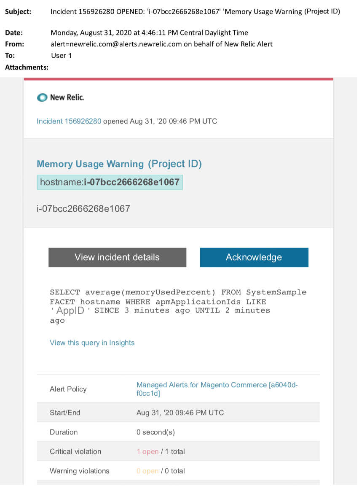

# Managed alerts for Adobe Commerce:memory warning アラート

この記事では、New RelicでAdobe Commerceのメモリ警告アラートが表示された場合のトラブルシューティング手順を説明します。 この問題を修正するには、直ちに対処する必要があります。 選択したアラート通知チャネルに応じて、アラートは次のようになります。

{width="500"}

## 影響を受ける製品とバージョン

Adobe Commerce on cloud infrastructure Pro プランアーキテクチャ

## 問題

[Adobe Commerceの Managed アラート ](/help/support-tools/managed-alerts-for-adobe-commerce/managed-alerts-for-magento-commerce.md) にサインアップし、1 つ以上のアラートしきい値を超えた場合、New Relicでアラートが届きます。 これらのアラートは、サポートおよびエンジニアリングのインサイトを使用して、標準セットをお客様に提供するために、Adobe Commerceで開発されました。

<u>**実行**</u>:

* このアラートがクリアされるまで、スケジュールされているデプロイメントを中止することをお勧めします。
* サイトが応答しない、または完全に応答しなくなった場合は、すぐにサイトをメンテナンスモードにします。 手順については、開発者向けドキュメントの [ インストールガイド/メンテナンスモードの有効化または無効化 ](https://devdocs.magento.com/guides/v2.4/install-gde/install/cli/install-cli-subcommands-maint.html?itm_source=devdocs&amp;itm_medium=search_page&amp;itm_campaign=federated_search&amp;itm_term=mainten) を参照してください。 トラブルシューティングのためにサイトに引き続きアクセスできるように、IP を除外 IP アドレスリストに追加してください。 手順については、開発者向けドキュメントの [ 免除 IP アドレスのリストを管理する ](https://devdocs.magento.com/guides/v2.4/install-gde/install/cli/install-cli-subcommands-maint.html?itm_source=devdocs&amp;itm_medium=search_page&amp;itm_campaign=federated_search&amp;itm_term=mainten#instgde-cli-maint-exempt) を参照してください。

<u>**止めて！**</u>:

* 追加のマーケティングキャンペーンを開始すると、サイトに追加のページビューが表示される場合があります。
* インデクサーまたは追加のクローンを実行すると、CPU またはディスクに追加の負荷がかかる可能性があります。
* 主要な管理タスク（管理者、データの読み込み/書き出し）を実行します。
* キャッシュをクリアします。

## 解決策

原因の特定とトラブルシューティングを行うには、次の手順に従います。

1. [New Relic APM のインフラストラクチャページ ](https://docs.newrelic.com/docs/infrastructure/infrastructure-ui-pages/infra-hosts-ui-page/) を使用して、メモリを大量に消費する上位のプロセスを特定します。 手順については、New Relicを参照してください [Infrastructure monitoring Hosts ページ/「プロセス」タブ ](https://docs.newrelic.com/docs/infrastructure/infrastructure-ui-pages/infra-hosts-ui-page/#processes)。 メモリ消費の上位ソースが Redis や MySQL などのサービスである場合は、次の操作を実行してください。

   * 最新バージョンを使用していることを確認します。 新しいバージョンでは、メモリリークが修正される場合があります。 最新バージョンでない場合は、アップグレードを検討してください。 手順については、開発者向けドキュメントの [ クラウドインフラストラクチャー上のAdobe Commerce/サービス/サービスを変更 ](https://experienceleague.adobe.com/docs/commerce-cloud-service/user-guide/configure/service/services-yaml.html) を参照してください。
   * それでもメモリ消費量が増加した原因を特定できない場合は、クエリの長時間実行、プライマリキーが定義されていない、インデックスが重複しているなど、MySQL の問題がないかどうかを確認します。 手順については、サポートナレッジベースの [ クラウドインフラストラクチャ上のAdobe Commerceで発生するデータベースの最も一般的な問題 ](https://experienceleague.adobe.com/docs/commerce-operations/implementation-playbook/best-practices/maintenance/resolve-database-performance-issues.html) を参照してください。
   * MySQL の問題がない場合は、PHP の問題を確認してください。 CLI/ターミナルで `ps aufx` を実行して、実行中のプロセスを確認します。 端末の出力には、現在実行中の cron ジョブとプロセスが表示されます。 出力でプロセスの実行時間を確認します。 実行時間が長い Cron がある場合は、Cron がハングしている可能性があります。 トラブルシューティング手順については、サポートナレッジベースの [ パフォーマンスが遅い、動作が遅い、長時間実行されている Cron](/help/troubleshooting/miscellaneous/slow-performance-slow-and-long-running-crons.md) および [Cron ジョブが「実行中」ステータスのままになる ](/help/troubleshooting/miscellaneous/cron-job-is-stuck-in-running-status.md) を参照してください。

1. それでも問題の原因を特定できない場合は、[New Relic APM のトランザクションページ ](https://docs.newrelic.com/docs/apm/applications-menu/monitoring/transactions-page-find-specific-performance-problems) を使用して、パフォーマンスの問題があるトランザクションを特定します。

   * Apdex スコアの昇順でトランザクションを並べ替えます。 [Apdex](https://docs.newrelic.com/docs/apm/new-relic-apm/apdex/apdex-measure-user-satisfaction) は、web アプリケーションおよびサービスの応答時間に対するユーザー満足度を指します。 [Apdex スコアが低い ](/help/support-tools/managed-alerts-for-adobe-commerce/managed-alerts-for-magento-commerce-apdex-warning-alert.md) は、ボトルネック（応答時間の長いトランザクション）を示している場合があります。 通常は、データベース、Redis、または PHP です。 手順については、New Relic[Apdex の不満が最も高いトランザクションの表示 ](https://docs.newrelic.com/docs/apm/new-relic-apm/apdex/view-your-apdex-score#apdex-dissat) を参照してください。
   * スループット、平均応答時間が最も遅い、最も時間がかかる、およびその他のしきい値でトランザクションを並べ替えます。 手順については、New Relic[ 特定のパフォーマンスの問題の検索 ](https://docs.newrelic.com/docs/apm/applications-menu/monitoring/transactions-page-find-specific-performance-problems) を参照してください。 それでも問題を特定できない場合は、New Relic APM の「インフラストラクチャ」ページを使用します。

1. メモリ消費が増加した原因を特定できない場合は、最近の傾向を確認して、最近のコードのデプロイメントまたは設定の変更に関する問題（新しい顧客グループやカタログの大幅な変更など）を特定します。 コードのデプロイメントまたは変更における相関関係について、過去 7 日間のアクティビティを確認することをお勧めします。

1. 上記の方法で適切な時間内に原因や解決策を見つけられなかった場合は、アップサイズをリクエストするか、まだサイトをメンテナンスモードに設定します（まだ設定していない場合）。 手順については、サポートナレッジベースの [ 一時サイズ変更のリクエスト方法 ](/help/how-to/general/how-to-request-temporary-magento-upsize.md) および開発者ドキュメントの [ インストールガイド/メンテナンスモードの有効化または無効化 ](https://devdocs.magento.com/guides/v2.4/install-gde/install/cli/install-cli-subcommands-maint.html?itm_source=devdocs&amp;itm_medium=search_page&amp;itm_campaign=federated_search&amp;itm_term=mainten) を参照してください。

1. アップサイズによってサイトが通常の処理に戻った場合は、永続的なアップサイズを要求するか（Adobeアカウントチームにお問い合わせください）、負荷テストを実行してクエリまたはサービスの負荷を軽減するコードを最適化し、専用のステージングで問題を再現することを試みてください。 開発者向けドキュメントで、[ クラウドインフラストラクチャー上のAdobe Commerce/テストデプロイメント/負荷およびストレステスト ](https://devdocs.magento.com/cloud/live/stage-prod-test.html#loadtest) を参照してください。
