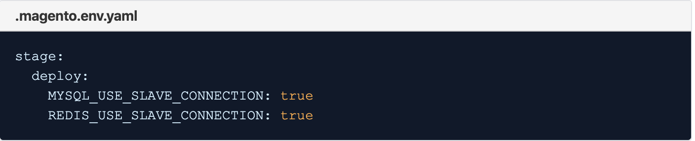

# クラウドインフラストラクチャー上のAdobe Commerceにおける MySQL の高負荷ボトルネック

ここでは、MySQL からの高負荷が原因で、クラウドインフラストラクチャー上のAdobe Commerceでパフォーマンスがボトルネックになる場合の解決策について説明します。

## 影響を受ける製品とバージョン

* クラウドインフラストラクチャー 2.x.x 上のAdobe Commerce、Pro アカウント。

### 前提条件

* ECE ツールバージョン 2002.0.16 以降
* New Relic APM サービス （**クラウドインフラストラクチャアカウント上のAdobe Commerceには、New Relic APM サービスのソフトウェアとライセンスキーが含まれています**）

New Relic APM サービスと、クラウドインフラストラクチャアカウント上のAdobe Commerceを使用した設定について詳しくは、[New Relic サービス ](https://experienceleague.adobe.com/en/docs/commerce-cloud-service/user-guide/monitor/new-relic/new-relic-service) および [New Relic APM の概要 ](https://docs.newrelic.com/docs/apm/new-relic-apm/getting-started/introduction-apm/) を参照してください。

## 問題

<u> 問題が影響を受けるかどうかを確認する手順 </u>

1. New Relicの APM の概要グラフで、MySQL がボトルネックになっていることが最初に示されているかを確認します。 以下のサンプル図を参照してください。ここでは、MySQL がボトルネックとなり、web トランザクション時間の大部分を占めています。

   

   画像の赤い破線は、MySQL web トランザクションの時間に目に見える上昇傾向を示し、さらに高いレベルでピークを迎えています。
1. ここから **データベース** 画面に移動すると、MySQL の高スループットまたは遅 `SELECT` クエリの 2 番目の指標が表示されます。以下のサンプル画像では、**最も時間がかかる** で並べ替えると、この例ではストアの MySQL クエリが遅 `SELECT` ことがわかります。

   

New Relic APM で低速のトランザクションを分析します。 MySQL データベースに大量のクエリや高い圧力がかかる場合は、`SLAVE` 接続を有効にすることで、負荷を様々なノードに分散させることができます。

## 原因：

クラウドインフラストラクチャストア上のAdobe Commerceのスループットが高いか、MySQL クエリ `SELECT` 処理が遅い。

## 解決策

>[!WARNING]
>
>スケールされたアーキテクチャ（分割アーキテクチャ）の場合、Redis スレーブ接続 **有効にしない** ください。 スケールされたアーキテクチャを使用しているかどうかを確認するには、プロジェクト URL （例：`https://console.adobecommerce.com/<owner-user-name>/<project-ID>/<environment-name>`）に移動します。 「**[!UICONTROL SSH]**」をクリックします。 ノードが 3 つ以上ある場合は、スケールされたアーキテクチャ上にあります。 スケーリングされたアーキテクチャで Redis スレーブ読み取りを有効にすると、お客様は Redis 接続が接続できないというエラーを受け取ります。 これは、Redis 接続を処理するためにクラスターがどのように設定されているかに関係しています。 Redis スレーブはアクティブですが、Redis 読み取りには使用されません。 Adobe Commerce 2.3.5 以降を使用し、新しい Redis バックエンド設定を実装し、Redis 用の L2 キャッシングを実装するために、スケールアーキテクチャをお勧めします。

これらの 2 つの兆候が発生した場合、MySQL データベースと Redis の `SLAVE` 接続を有効にすると、負荷を様々なノードに分散させるのに役立ちます。

Adobe Commerceは、複数のデータベースまたは Redis を非同期で読み取ることができます。 `.magento.env.yaml` ファイルを更新します。値 `MYSQL_USE_SLAVE_CONNECTION` を `true` に設定し、`REDIS_USE_SLAVE_CONNECTION` をデータベースへの **読み取り専用** 接続を使用して非マスターノードで読み取り専用トラフィックを受信するようにします。 読み取り/書き込みトラフィックを処理する必要があるのは 1 つのノードのみであるため、ロード・バランシングによってパフォーマンスが向上します。 既存の読み取り専用接続配列を `env.php` ファイルから削除するには、`false` に設定します。

### 手順

1. `.magento.env.yaml` ファイルを編集し、次の内容を追加します。

   

   詳しくは、[DevDocs で変数をデプロイ ](https://experienceleague.adobe.com/en/docs/commerce-cloud-service/user-guide/configure/env/stage/variables-deploy#mysql_use_slave_connection) を参照してください。

1. 変更をコミットし、変更をプッシュします。
1. 変更をプッシュすると、新しいデプロイメントプロセスが開始されます。 デプロイメントが正常に完了したら、Adobe Commerce on cloud infrastructure インスタンスがスレーブ接続を使用するように設定されています。

## よくある質問

クラウドインフラストラクチャストア上のAdobe Commerceにスレーブ接続機能を使用する場合に尋ねられうる一般的な質問を以下に示します。

* スレーブ接続を使用する際の既知の問題や制限はありますか？ **スレーブ接続の使用に関する既知の問題はありません。 最新の ece-tools パッケージを使用していることを確認してください。 手順は [ece-tools パッケージの更新方法 ](https://experienceleague.adobe.com/en/docs/commerce-cloud-service/user-guide/dev-tools/ece-tools/update-package) で確認できます**。
* スレーブ接続を使用して追加のレイテンシーはありますか？ *はい。クロス AZ （クロス可用性ゾーン）の待ち時間は、インスタンスが過負荷ではなく、負荷全体を処理できる場合に、クラウドインフラストラクチャインスタンス上のAdobe Commerceのパフォーマンスを低下させます。 ただし、インスタンスが過負荷の場合、マスタースレーブは異なるノードに MySQL データベースまたは Redis の負荷を分散させることで、パフォーマンスの向上に役立ちます。*

  **オーバーロードされていないクラスターで** - **スレーブ接続では、パフォーマンスが 10～15% 低下します**。これは、デフォルトではない理由の 1 つです。

  *ただし、過負荷のクラスターでは、トラフィックによる負荷を減らすことで 10～15% が軽減されるので、パフォーマンスが向上します。*
* ストアに対してこれらの設定を有効にする必要がありますか？ *MySQL データベースまたは Redis の負荷が高い、または高いと予想される場合は、必ずスレーブ接続を有効にする必要があります。 平均トラフィックを使用する通常の顧客の場合、これは有効にする&#x200B;**ではなく**&#x200B;最適な設定です。*

## 関連資料

開発者向けドキュメントでは、

* [ 変数をデプロイ ](https://experienceleague.adobe.com/en/docs/commerce-cloud-service/user-guide/configure/env/stage/variables-deploy) します。
* [ オプションのデータベースレプリケーションを設定します ](https://experienceleague.adobe.com/en/docs/commerce-operations/configuration-guide/storage/split-db/multi-master-replication)。
* [ece-tools パッケージ ](https://experienceleague.adobe.com/en/docs/commerce-cloud-service/user-guide/dev-tools/ece-tools/package-overview)。

>[!NOTE]
>
>この記事には、一部のユーザーが人種差別的、性差別的、または抑圧的と見なす業界標準のソフトウェア用語が依然として含まれており、読者が苦痛を感じたり、トラウマを抱いたり、歓迎されないと感じたりする可能性があることを認識しています。 Adobeでは、これらの用語をアドビのコード、ドキュメントおよびユーザーエクスペリエンスから削除するよう取り組んでいます。
