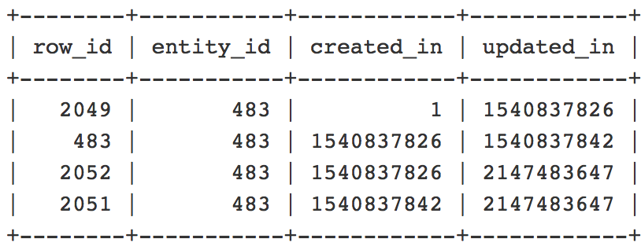

# スケジュール更新の終了日を編集した後、カタログのルール テーブルのエントリが重複する

この記事では、Adobe Commerce 2.2.3 の既知の問題に対するパッチを提供します。このパッチでは、カタログ価格ルール スケジュールの更新の終了日または時刻を変更すると、`catalogrule` テーブルに重複したエントリが追加され、`catalogrule_rule` （カタログ ルール製品）インデクサーの再インデックスでエラーが発生します。

## 問題

既存のカタログ価格ルールのスケジュール更新の終了日または時刻を変更すると、重複するエントリが `catalogrule` データベース テーブルに作成されます。 その結果、`catalogrule_rule` の再インデックスに失敗し、例外ログに「*同じ ID の項目が既に存在します* というエラーが表示されます。

<u> 再現手順 </u>:

前提条件：`catalogrule_rule` インデクサーは *[スケジュールに従って更新 ](https://experienceleague.adobe.com/docs/commerce-operations/implementation-playbook/best-practices/maintenance/indexer-configuration.html)* モードに設定されています。

1. Commerce管理者で、**マーケティング**/**プロモーション**/**カタログ価格ルール** の下に新しいカタログ価格ルールを作成します。
1. **カタログ価格ルール** グリッドで **編集** をクリックし、新しい更新をスケジュールして **ステータス** を *アクティブ* に設定します。
1. 新しく作成された更新の横にある **表示/編集** をクリックし、終了日を以前の日付に変更します。
1. 更新を保存します。
1. `catalogrule_rule` インデクサーの reindex コマンドを実行します。

<u> 期待される結果 </u>:

`catalogrule_rule` インデクサーのインデックスが正常に再作成されました。 `catalogrule` テーブルに重複エントリはありません。

<u> 実際の結果 </u>:

*同じ ID の項目が既に存在します*。`catalogrule` テーブルに重複エントリがあるため、再インデックスに失敗します。

## 解決策

この問題を解決するには、添付されているパッチを適用し、既存の重複エントリを削除する必要があります。 重複が存在するかどうかを確認し、重複を削除する方法について詳しくは、[ 重複エントリの削除 ](#remove) の節を参照してください。

## パッチ

パッチはこの記事に添付されています。 ダウンロードするには、記事の最後まで下にスクロールしてファイル名をクリックするか、次のリンクをクリックします。

[MDVA-10974\_EE\_2.2.3\_COMPOSER\_v2.patch のダウンロード](assets/MDVA-10974_EE_2.2.3_COMPOSER_v2.patch.zip)

### 互換性のあるAdobe Commerceのバージョン：

パッチは次のために作成されました。

* Adobe Commerce 2.2.3

このパッチは、次のAdobe Commerceのバージョンとエディションとも互換性があります（ただし、問題が解決しない可能性があります）。

* クラウドインフラストラクチャー上のAdobe Commerce 2.2.1 - 2.2.5
* Adobe Commerce オンプレミス 2.2.1 ～ 2.2.2 および 2.2.4 ～ 2.2.5

## パッチの適用方法

サポートナレッジベースの手順については、[Adobeが提供する Composer パッチの適用方法 ](/help/how-to/general/how-to-apply-a-composer-patch-provided-by-magento.md) を参照してください。

## 重複したエントリの削除 {#remove}

>[!NOTE]
>
>操作を行う前に、最新のバックアップを作成してください。

重複したエントリを探して削除するには、次の手順を実行します。

1. 次のクエリを実行して、重複したエントリがデータベース内に存在するかどうかを確認します。

   ```SQL
   SELECT entity_id, "catalog_product_entity" AS entity_table FROM catalog_product_entity GROUP BY entity_id, created_in HAVING COUNT(*) > 1    UNION    SELECT entity_id, "catalog_product_entity" AS entity_table FROM catalog_product_entity group by entity_id, updated_in having count(*) > 1    UNION    SELECT rule_id as entity_id, "catalogrule" AS entity_table FROM catalogrule GROUP BY entity_id, created_in HAVING COUNT(*) > 1    UNION    SELECT rule_id as entity_id, "catalogrule" AS entity_table FROM catalogrule GROUP BY entity_id, updated_in HAVING COUNT(*) > 1    UNION    SELECT rule_id as entity_id, "salesrule" AS entity_table FROM salesrule GROUP BY entity_id, created_in HAVING COUNT(*) > 1    UNION    SELECT rule_id as entity_id, "salesrule" AS entity_table FROM salesrule GROUP BY entity_id, updated_in HAVING COUNT(*) > 1    UNION    SELECT page_id as entity_id, "cms_page" AS entity_table FROM cms_page GROUP BY entity_id, created_in HAVING COUNT(*) > 1    UNION    SELECT page_id as entity_id, "cms_page" AS entity_table FROM cms_page GROUP BY entity_id, updated_in HAVING COUNT(*) > 1    UNION    SELECT block_id as entity_id, "cms_block" AS entity_table FROM cms_block GROUP BY entity_id, created_in HAVING COUNT(*) > 1    UNION    SELECT block_id as entity_id, "cms_block" AS entity_table FROM cms_block GROUP BY entity_id, updated_in HAVING COUNT(*) > 1;
   ```

   重複するエントリがない場合、応答は空になり、それ以外の操作は必要ありません。 重複したエントリが存在する場合は、次の例のように、重複したエンティティのテーブル名と `entity_id` が取得されます。

   

   特定のテーブルでは、エンティティ ID を持つフィールド名が `entity_id` とは異なることに注意してください。 例えば、`cms_page` テーブルでは、`entity_id` ではなく `page_id` になります。

1. 次に、重複について詳しく見ていき、どちらを削除する必要があるかを理解する必要があります。 次のようなクエリを使用して、重複を確認します。 前の手順で受け取った結果に従って、テーブル名、エンティティ ID 名、値を置き換えます。

   ```sql
   SELECT row_id, entity_id, created_in, updated_in FROM catalog_product_entity WHERE entity_id = 483 ORDER BY created_in;
   ```

   複数の列を持つレコードのリストが表示されます。 例：

   

   `created_in` と `updated_in` の値は、次のパターンに従う必要があります。現在の行の `created_in` 値は、前の行の `updated_in` 値と等しいからです。 また、**最初の行** には created\_in = 1 が含まれ、**最後の行** には updated\_in = 2147483647 が含まれている必要があります。 行が 1 つしかない場合は、created\_in=1 **および** updated\_in=2147483647）と表示されます。 このパターンが適用されていない行を削除する必要があります。 この例では、2 行目と 3 行目の両方で created_in: 1540837826 の値が同じなので、`row_id` =2052 が含まれる行になりますが、この値は発生しません。

1. 次のようなクエリを使用して、重複を削除します。 前の手順で受け取った結果に従って、テーブル名、エンティティ ID 名、値を置き換えます。

   ```sql
   DELETE FROM catalog_product_entity WHERE entity_id = 483 AND row_id = 2052;
   ```

1. 次を実行してキャッシュをクリーンアップします。

   ```bash
   bin/magento cache:clean
   ```

   または、Commerce管理の **システム**/**ツール**/**キャッシュ管理** で設定します。

## 開発者向けドキュメントの便利なリンク

* [ クラウドインフラストラクチャー上のAdobe Commerceにカスタムパッチを適用 ](https://experienceleague.adobe.com/docs/commerce-cloud-service/user-guide/develop/upgrade/apply-patches.html)
* [ クラウドインフラストラクチャー上のAdobe Commerceのログの表示 ](https://experienceleague.adobe.com/docs/commerce-cloud-service/user-guide/develop/test/log-locations.html) 管理）

## 添付ファイル
