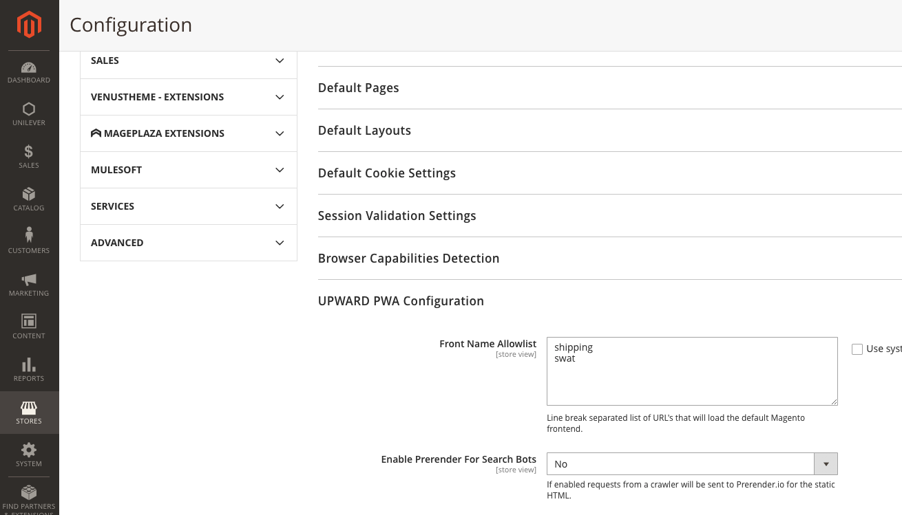

# Adobe Commerceで Site-Wide Analysis Tool にアクセスすると、403 エラーが発生する

この記事では、Adobe Commerceで Site-Wide Analysis Tool にアクセスしようとすると 403 エラーが発生した場合の解決策を提供します。

## 影響を受ける製品とバージョン

クラウドインフラストラクチャー 2.4.1 以降でのAdobe Commerce。

## 問題

サイト全体の分析ツールにアクセスしようとすると、403 エラーが発生します。

<u>再現手順：</u>

Commerce管理パネルにログインし、 **報告書** > *システムインサイト* > **サイト全体分析ツール**.

<u>期待される結果：</u>

Site-Wide Analysis Tool が表示されます。

<u>実際の結果：</u>

以下が表示されます。 *エラー 403。*


## 解決策

Site-Wide Analysis Tool がアプリケーションに適切にアクセスできることを確認するには、CLI で次のコマンドを実行します。 置換 `<store URL>` ストア URL を次に示します。

```cURL
curl -sIL -X GET <store URL>/swat/key/index | grep HTTP
HTTP/2 403
```

取得した応答コードに応じて手順を実行します。

### 403 Forbidden 応答コード

応答コードが 403 の場合、Cloudflare ボット保護がサイト全体の分析ツールをブロックしている可能性があります。 ツールにアクセスするには、ツールの IP を許可リストに加えます。

* 107.23.33.174
* 3.225.9.244
* 3.88.83.85

### 200 応答コードと JSON 出力の修正

応答が正しい 200 コードおよび JSON 出力である場合、 [サポートチケットを送信](/help/help-center-guide/help-center/magento-help-center-user-guide.md#submit-ticket) Site-Wide Analysis Tool へのアクセスで問題をエスカレートさせる。


### 500 （致命的なエラー）応答コード

応答コードが 500 （Fatal error）の場合は、MDVA-38526 パッチをインストールしてください。 次のいずれかのリンクを使用して、必要なパッチのタイプに応じてパッチをダウンロードします。

* クラウドインフラストラクチャー上のAdobe Commerceのパッチ： [MDVA-38526_EE_2.4.1-p1_v3.patch.zip](assets/MDVA-38526_EE_2.4.1-p1_v3.patch.zip)
* cloud infrastructure composer 上のAdobe Commerce パッチ： [MDVA-38526_EE_2.4.1-p1_COMPOSER_v3.patch.zip](assets/MDVA-38526_EE_2.4.1-p1_COMPOSER_v3.patch.zip)

このパッチは、クラウドインフラストラクチャバージョン 2.4.1 以降のAdobe Commerceに適用されます。

### 応答が JSON ではない

応答出力が JSON でない場合は、PWA/ヘッドレスの実装が原因である可能性があります。 ヘッドレス実装を使用している場合は、Adobe Commerce オリジンへのリクエストをバイパスするように UPWARD 設定を更新します。 これをおこなうには、Adobe Commerce管理者の下の **ストア** > **設定** > **一般** > **Web** > **UPWARD PWAの設定** > **フロント名^許可リスト**、追加： *swat*.



それでも Site-Wide Analysis Tool にアクセスできない場合は、次回Commerce管理パネルにログインして、に移動します **報告書** > *システムインサイト* > **サイト全体分析ツール**, [サポートチケットを送信](/help/help-center-guide/help-center/magento-help-center-user-guide.md#submit-ticket).

## 関連資料

* [Site-Wide Analysis Tool ガイド](https://experienceleague.adobe.com/docs/commerce-operations/tools/site-wide-analysis-tool/intro.html)
