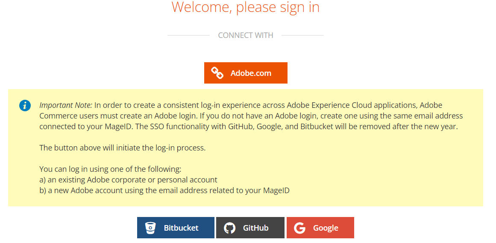

# 正しいクラウドアカウント / プロジェクトにアクセスできないか、プロジェクトがアカウントにありません

この記事では、アカウントの所有権または関連するメールアドレスに変更が加えられた後の次の問題を修正します。

1. 正しい Cloud Adobe Commerce プロジェクトにアクセスできません。
1. Cloud Adobe Commerce プロジェクトは、次のアカウントの下には表示されません： [accounts.magento.cloud/user](https://accounts.magento.cloud/user).
1. 別のアカウント（以前のアカウント所有者）の詳細が次の場所に表示されています [accounts.magento.cloud/user](https://accounts.magento.cloud/user).

## 問題

所有権やメールアドレスに変更がある場合、正しい Cloud Adobe Commerce プロジェクトにアクセスできません。

## 影響を受ける製品とバージョン

* クラウドインフラストラクチャー上のAdobe Commerce [すべてのサポートされているバージョン](https://www.adobe.com/content/dam/cc/en/legal/terms/enterprise/pdfs/Adobe-Commerce-Software-Lifecycle-Policy.pdf)

## 原因：

この問題は、通常、次の期間が経過した後も、以前のプロジェクト所有者のシングルサインオン（SSO）が引き続きAdobe.comと統合されている場合に発生します。

1. クラウドプロジェクトの所有権が（ユーザーの）自分に転送され、元のプロジェクト所有者のアカウントが表示されています。 を参照するには、ここをクリックしてください [解決策](#solution-for-cause-one-and-two).

   または

1. ユーザーが別の会社に移動し、メールアドレスとアクセス権のあるプロジェクトが変更された。 以前の役割/会社でアクセス権を付与されていたプロジェクトが表示されます。 を参照するには、ここをクリックしてください [解決策](#solution-for-cause-one-and-two).

   または

1. https://account.adobe.comのメールアドレスを、現在クラウドプロジェクトに関連付けられていない別のメールアドレスに変更しました。 を参照するには、ここをクリックしてください [解決策](#solution-for-cause-three).

## 原因 1 と 2 の解決策 {#solution-for-cause-one-and-two}

この問題の原因が 1 と 2 である場合の解決策は、Adobe.comとのシングルサインオン統合を切断することです。 接続解除するには、次の手順に従います。

1. https://accounts.magento.cloud/userから、を展開します **[!UICONTROL Single Sign-On]** セクション。 クリック **[!UICONTROL Disconnect from Adobe.com]**：切断します。

   

1. クリック **[!UICONTROL Disconnect]**.

   

1. ログアウトします。
1. 「」をクリック **[!UICONTROL Adobe.com]** ボタン。

   

1. これで、正しいアカウントが表示され、正しいクラウドプロジェクトにアクセスできるようになります。

## 原因 3 の解決策 {#solution-for-cause-three}

問題が原因で発生している場合は、プロジェクトの既存のスーパーユーザーに、新しいメールアドレスをプロジェクトに追加するように依頼します。 詳しくは、次を参照してください。 [ユーザーアクセスの管理](https://experienceleague.adobe.com/docs/commerce-cloud-service/user-guide/project/user-access.html).
