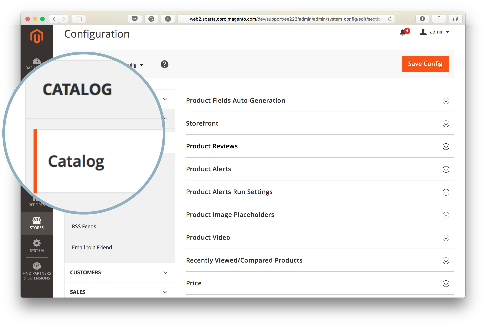
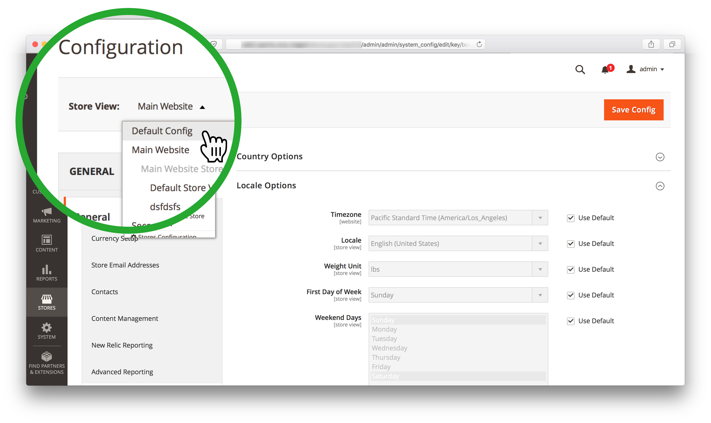

# Commerce Admin を使用して検索エンジンを変更できない（検索エンジンメニューにアクセスできない）

>[!WARNING]
>
> [MySQL カタログ検索エンジンは、Adobe Commerce 2.4.0 で削除されます ](/help/announcements/adobe-commerce-announcements/mysql-catalog-search-engine-will-be-removed-in-magento-2-4-0.md)。 バージョン 2.4.0 をインストールする前に、Elasticsearch・ホストをセットアップして構成する必要があります。
> 
> 以下を参照してください。
> [Elasticsearchのインストールと設定 ](https://experienceleague.adobe.com/en/docs/commerce-cloud-service/user-guide/configure/service/elasticsearch).
> [Opensearch のインストールと設定 ](https://experienceleague.adobe.com/en/docs/commerce-cloud-service/user-guide/configure/service/opensearch)
> [Live Search のインストールと設定 ](https://experienceleague.adobe.com/en/docs/commerce-merchant-services/live-search/install)

この記事では、「**検索エンジン**」フィールドが表示されない場合や、「**システム値を使用**」チェックボックスが灰色表示になっており、アクセスできない場合に、Commerce管理を使用してAdobe Commerce検索エンジンを変更する方法について説明します。

この記事の内容は次のとおりです。

* [影響を受けるバージョン](#affected-versions)
* [Commerce Admin を使用した検索エンジンの変更（手順）](#change-search-engine-using-magento-admin-steps)
* [Adobe Commerceのオンプレミスにおける問題](#magento-commerce-on-premise)
* [クラウドインフラストラクチャー上のAdobe Commerce](#magento-commerce-cloud)

## 影響を受けるバージョン

* Adobe Commerce オンプレミス：2.4.X
* クラウドインフラストラクチャー上のAdobe Commerce:
   * バージョン：2.4.X
   * スターターおよび Pro プランアーキテクチャ
* MySQL、Elasticsearch、Opensearch、Live Search：サポートされているすべてのバージョン

## 管理者を使用して検索エンジンを変更する（手順）

1. 管理者として **[!UICONTROL Admin]** にログインします。
1. **[!UICONTROL Admin]** サイドバーの左側にある「**[!UICONTROL Stores]**」をクリックします。
1. 「**[!UICONTROL Settings]**」で、「**[!UICONTROL Configuration]**」を選択します。
1. **[!UICONTROL Catalog]の下にある左側のパネルに移動し** 「**[!UICONTROL Catalog]**」を選択します。
1. 「**[!UICONTROL Catalog Search]**」セクションを展開します。    
1. 「**[!UICONTROL Search Engine]**」フィールドに移動し、「**[!UICONTROL Use system value]**」チェックボックスから選択項目を削除します。
1. **[!UICONTROL Search Engine]** メニューをクリックし、以下に示すように、使用可能なオプションの 1 つを選択します。    
1. ページの右上隅にある「**[!UICONTROL Save Config]**」をクリックします。

## Adobe Commerceのオンプレミスにおける問題

### 問題 1：検索エンジンフィールドが表示されない

「**カタログ検索**」セクションにアクセスすると、「**検索エンジン**」メニューが表示されません。


### 原因：ストア ビューが既定の構成ではありません

管理者のストア表示が、*デフォルト設定* 以外の値に設定されています。

検索エンジンは、ストア範囲ではなく、アプリケーションレベルで設定されるグローバル設定です。 Adobe Commerce アプリケーション内のストアは、異なる検索エンジンを使用できません。

### 解決策：ストア表示をデフォルト設定に設定します

1. 管理者として **[!UICONTROL Admin]** にログインします。
1. **[!UICONTROL Admin]** サイドバーの左側にある「**[!UICONTROL Stores]**」をクリックします。
1. **[!UICONTROL Settings]** に移動し、「**[!UICONTROL Configuration]**」を選択します。
1. 左上隅の **[!UICONTROL Store View]** セレクターをクリックして、「**[!UICONTROL *デフォルト設定&#x200B;*]**」を選択します。
1. 確認ダイアログボックスで「**[!UICONTROL OK]**」をクリックして、ストア表示の変更を承認します。



**関連ドキュメント：**[ 範囲の変更 ](https://experienceleague.adobe.com/docs/commerce-admin/config/scope-change.html#set-the-scope) をユーザーガイドで参照してください。

### 問題 2:「システム値を使用」をオフにできません

管理者の「**カタログ検索**」セクションにアクセスすると、「**システム値を使用**」チェックボックスが灰色表示になるので、チェックボックスの選択を削除して後で検索エンジンを変更することはできません。

### 原因：

デフォルトの検索エンジンは、`app/etc/env.php` ファイルまたは `app/etc/config.php` ファイル内でアプリケーション設定レベルで設定されているので、管理者を使用して変更することはできません。

デフォルトの検索エンジン設定を含むセクションの例：

```php
'system'=>
array (
'default'=>
array (
'catalog'=>
array (
'search'=>
array (
'engine'=>'mysql',
),
),
),
),
```

### 解決策

デフォルトの検索エンジン設定があるセクションを、`app/etc/env.php` または `app/etc/config.php` の設定ファイルから削除します。

### 開発者向けドキュメントの関連記事

Adobe Commerce設定ガイドの [Adobe Commerce設定ファイル ](https://experienceleague.adobe.com/docs/commerce-operations/configuration-guide/files/deployment-files.html)

## クラウドインフラストラクチャー上のAdobe Commerce

クラウドインフラストラクチャの編成の仕方により、クラウドインフラストラクチャ上のAdobe Commerceでは、管理者を使用して検索エンジンを切り替えることはできません。

デプロイメントプロセス中に、クラウドインフラストラクチャー上のAdobe Commerce デプロイメントスクリプトは、Elasticsearchが `MAGENTO_CLOUD_RELATIONSHIPS` 変数で宣言されているかどうかを確認します。 宣言すると、Elasticsearchがアクティブな検索エンジンとして選択され、自動的に設定されます。[MySQL 検索エンジン ](/help/announcements/adobe-commerce-announcements/mysql-catalog-search-engine-will-be-removed-in-magento-2-4-0.md) は管理者からアクセスできなくなります。 Elasticsearch関係が宣言されていない場合、MySQL はアクティブに設定され、Elasticsearchにアクセスできなくなります。

`app/etc/env.php` または `app/etc/config.php` の設定ファイルをクラウド環境で直接編集することはお勧めしません。そのため、これらのファイルを変更して、Elasticsearchエンジンを管理者に表示するように設定することは、クラウドプロジェクトには適用されません（前の節で推奨したソリューション）。

### ステージング環境と実稼動環境での検索エンジンの変更

ステージング環境と実稼動環境で検索エンジンを MySQL からElasticsearchに切り替える前に、以前に環境でのElasticsearchを有効にするようにリクエストしている [ サポートチケットを送信している ](/help/help-center-guide/help-center/magento-help-center-user-guide.md#submit-ticket) ことを確認し、チケットが正常に解決されていることを確認します。

ステージング環境と実稼動環境で使用する検索エンジンを変更するには、ローカル環境上の `.magento.env.yaml` ファイルの `SEARCH_CONFIGURATION` 環境変数を変更してから、変更を統合およびステージング/実稼動環境にプッシュして、変更を有効にします。

Elasticsearch 7 に切り替えた場合、結果の `.magento.env.yaml` ファイルの SEARCH\_CONFIGURATION 変数は次のようになります。

```yaml
stage:
  deploy:
   SEARCH_CONFIGURATION:
     engine: elasticsearch7
     elasticsearch_server_hostname: hostname
     elasticsearch_server_port: '12345'
     elasticsearch_index_prefix: magento
     elasticsearch_server_timeout: '15'
```

（2.4.6 以降で [Opensearch に切り替える場合 ](https://experienceleague.adobe.com/en/docs/commerce-knowledge-base/kb/troubleshooting/elasticsearch/search-engine-shown-elasticsearch-despite-open-search) 結果の `.magento.env.yaml` ファイルの SEARCH\_CONFIGURATION 変数は次のようになります。

```yaml
stage:
  deploy:
   SEARCH_CONFIGURATION:
     engine: opensearch
     elasticsearch_server_hostname: hostname
     elasticsearch_server_port: '12345'
     elasticsearch_index_prefix: magento
     elasticsearch_server_timeout: '15'
```

[Live Search に切り替える ](https://experienceleague.adobe.com/en/docs/commerce-knowledge-base/kb/troubleshooting/miscellaneous/error-opensearch-search-engine-doesnt-exist-falling-back-to-livesearch) 場合、結果の `.magento.env.yaml` ファイルの SEARCH\_CONFIGURATION 変数は次のようになります。

```yaml
stage:
  deploy:
   SEARCH_CONFIGURATION:
     engine: livesearch
```

### 関連ドキュメント

#### サポートナレッジベース

* [クラウドでElasticsearchを有効にする](/help/how-to/general/enable-elasticsearch-on-cloud.md)

#### 開発者向けドキュメント

* [Elasticsearchサービスの設定 ](https://experienceleague.adobe.com/docs/commerce-cloud-service/user-guide/configure/service/elasticsearch.html)
* [ ビルドとデプロイ ](https://experienceleague.adobe.com/docs/commerce-cloud-service/user-guide/configure/env/configure-env-yaml.html) （`.magento.env.yaml` 設定ファイルに関するドキュメント）
* [ 変数をデプロイ ](https://experienceleague.adobe.com/docs/commerce-cloud-service/user-guide/configure/env/stage/variables-deploy.html) （[SEARCH\_CONFIGURATION セクション ](https://experienceleague.adobe.com/docs/commerce-cloud-service/user-guide/configure/env/stage/variables-deploy.html#search_configuration)）
* [ サービス ](https://experienceleague.adobe.com/docs/commerce-cloud-service/user-guide/configure/service/services-yaml.html) （`.magento/services.yaml` 設定ファイルに関するドキュメント）
* [Live Search](https://experienceleague.adobe.com/en/docs/commerce-merchant-services/live-search/overview)
