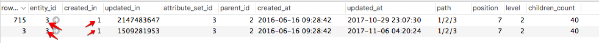

# カテゴリへの変更が保存されない

この記事では、Commerce管理者を使用して商品カテゴリをアップデートする際に、管理者およびストアフロントに変更内容が表示されないようにする方法について説明します。 問題は、`catalog_category_entity` テーブルのデータが破損していることが原因です。 この問題を解決するには、テーブル内の問題のあるカテゴリ更新レコードを修正または削除します。 その後、管理者を使用して製品カテゴリを更新できるようになります。

## 問題

管理者で製品カテゴリに変更を加えて保存すると、新しい更新は保存されず、管理およびストアフロントにも表示されません。

### 再現手順

1. **カタログ**/**カテゴリ** に移動します。
1. カテゴリを選択します。
1. 変更を加え、「**保存**」をクリックします。
1. *カテゴリを保存しました* というメッセージが表示されます。
1. 行った変更は保存されていません。

## 原因：`catalog_category_entity` テーブルのデータが破損しています

この問題は、データベース（DB）内の影響を受けるカテゴリレコードの `created_in` 列に同じ値が含まれていることが原因です。

詳細：

* `catalog_category_entity` DB テーブルには、影響を受けるカテゴリの複数のレコードがあります（これらのレコードの `entity_id` 値は同じです）。
* これらのカテゴリレコードには **`created_in` 列の同じ値** があります。

### 2 つ目の DB エントリ（および次に続くすべての DB エントリ）は、同じカテゴリに対してどのように DB に表示されますか？

影響を受けるカテゴリの 2 つ目の DB レコード（場合によっては次のレコード）は、Category\_Staging モジュールを使用してMagentoの更新がスケジュールされていることを意味します。 モジュールは、`catalog_category_entity` のカテゴリに対して追加のレコードを作成します。これは、想定されるアプリケーション動作です。問題は、レコードの `created_in` 列の値が同じであるということです。

### 同じ値はどのように表示されますか？

データ破損の理由を確実に述べることはできません。 考えられる理由は次のとおりです。

* カスタマイズ（コード、テーマなど）
* 誤ったデータ移行
* バックアップからの誤ったデータ復元

私たちの知る限り、このようなデータ破損は、（標準の）「クリーンな」Adobe Commerce インスタンスでは一般的ではなく、カスタマイズを行わずにAdobe Commerce インストールで再現することはできません。

### これが問題であることを確認する方法

`catalog_category_entity` テーブルには、影響を受けるカテゴリの複数のレコード （レコードは同じ `entity_id` 値である必要があります）と、それらのレコードの少なくとも 2 つが同じ `created_in` 値である必要があります。 これにより、ステージングスケジュールされた更新はCommerce管理者に表示されず、空の「スケジュールされた変更」ブロックのみが表示されます。

#### 検証の手順

1. データベースの catalog\_category\_entity テーブルにアクセスします。
1. entity\_id でエンティティをフィルタリングします。entity\_id は影響を受けるカテゴリを識別します。
1. 同じ entity\_id を持つ異なるエントリに対して created\_in カラムの値が同じ場合は、この例になります。 通常、`created_in` の値はレコードごとに異なります。

## 解決策

次のいずれかのソリューションを選択できます。

1. **削除** 問題のあるカテゴリ更新レコード
1. **修復** 問題のあるカテゴリ更新レコード

### 問題のあるカテゴリ更新レコードを削除します

このソリューションでは、最初のカテゴリ レコードに正しい `updated_in` 値を設定し、このカテゴリの他のすべてのレコードを削除する必要があります。 これにより、スケジュールされたすべてのカテゴリの更新が削除されます。

次の手順に従います。

1. 影響を受けるカテゴリの `entity_id` を含む DB レコードを見つけます。
1. `updated_in` 列で最大の整数を持つレコードを選択します。
1. 選択したレコードから `updated_in` 値をコピーします。
1. `row_id` = `entity_id` （初期カテゴリレコード）のレコードを選択し、コピーした値をこのレコードの `updated_in` 列に貼り付けます。
1. `entity_id` に等しくない `row_id` を持つ行を削除します。

### 問題のあるカテゴリ更新レコードの修復

1. `entity_id` と `created_in` の値が同じカテゴリ レコードを検索します。
1. `row_id` = `entity_id` のレコードを選択し、`updated_in` の値をコピーします。
1. `row_id` が `entity_id` に等しくないレコードを選択し、コピーした `updated_in` 値を `created_in` 値として貼り付けます。 以下のスクリーンショットを図として参照してください。    
1. 手順 3 で更新したカテゴリ更新レコードの `created_in` 値が、`staging_update` テーブルに存在することを確認します。 *例：* コピーされた `created_in` 値が 1509281953 の場合、`row_id` = 1509281953 のエンティティが `staging_update` テーブルに存在する必要があります。

## 関連資料

Commerce実装プレイブックの [ データベーステーブルを変更する際のベストプラクティス ](https://experienceleague.adobe.com/ja/docs/commerce-operations/implementation-playbook/best-practices/development/modifying-core-and-third-party-tables#why-adobe-recommends-avoiding-modifications)
