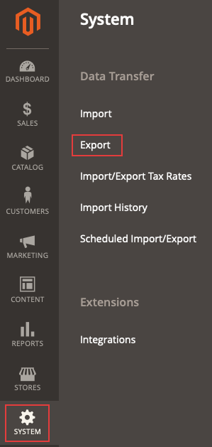

# エクスポートした製品.csv ファイルが表示されない

この記事では、目的のエンティティ型をCommerce Admin の.csv ファイルに書き出すと、ファイルが表示されない問題の解決策を提供します。

## 影響を受ける製品とバージョン

* クラウドインフラストラクチャ上のAdobe Commerce、すべての[&#x200B; サポートされているバージョン &#x200B;](https://magento.com/sites/default/files/magento-software-lifecycle-policy.pdf)。

## イシュー

<u>複製する手順</u>

前提条件：**秘密鍵をURLに追加** オプションは&#x200B;*はい*&#x200B;に設定されています。 このオプションは、**Stores** > **Configuration** > **Advanced** > **Admin** > **Security**&#x200B;の下のCommerce管理者で設定されます。

1. 管理画面で、**システム** > **データ転送** > **書き出し**&#x200B;に移動します。

   

1. Select
   * **エンティティの種類**：書き出すエンティティ
   * **書き出しファイル形式**: *CSV*
   * **フィールドエンクロージャ**：選択を解除します。
1. **続行**&#x200B;をクリックします。
1. 次のメッセージが表示されます：*「メッセージがキューに追加されました。ファイルをすぐに取得するのを待ってください」*。

<u>期待される結果</u>

書き出された目的のエンティティタイプを含む.csv ファイルは、数分以内にグリッドに表示されます。

<u>実際の結果</u>

書き出された目的のエンティティタイプを含む.csv ファイルは、10分以上でグリッドに表示されません。

## 原因

Adobe Commerce アプリケーションの一部バージョン 2.3.2の書き出し機能に関する既知の問題。

## Solution

この問題には、次の2つの解決策が考えられます。

* 「URLに秘密鍵を追加」オプションを無効にします。
* `bin/magento queue:consumers:start exportProcessor` コマンドを手動で実行し、必要に応じてcronで実行するように設定します。

両方のオプションについて詳しくは、次の段落を参照してください。

### 「URLに秘密鍵を追加」オプションを無効にする

1. 管理画面で、**Stores** > **Configuration** > **Advanced** > **Admin** > **Security**&#x200B;に移動します。
1. 「**秘密鍵をURLに追加**」オプションを&#x200B;*番号*&#x200B;に設定します
1. 「**設定を保存**」をクリックします。
1. **システム**/**ツール**/**キャッシュ管理**&#x200B;の下にあるキャッシュをクリーンアップするか、`bin/magento cache:clean`または管理者を実行します。

### export コマンドを手動で実行し、オプションでcron ジョブとして追加します

書き出しファイルを取得するには、`bin/magento queue:consumers:start exportProcessor` コマンドを実行します。 これを実行すると、ファイルがグリッドに表示されます。


プロセスをcron ジョブとして追加するには、オプションで`CRON_CONSUMERS`変数を`.magento.env.yaml` ファイルに追加する必要があります。

#### プロセスをcron ジョブとして追加（オプション）

1. cronが設定および設定されていることを確認します。 詳しくは、[cron ジョブの設定](https://experienceleague.adobe.com/docs/commerce-cloud-service/user-guide/configure/app/properties/crons-property.html?lang=ja)を参照してください。
1. 次のコマンドを実行して、メッセージキューコンシューマーのリストを返します：`./bin/magento queue:consumers:list`
1. ルートアプリケーションディレクトリの`.magento.env.yaml` ファイルに以下を追加し、追加するコンシューマーを含めます。 例えば、以下は書き出し処理に必要な消費者です。

   ```yaml
   stage:
       deploy:
           CRON_CONSUMERS_RUNNER:
               cron_run: true
               max_messages: 1000
               consumers:
                   - exportProcessor
   ```

   次に、この更新されたファイルをプッシュして、環境を再デプロイします。 また、開発者ドキュメントの[&#x200B; プロジェクトにカスタム cron ジョブを追加する](https://experienceleague.adobe.com/docs/commerce-cloud-service/user-guide/configure/app/properties/crons-property.html?lang=ja#add-custom-cron-jobs-to-your-project)ことも参照してください。

>[!NOTE]
>
>環境の`.magento.env.yaml` ファイルが見つからず、削除されたと思われる場合は、新しい`.magento.env.yaml`を作成する必要があります。 最初は空の場合がありますが、必要に応じてそこに情報を追加できます。 次の記事を参照してください。[&#x200B; デプロイメント用の環境変数を設定](https://experienceleague.adobe.com/docs/commerce-cloud-service/user-guide/configure/env/configure-env-yaml.html?lang=ja)および[環境変数](https://experienceleague.adobe.com/docs/commerce-cloud-service/user-guide/configure/env/stage/variables-intro.html?lang=ja)。詳しくは、開発者ドキュメントを参照してください。

>[!TIP]
>
>[YAML ファイル &#x200B;](https://experienceleague.adobe.com/docs/commerce-cloud-service/user-guide/configure/env/configure-env-yaml.html?lang=ja)では大文字と小文字が区別され、タブは使用できません。 .magento.env.yaml ファイル全体で一貫したインデントを使用するように注意してください。そうしないと、設定が期待どおりに動作しない可能性があります。 ドキュメントおよびサンプルファイルの例では、2つのスペースのインデントが使用されています。 ece-tools validate コマンドを使用して、設定を確認します。

>[!NOTE]
>
>Adobe Commerce on cloud infrastructure Pro プロジェクトでは、`.magento.app.yaml`を使用してステージング環境と実稼動環境にカスタム cron ジョブを追加する前に、[自動cron機能](https://experienceleague.adobe.com/docs/commerce-cloud-service/user-guide/configure/app/properties/crons-property.html?lang=ja#crontab)をAdobe Commerce on cloud infrastructureで有効にする必要があります。 この機能が有効になっていない場合は、[&#x200B; サポートチケット &#x200B;](https://experienceleague.adobe.com/ja/docs/support-resources/adobe-support-tools-guide/adobe-commerce-support/adobe-commerce-help-center-user-guide#submit-ticket)を作成して、ジョブを追加します。

