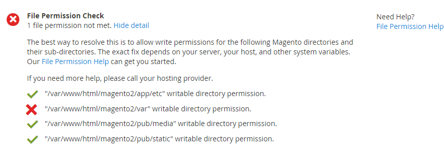

# ファイル権限の準備チェックの問題

この記事では、ファイル権限の準備状況チェックの問題を修正します。 Adobe Commerce ファイルシステム内のディレクトリは、web サーバーユーザーおよびAdobe Commerce ファイルシステム所有者（該当する場合）によって書き込み可能である必要があります。 権限が正しく設定されていない場合は、Web 設定ウィザードに次のようなエラーが表示されます。



この問題を解決する方法は、設定が 1 ユーザーか 2 ユーザーかによって異なります。

* *1 人のユーザー* つまり、web サーバーも実行しているユーザーとしてAdobe Commerce サーバーにログインします。 このタイプの設定は、共有ホスティング環境で一般的です。
* *2 人のユーザー* は通常、を意味します *できません* web サーバーユーザーとしてログインするか、に切り替えます。 通常は、1 人のユーザーとしてログインし、別のユーザーとして web サーバーを実行します。 これは、プライベートホスティングの場合や、独自のサーバーがある場合に典型的です。

## 1 ユーザーによる解決

コマンドラインでアクセスできる場合は、Adobe Commerceがにインストールされていると仮定して、次のコマンドを入力します。 `/var/www/html/magento2`:

```bash
$ cd /var/www/html/magento2 && find var vendor pub/static pub/media app/etc -type f -exec chmod g+w {} + && find var vendor pub/static pub/media app/etc -type d -exec chmod g+w {} + && chmod u+x bin/magento
```

コマンドラインでアクセスできない場合は、FTP クライアントまたはホスティングプロバイダーが提供するファイルマネージャーアプリケーションを使用して権限を設定します。

## 2 ユーザーによる解決

オプションで 1 行にすべてのコマンドを入力するには、Adobe Commerceがにインストールされている場合は、次のように入力します `/var/www/html/magento2` web サーバーグループ名はです。 `apache`:

```bash
$ cd /var/www/html/magento2 && find var vendor pub/static pub/media app/etc -type f -exec chmod g+w {} + && find var vendor pub/static pub/media app/etc -type d -exec chmod g+ws {} + && chown -R :apache . && chmod u+x bin/magento
```

ファイルシステムの権限が不適切に設定され、Adobe Commerce ファイルシステムのオーナーが変更できない場合は、 `root` 権限：

```bash
$ cd /var/www/html/magento2 && sudo find var vendor
  pub/static pub/media app/etc -type f -exec chmod g+w {} + && sudo find
  var vendor pub/static pub/media app/etc -type d -exec chmod g+ws {} + &&
  sudo chown -R :apache . && sudo chmod u+x bin/magento
```
