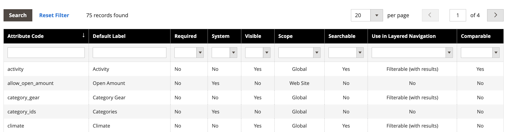
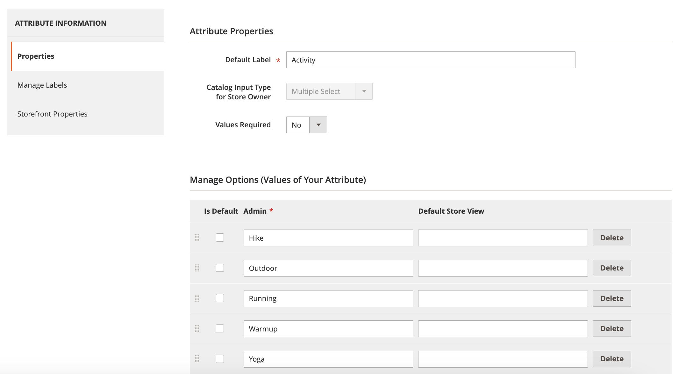

# [!DNL Live Search]個のファセットがアルファベット順に並べ替えられていません

## 影響を受ける製品とバージョン

Adobe Commerce バージョン 2.4.x以降

## イシュー

Adobe Commerceのストアフロントのすべてのファセットは、対応する属性に割り当てられている入力タイプに関係なく、単一選択オプションを使用してアルファベット順に並べ替えられます。

## 回避策

ただし、一部のエッジケースでは、[[!DNL Live Search]  ファセットワークスペース ](https://experienceleague.adobe.com/en/docs/commerce-merchant-services/live-search/live-search-admin/facets/faceting-workspace)で設定したアルファベット順にファセットが並べ替えられない場合があります。

回避策として、[!UICONTROL Admin]属性セクションで製品属性を並べ替えることができます。

1. **[!UICONTROL Admin]** サイドバーで、**ストア** > *属性* > **製品**&#x200B;に移動します。
1. テーブルから属性を選択します。

   

1. 並べ替える値を持つ属性を開き、**属性情報** > **プロパティ**&#x200B;を選択します。
1. **オプションの管理**&#x200B;で、属性値を並べ替えることができます。

   
