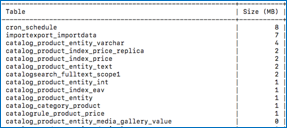

# Adobe Commerce 2.4.0 の既知の問題 – 輸出税率が機能しない

この記事では、が発生したAdobe Commerce 2.4.0 の既知の問題の解決策を提供します。 **輸出税率** ボタンが機能しない。

## 影響を受ける製品とバージョン

* クラウドインフラストラクチャー 2.4.0 上のAdobe Commerce
* Adobe Commerce オンプレミス 2.4.0

## 問題

<u>再現手順：</u>

1. Commerce管理パネルに移動します。 **ストア** > **税務処理基準**.
1. 「」をクリックします **新しい税務処理基準を追加** ボタン。
1. のテキストをクリックします **輸出税率** ボタン。

   

<u>期待される結果</u>:

A `tax_rates.csv` 税率を含むファイルのダウンロード。

<u>実際の結果</u>:

.csv ファイルはダウンロードされません。

## 解決策

回避策：

の左下エッジをクリックします **輸出税率** を書き出すためのボタン `tax_rates.csv` ファイル。

この問題は 2.4.1 パッチで解決される予定です。

## 関連資料

サポートナレッジベースでは、

* [Adobe Commerce 2.4.0 既知の問題：複数のアドレスのチェックアウトにBraintree支払い方法が表示されない](/help/troubleshooting/payments/magento-2-4-0-braintree-not-in-multiple-addresses-checkout.md).
* [Adobe Commerce 2.4.0 での配送ラベル作成の既知の問題](/help/troubleshooting/known-issues-patches-attached/shipping-labels-creation-known-issue-in-magento-2-4-0.md).
* [Adobe Commerce 2.4.0 の既知の問題 – 顧客のアクティビティの更新が機能しない](/help/troubleshooting/miscellaneous/magento-2-4-0-refresh-on-customer-activities-does-not-work.md).
* [Adobe Commerce 2.4.0 の既知の問題：ストアフロントに生のメッセージデータが表示される](/help/troubleshooting/storefront/magento-2-4-0-issue-storefront-raw-message-data-display.md).
* [Adobe Commerce 2.4.0 の既知の問題：「買い物かごに選択項目を追加」ボタンが機能しない](/help/troubleshooting/miscellaneous/magento-2-4-0-add-selections-to-my-cart-does-not-work.md).
