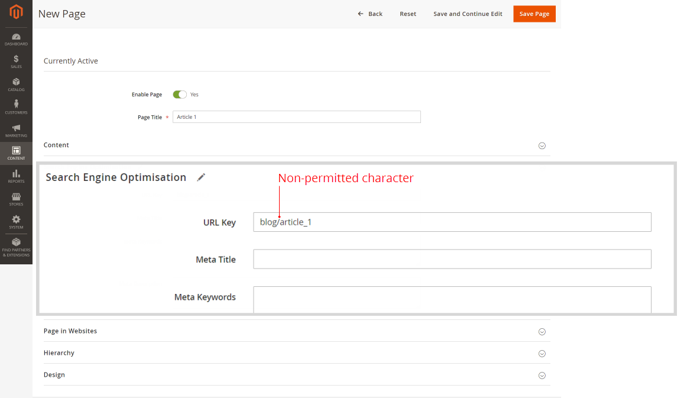

# Fastly が有効になっているサブページにメインメニュー（カテゴリ）が表示されない

この記事では、Fastly または Varnish が有効になっているときに、メインメニュー（またはユーザーガイドの [ カテゴリトップナビゲーションメニュー ](/docs/commerce-admin/catalog/catalog/navigation/navigation-top.html)）がサブページのストアフロント（例：*ブログ/ページ*）に表示されない問題を修正しました。

**原因：** ページの *URL キー* パラメーター（検索エンジン最適化設定）に使用できる `/` 文字（スラッシュ）ではありません。 通常、この文字は、*URL キー* の代わりに（ページの場所全体を含む *URL パス* が誤って指定された場合に追加されます。例えば、単なる *page\_name* ではなく、*blog/page\_name* となります。

**解決策：**`/` 文字（スラッシュ）を削除します。*URL キー* パラメーターには、ページ名のみを指定します。

## 影響を受けるバージョン

* Adobe Commerce オンプレミス 2.X.X
* クラウドインフラストラクチャー 2.X.X 上のAdobe Commerce
* Fastly またはワニス

## 問題

Fastly またはその他のワニスベースのサービスが有効になっている場合、メインメニュー（ユーザーガイドでは [ カテゴリトップナビゲーションメニュー ](/docs/commerce-admin/catalog/catalog/navigation/navigation-top.html) とも呼ばれます）は、サブページのストアフロントに表示されません。

## 原因：

この問題は、（URL キー *パラメーター（検索エンジン最適化設定）に追加された、許可されていない `/` 文字* スラッシュ）が原因です。

通常、この文字は、*URL キー* の代わりに（ページの親リソースやディレクトリを含む、ページの場所全体を含む *URL パス* が誤って指定された場合に追加されます。例えば、単なる *page\_name* ではなく、*blog/page\_name* となります。

## 解決策

ストアのすべてのページの *URL キー* パラメーターから `/` 文字（スラッシュ）を削除します。

つまり、*URL パス* の代わりに *URL キー* を使用します。親リソース/ディレクトリを含まないページ名のみを指定します。

### ページ階層と SEO のRecommendations

ページ階層を設定するには、ページを編集メニューの **階層** セクションを使用します。

より複雑な階層ソリューションには、**コンテンツ**/**要素**/**階層** メニューを使用することもできます。

製品ページで SEO を行う場合は、URL の書き換えを使用します（**マーケティング**/**SEO と検索**/**URL の書き換え**）。

## 詳しくは、ユーザーガイドを参照してください。

SEO の *URL キー* パラメーター：

* [検索エンジンの最適化](/docs/commerce-admin/catalog/categories/create/categories-search-engine-optimization.html)
* [新しいページの追加](/docs/commerce-admin/content-design/elements/pages/page-add.html)

ページ階層：

* [概要](/docs/commerce-admin/content-design/elements/pages/page-hierarchy.html)
* [ノードの追加](/docs/commerce-admin/content-design/elements/pages/page-hierarchy.html#add-a-hierarchy-node)
