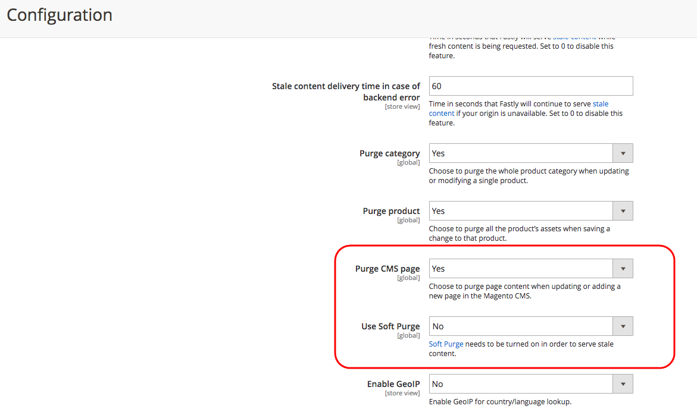

# スケジュールされたコンテンツステージングの更新が、古い Fastly キャッシュで表示されない

この記事では、コンテンツのステージングと Fastly を使用する際に、Adobe Commerce ストアにスケジュールされた更新が表示されない問題を修正します。 この問題は、デフォルトで Fastly ソフトパージが有効になっていることが原因です。 この機能により、アプリケーションのリソースの負荷が軽減され、2 回目のリクエストで新しいキャッシュのみが再生成されます。 これを解決するには、Commerce Admin で CMS ページをパージを有効にして、常に新規コンテンツを再生成および提供します。

## 問題

ストアのコンテンツアセット（ページ、製品、ブロックなど）のスケジュールされた更新 更新開始直後はストアフロントに表示されません。 これは、「コンテンツのステージング [&#x200B; 機能を使用して更新がスケジュールされている場合 &#x200B;](https://experienceleague.adobe.com/docs/commerce-admin/content-design/staging/content-staging.html?lang=ja) 発生します。

## 原因：

Fastly のソフトパージ機能（デフォルトで有効）により、更新されたアセットに対する **最初の** リクエストを Fastly に送信する際に、Adobe Commerce ストアフロントは古い（古い）キャッシュされたコンテンツを引き続き受け取ります。 Fastly では、サイトデータを再生成するための 2 つ目のリクエストが必要です。

その結果、更新されたコンテンツに対する 2 回目のリクエストが行われるまで、Fastly は古いコンテンツを提供する場合があります。

**予想されるキャッシュ：** コンテンツステージングを使用してコンテンツアセットの更新をスケジュールした後、Adobe Commerceは Fastly にキャッシュを更新するリクエストを送信します。 Fastly は、以前にキャッシュされたコンテンツを（コンテンツを削除せずに）無効にし、更新されたコンテンツの提供を開始します。

**実際のキャッシュ：** 更新されたコンテンツに対する **最初の** リクエストを受信したときに Fastly が古いコンテンツを提供する場合、**2 番目の** リクエストを受信した後にのみ、再生成された正しいコンテンツが送信されます。 この動作は、Web サイト全体のキャッシュを再生成せずに、トラフィックが証明済みの領域でのみキャッシュを更新することで、サーバーの負荷を軽減するために実装されました。 Fastly は、キャッシュを徐々に更新して、アプリケーションリソースを節約します。

## 解決策

最初のリクエストでも古いコンテンツを提供することが許容できない場合は、ソフトパージを無効にして、CMS ページをパージを有効にできます。

1. 管理者として、ローカルのCommerce管理者にログインします。
1. **ストア**/**設定**/**詳細**/**システム**/**フルページキャッシュ** に移動します。
1. **Fastly 設定** を展開し、**詳細** を展開します。
1. **ソフト消去を使用** を *いいえ* に設定します。
1. 「**CMS ページをパージ**」を *はい* に設定します。
1. ページ上部にある「**設定を保存**」をクリックします。

## 関連ドキュメント

* Commerce on Cloud Infrastructure ガイドの [&#x200B; パージオプションの設定 &#x200B;](https://experienceleague.adobe.com/docs/commerce-cloud-service/user-guide/cdn/setup-fastly/fastly-configuration.html?lang=ja)。
* [&#x200B; コンテンツのステージング &#x200B;](https://experienceleague.adobe.com/docs/commerce-admin/content-design/staging/content-staging.html?lang=ja) - コンテンツとデザインに関するドキュメント。
* Fastly ドキュメントの [&#x200B; 古いコンテンツの提供 &#x200B;](https://docs.fastly.com/guides/performance-tuning/serving-stale-content)。
