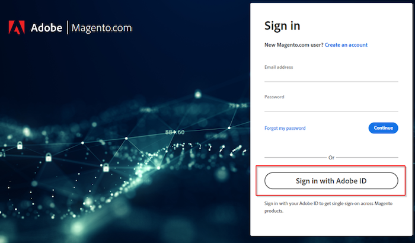

# Adobe Commerce サポートまたはクラウドアカウントにログインできない

この記事では、Adobe Commerce サポートまたはクラウドプロジェクトにログインするのに苦慮している場合の解決策を提供します。

## 影響を受ける製品とバージョン

Adobe Commerce （すべてのデプロイメント方法）すべての[ サポートされているバージョン ](https://www.adobe.com/content/dam/cc/en/legal/terms/enterprise/pdfs/Adobe-Commerce-Software-Lifecycle-Policy.pdf)

## イシュー

[https://account.magento.com/customer/account/login/](https://account.magento.com/customer/account/login/)または[https://accounts.magento.cloud/user](https://accounts.magento.cloud/user)に移動すると、統合ログインフォームが作成され、以前と同じように資格情報を入力できないことに気付く可能性があります。

<u>複製する手順</u>:

Commerce アカウントにログインしてみてください。

<u>期待される結果</u>:

正常にログインしました。

<u>実際の結果</u>:

Adobe アカウントでログインするためのページにリダイレクトされ、資格情報が機能しない。

## 原因

Adobe Commerceを他のAdobe ソリューションと統合するプロセスの一環として、すべてのユーザーは、MageIDに接続された同じメールアドレスを使用して、Adobe ログインを作成する必要があります（まだ作成していない場合）。

## Solution

次の方法でアカウントにログインできます。

- 既存のAdobeの法人/個人アカウント。
- Adobe アカウントをお持ちでない場合は、同じメールアドレスでアカウントを作成します。

手順については、Adobe Experience Leagueの[Commerce Identity Manager](https://experienceleague.adobe.com/docs/commerce-admin/start/commerce-account/commerce-identity-manager.html)を参照してください。

## 関連トピックス

- [Magento.comとaccounts.magento.cloud アカウントのログイン情報をリンク](/help/faq/general/linking-magento-com-and-accounts-magento-cloud-account-logins.md)
