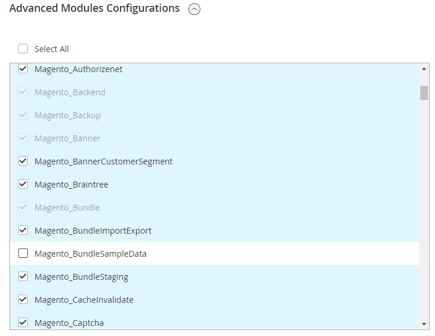

# 不明なモジュール Magento_BundleSampleData

この記事では、Adobe Commerceのインストール中に発生した不明なモジュールエラーの修正について説明します。

## 問題 {#details}

インストール中に、次のようなメッセージが表示されます。

```text
[ERROR] exception 'LogicException' with message 'Unknown module in the requested list: 'Magento_BundleSampleData''
```

## 解決策 {#solution}

次の各操作を一度に実行してから、インストールを再試行してください。

1. Web セットアップ ウィザードを実行します。 モジュールの一覧については、**詳細モジュール設定** を参照してください。 **Module\_BundleSampleData** Magentoを無効にするには、次の図に示すように、「**Magento\_BundleSampleData**」チェックボックスをオフにします。

   

1. Web ブラウザーからすべてのブラウザー履歴とデータを消去します。
1. Chromeを使用している場合は、サイトに関連するすべてのブラウザーデータを消去します。  **設定**/**詳細オプション**/**プライバシー**/**コンテンツ設定**/**すべての Cookie とサイトデータ** に移動します。 サイト列で、Adobe Commerce サーバーのアドレスをクリックし、「**すべて削除**」をクリックします。
