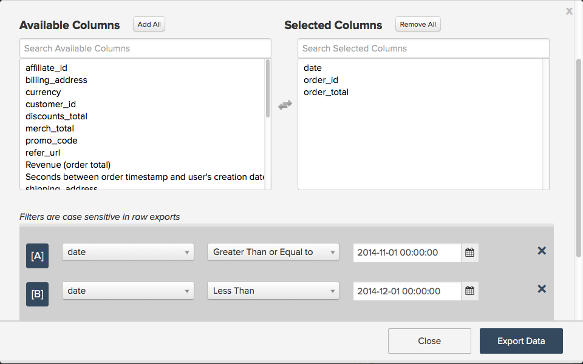

# データ書き出しの使用による不一致の特定

この記事では、Magentoの BI データの不一致をトラブルシューティングする方法について説明します。 データ書き出しは、特に次の場合に、レポートでデータの相違を正確に特定するために、Magentoの BI データとソースデータを比較するのに便利なツールです [データ不一致の診断チェックリスト](/help/troubleshooting/miscellaneous/diagnosing-a-data-discrepancy.md) は問題の特定に役立たなかった。 この記事では、データ書き出しを使用してデータの不一致を特定する方法の実際の例について説明します。

例えば、次の分析を考えてみましょう。

2014 年 11 月は不審な下落が見られます。 500,780.94 ドルの収入？ そんな事言ってないよ。 ソースデータベースで 2014 年 11 月の売上高がより多く表示されていることを確認し、 **収益** このレポートで使用される指標は正しく定義されています。 MagentoBI データウェアハウスのデータが不完全であり、データエクスポートを使用して確認できるようです。

## データのエクスポート {#export}

開始するには、グラフの右上隅にある歯車をクリックし、ドロップダウンメニューの「生の書き出し」オプションをクリックします。 これにより、グラフの背後にあるデータを生の形式で書き出すことができます。

生データの書き出しメニューでは、書き出し元のテーブルと、書き出しに含める列を選択できます。 結果セットにフィルターを適用することもできます。

この例では、 **収益** このレポートで使用される指標は、 **order\_total** に定義されているフィールド **注文件数** テーブル、使用する **日付** をタイムスタンプとして使用します。 このエクスポートには、以下のすべてを含めます **order\_id** 2014 年 11 月の値と **order\_total** . この **収益** 指標ではフィルターを使用しませんが、書き出しにフィルターを追加して、結果セットを 2014 年 11 月のみに制限します。

生データの書き出しメニューは、次の例のようになります。

「データの書き出し」をクリックして書き出しを開始します。 ステータスを含む書き出しの詳細を示すウィンドウが表示されます。 書き出しの準備には数分かかるので、2014 年 11 月のソースデータの類似した抽出を実行するのに良い時間です。これには次のものが含まれます **date, order\_id** 、および **order\_total** . このファイルを Excel で開き、そのままにしておきます。このファイルについては後ほど説明します。

生データの書き出しウィンドウに「ダウンロード」ボタンが表示されたら、ボタンをクリックして、CSV ファイルを含む zip ファイルをダウンロードします。

この時点で、問題を見つけるためにすべてのデータを 1 つのシートに入れる必要があります。 CSV ファイル（Magento BI からの書き出し）を、ソースデータを含む Excel ファイルの別のシートに読み込みます。

## 問題の特定 {#pinpoint}

すべてのデータが 1 か所にまとまったので、相違の原因を探すことができます。 各シートの行数を比較すると、問題を特定するのに役立ちます。 それぞれの状況を詳しく見てみましょう。

### 両方のシートに含まれる行数は同じです

両方のシステムの行数と行数が同じ場合 **収益** 指標がソースデータに一致せず、次に **order\_total** どこかへ行ってらっしゃい。 次の可能性があります **order\_total** ソースデータベースのフィールドが更新されましたが、Magento BI がこれらの変更を取得していません。

これを確認するために、 **order\_total** 列は再チェック中です。 Data Warehouseマネージャーに移動し、「注文」テーブルをクリックします。 が表示されます。 [再確認頻度](https://experienceleague.adobe.com/docs/commerce-business-intelligence/mbi/analyze/warehouse-manager/cfg-data-rechecks.html) 「変更」にリストされる 列。 この **order\_total** フィールドは、変更が予想される頻度で再チェックするように設定する必要があります。そうでない場合は、続行して、目的の再チェック頻度に設定します。

### 

再チェックの頻度が既に正しく設定されている場合は、別の問題が発生しています。 を参照してください。 [サポートセクションへの問い合わせ](#support) 次の手順については、この記事の最後を参照してください。

## ソース データベースの行数がMagento BI の行数を超えています {#morerows}

ソース・データベースにMagentoBI よりも多くの行があり、そのギャップが更新サイクル中に受け取ると予想されるオーダー数より大きい場合は、接続に問題がある可能性があります。 つまり、MagentoBI はソースデータベースから新しいデータを取り込むことができず、これはいくつかの理由で発生する可能性があります。

接続ページに移動し、注文テーブルを含むデータソースのステータスを確認します。

1. **ステータスが再認証の場合** 。接続に正しい資格情報が使用されていません。 接続をクリックし、正しい資格情報を入力して、もう一度試してください。
1. **ステータスが失敗の場合** の場合、サーバー側の接続が正しくセットアップされていない可能性があります。 通常、接続の失敗はホスト名が正しくないか、ターゲットサーバーが指定されたポートで接続を受け入れないために発生します。接続をクリックしてホスト名のつづりを再確認し、正しいポートが入力されていることを確認します。 サーバー側で、ポートが接続を受け入れ、ファイアウォールに許可されたMagentoBI IP アドレス（54.88.76.97/32）が設定されていることを確認します。 **接続に失敗し続ける場合** を参照してください。 [サポートセクションへの問い合わせ](#support) 次の手順については、この記事の最後を参照してください。
1. **ステータスが「成功」の場合** 接続は問題ではなく、RJ サポートが関与する必要があります。 を参照してください。 [サポートセクションへの問い合わせ](#support) 次の手順については、この記事の最後を参照してください。

## ソース データベースの行数がMagento BI の行数より少なくなっています {#lessrows}

ソース・データベースの行数がMagentoBI の行数よりも少ない場合は、ソース・データベースから行が削除され、MagentoBI がこれらの削除を取得していない可能性があります。 ** [データの削除](https://experienceleague.adobe.com/docs/commerce-business-intelligence/mbi/best-practices/data/opt-db-analysis.html) 不一致が発生したり、更新時間が長くなったり、ロジスティックの問題が多発したりする可能性があるので**本当に必要でない限り、データを削除しないことを強くお勧めします。

ただし、ローがテーブルから削除された場合は、プライマリ・キーの再チェック頻度を確認してください。 プライマリキーを再チェックすると、テーブルの削除された行がチェックされます。

Data Warehouseマネージャでは、主キー列はキーシンボルでマークされます。 この例では、プライマリキーはです **order\_id** 列：

プライマリキーが既に再チェックされるように設定されている場合、または行がこのテーブルから削除されない場合は、問題を特定するために RJ サポートが必要です。 次の手順については、次の節を参照してください。

## サポートへのお問い合わせ {#support}

問題の原因を特定できない場合は、RJ サポートでループする必要があります。 チケットを送信する前に、次の手順を実行してください。

* **ソースデータベースとMagentoBI の行数が同じ場合** 再確認頻度が正しく設定されている場合は、スプレッドシートで VLOOKUP を実行します **MagentoBI とソース・データベースの間で異なる order\_id 値を持つ order\_total を検索します。** チケットを送信する際に、これらの値を含めます。
* **ソースデータベースにMagento BI よりも多くの行がある場合** 接続が成功したとして表示されるか、引き続き失敗すると、接続の名前と、表示されているエラーメッセージ（存在する場合）を把握する必要があります。
* **ソース・データベースの行数がMagentoBI の行数より少ない場合、** 行がテーブルから削除されず、再チェック頻度が正しく設定されている場合は、スプレッドシートで VLOOKUP を実行します **どの order\_id 値がMagento BI であるかを調べるには** ただし、ソースデータベースには含まれません。 チケットを送信する際に、これらの値を含めます。

## 関連

* [データの食い違い診断チェックリスト](/help/troubleshooting/miscellaneous/diagnosing-a-data-discrepancy.md)
* [データ不一致チケットの送信](https://support.magento.com/hc/en-us/articles/360016506472-Submitting-a-data-discrepancy-ticket)
