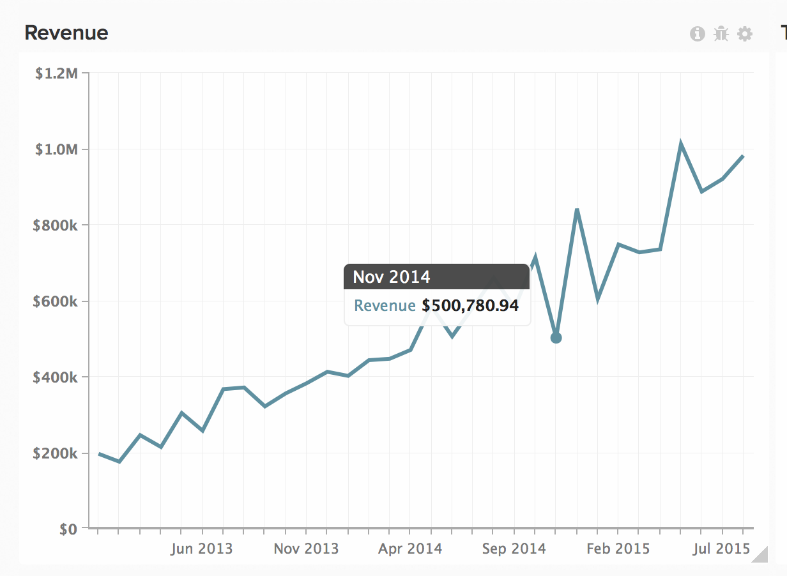
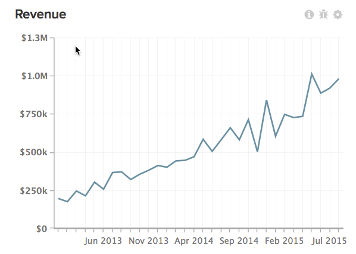
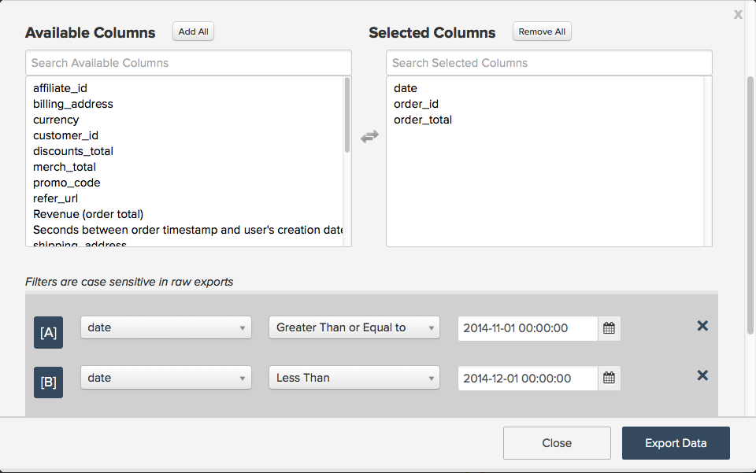
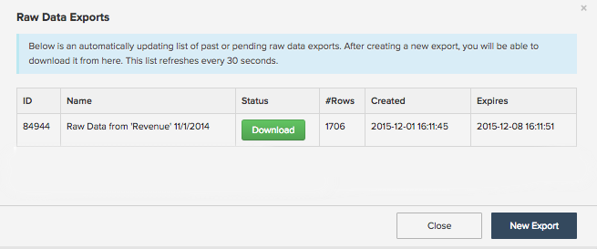
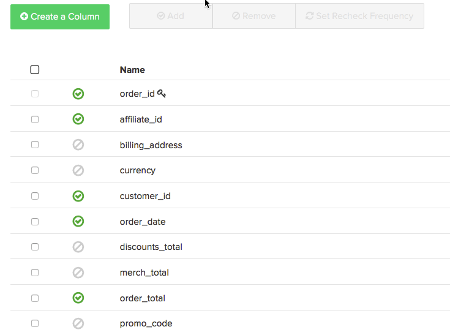
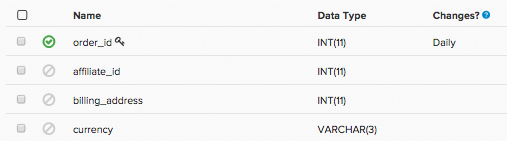

# データ書き出しを使用した不一致の特定

この記事では、Magento BI データ内の矛盾をトラブルシューティングするためのソリューションを提供します。 データの書き出しは、Magento BI データとソースデータを比較して、レポート内のデータの不一致を特定するのに役立ちます。特に、[ データの不一致の診断チェックリスト ](https://experienceleague.adobe.com/en/docs/experience-cloud-kcs/kbarticles/ka-41479)で問題を特定できなかった場合に役立ちます。 この記事では、データ書き出しを使用してデータの不一致を特定する方法の実例について説明します。

次のような分析を考えてみましょう。

2014年11月に不審な動きが出ています。 50万780.94 ドル？ それは良くないことだ。 ソースデータベースに2014年11月の月に表示される収益が多いことを確認し、このレポートで使用される&#x200B;**収益**&#x200B;指標が正しく定義されていることを再確認しました。 Magento BI データウェアハウス内のデータが不完全で、データエクスポートを使用して確認できます。

## データの書き出し {#export}

最初に、グラフの右上隅にある歯車をクリックし、ドロップダウンメニューの「Raw書き出し」オプションをクリックします。 チャートの背後にあるデータの生の書き出しが表示されます。

**Raw データ書き出し** メニューで、書き出すテーブルと、書き出しに含める列を選択できます。 フィルターは結果セットにも適用できます。

この例では、このレポートで使用される&#x200B;**Revenue**&#x200B;指標は、**`orders`** テーブルで定義された&#x200B;**order\_total** フィールドを使用し、**date**&#x200B;をタイムスタンプとして使用しています。 書き出しでは、2014年11月の&#x200B;**order\_id**&#x200B;個の値と&#x200B;**order\_total**&#x200B;個の値をすべて含める必要があります。 **収益**&#x200B;指標ではフィルターは使用されませんが、書き出しにフィルターを追加して、結果セットを2014年11月のみに制限します。

次に、Raw データ書き出しメニューの例を示します。

「データを書き出し」をクリックして、書き出しを開始します。 ステータスを含む書き出しの詳細を含むウィンドウが表示されます。 書き出しの準備には数分かかります。これにより、**date、order\_id**、**order\_total**&#x200B;など、2014年11月のソースデータの類似の抽出を実行するのに適した時間になります。 このファイルをExcelで開いたままにしておきます。

Raw データ書き出しウィンドウに「ダウンロード」ボタンが表示されたら、そのボタンをクリックして、CSV ファイルを含むzip ファイルをダウンロードします。

この時点で、あらゆるデータを1枚のシートに集めて問題を見つける必要があります。 CSV ファイル（Magento BIからの書き出し）を、ソースデータを含む別のExcel ファイルに読み込みます。

## 問題の特定 {#pinpoint}

すべてのデータが一箇所にまとまったので、不一致の原因を探すことができます。 各シートの行数を比較することで、問題を特定することができます。 それでは、それぞれの状況を詳しく見ていきましょう。

### 両方のシートに同じ行数が含まれています

両方のシステムの行数が同じで、**収益**&#x200B;指標がソースデータと一致しない場合、**注文\_total**&#x200B;はどこかから外れている必要があります。 ソースデータベースの&#x200B;**order\_total** フィールドが更新され、Magento BIがこれらの変更を取得していない可能性があります。

これを確認するには、**order\_total**&#x200B;列が再チェックされているかどうかを確認します。 Data Warehouse Managerに移動し、**`orders`** テーブルをクリックします。 「変更？」列に[ リチェック頻度](https://experienceleague.adobe.com/docs/commerce-business-intelligence/mbi/analyze/warehouse-manager/cfg-data-rechecks.html)が表示されます。 **order\_total** フィールドは、変更が予想される頻度で再チェックするように設定する必要があります。そうでない場合は、先に進んで、目的の再チェック頻度に設定してください。

### 

再チェックの頻度が既に正しく設定されている場合は、他の何かが間違っています。 次の手順については、この記事の最後にある「[ サポートへの連絡」セクション ](#support)を参照してください。

## ソースデータベースにMagento BIよりも多くの行がある {#morerows}

ソースデータベースの行がMagento BIよりも多く、間隔が更新サイクルの間に発生すると予想される注文数よりも大きい場合は、接続の問題が発生する可能性があります。 つまり、Magento BIはソースデータベースから新しいデータを取り込むことができず、いくつかの理由で発生する可能性があります。

接続ページに移動し、`order` テーブルを含むデータソースのステータスを確認します。

1. **ステータスがRe-auth**&#x200B;の場合、接続で正しい資格情報が使用されていません。 接続をクリックし、正しい資格情報を入力して、再試行してください。
1. **ステータスが失敗した場合**、接続がサーバーサイドで正しく設定されていない可能性があります。 失敗した接続は、通常、誤ったホスト名またはターゲットサーバーが指定したポートで接続を受け入れないことから発生します。接続をクリックし、ホスト名のスペルと正しいポートが入力されていることを再確認します。 サーバーサイドでは、ポートが接続を受け入れることができること、およびファイアウォールにMagento BI IP アドレス （54.88.76.97/32）が許可されていることを確認します。 **接続が失敗し続ける場合**、次の手順については、この記事の最後にある「[ サポートへの連絡」セクション ](#support)を参照してください。
1. **ステータスが成功した場合**、接続は問題ではなく、RJ サポートが参加する必要があります。 次の手順については、この記事の最後にある「[ サポートへの連絡」セクション ](#support)を参照してください。

## ソースデータベースの行がMagento BIよりも少ない {#lessrows}

ソースデータベースの行がMagento BIよりも少ない場合、行がソースデータベースから削除され、Magento BIがこれらの削除を取得しない可能性があります。 **[ データを削除](https://experienceleague.adobe.com/docs/commerce-business-intelligence/mbi/best-practices/data/opt-db-analysis.html)すると、データの不整合、更新時間の長さ、多数のロジスティクス上の問題につながる可能性があります。そのため**本当に必要でない限り、データを削除しないことを強くお勧めします。

ただし、行がテーブルから削除された場合は、プライマリキーの再チェック頻度を確認してください。 プライマリキーを再チェックすると、テーブルが削除された行についてチェックされます。

Data Warehouse Managerでは、プライマリキー列にキーマークが付けられます。 この例では、プライマリキーは&#x200B;**order\_id**&#x200B;列です。

プライマリキーが既に再確認されるように設定されている場合、またはこのテーブルから行が削除されない場合は、問題を特定するためにRJ サポートが必要になります。 次の手順については、次の節を参照してください。

## サポートへの問い合わせ {#support}

問題の原因を特定できない場合は、RJ サポートでループする必要があります。 チケットを送信する前に、次の操作を行ってください。

* **ソースデータベースとMagento BIの行数が同じ**&#x200B;で、頻度が正しく設定されているかどうかを再確認する場合は、スプレッドシート **でVLOOKUPを実行して、Magento BIとソースデータベースの間でorder\_id値のorder\_total値が異なるものを見つけます。** チケットの送信時に、これらの値を含めます。
* **ソースデータベースにMagento BI**&#x200B;より多くの行があり、接続が「正常」または「引き続き失敗」と表示される場合、接続の名前とエラーメッセージを確認する必要があります（存在する場合）。
* **ソースデータベースの行がMagento BIよりも少ない場合、**&#x200B;行がテーブルから削除されず、頻度が正しく設定されていることを再確認するには、スプレッドシート **でVLOOKUPを実行して、どのorder\_id値がMagento BI**&#x200B;にあるのか、ソースデータベースにはないかを確認します。 チケットの送信時に、これらの値を含めます。

## 関連トピックス

* [データの相違の診断チェックリスト](https://experienceleague.adobe.com/en/docs/experience-cloud-kcs/kbarticles/ka-41479)
* [Adobe Commerce Intelligence サービスポリシー](https://experienceleague.adobe.com/en/docs/commerce-knowledge-base/kb/troubleshooting/miscellaneous/mbi-service-policies)
* [Commerce実装プレイブックのデータベーステーブルを修正するためのベストプラクティス ](https://experienceleague.adobe.com/en/docs/commerce-operations/implementation-playbook/best-practices/development/modifying-core-and-third-party-tables#why-adobe-recommends-avoiding-modifications)

