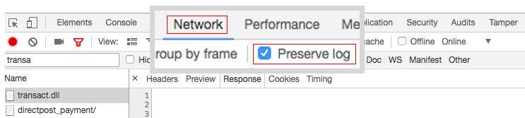
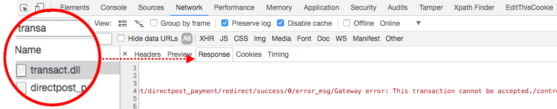

# Authorize.net サンドボックスアカウントへの注文でエラーが発生しました（サーバーでエラーが発生しました）

この記事では、Authorize.Net Direct Post を使用して注文する際に表示される「*サーバーでエラーが発生しました*」エラーメッセージの修正について説明します。

>[!WARNING]
>
>**廃止の届出**
>
>支払いサービスディレクティブ [PSD2](https://experienceleague.adobe.com/ja/docs/commerce-admin/start/compliance/payments/compliance-payment-services-directive) および多くの API の継続的な進化により、Authorize.Net は古くなり、将来的にセキュリティへの準拠が失われるリスクがあります。 このため、現在は非推奨となっており、Adobe Commerce設定で無効にして、対応する [Commerce Marketplace拡張機能 &#x200B;](https://marketplace.magento.com/extensions.html) に移行することをお勧めします。
>
>**この統合はAdobe Commerce 2.4.0 リリースから削除され、2.3.の現在のバージョンから非推奨（廃止予定）になりました。**
>
>非推奨（廃止予定）の支払い統合から安全に移行する方法について詳しくは、[DevBlog](https://community.magento.com/t5/Magento-DevBlog/Deprecation-of-Magento-core-payment-integrations/ba-p/426445) を参照してください。

## 問題

[Authorize.Net Direct Post](https://experienceleague.adobe.com/ja/docs/commerce-knowledge-base/kb/troubleshooting/payments/error-placing-order-with-authorize-net-sandbox-account-an-error-occurred-on-the-server) サンドボックスアカウントを使用して注文すると、次のエラーメッセージが表示されます。

&#x200B;>>
「サーバーでエラーが発生しました。 もう一度注文してみてください」

## 原因 1: テスト モードが有効になっています

サンドボックスアカウントを使用してテストする場合でも、Authorize.net の **テストモード** 設定は **いいえ** に設定する必要があります。

## 解決策 1：テストモードを無効にする

1. **Stores**/**Configuration**/**Sales**/**Payment Methods**/**Other Payment Methods**/10&rbrace;Authorize.net Direct Post **に移動します。**
1. **テストモード** を「いいえ」に設定します（**システム値を使用** のチェックを外してから、メニューで「いいえ」を選択します）。
1. 「**設定を保存**」をクリックします。

## 原因 2：間違った URL

Authorize.net設定には、重要な Authorize.Net リソースの間違った URL アドレスが含まれている可能性があります。

## 解決策 2：正しい URL を指定する

* **ゲートウェイ URL:**   `https://test.authorize.net/gateway/transact.dll`
* **トランザクションの詳細 URL:**   `https://apitest.authorize.net/xml/v1/request.api`
* **API リファレンス：**   `https://developer.authorize.net/api/reference/`

## 何も役に立たなかった場合：デバッグ情報を取得する

Authorize.netでの注文が非情報 *「Something wrong」* エラーで失敗した場合は、Adobe Commerceの `debug.log` を確認してください。

### Transact.dll

`debug.log` が空の場合は、web ブラウザーのコンソールで **transact.dll** 応答を確認します。

1. コンソールを開きます。
1. 注文する前に、「**ネットワーク**」タブに移動し、「**ログを保持**」を選択します。    
1. **transact.dll** で応答をフィルタリングして、エラーの可能性のある応答メッセージを表示します。    
