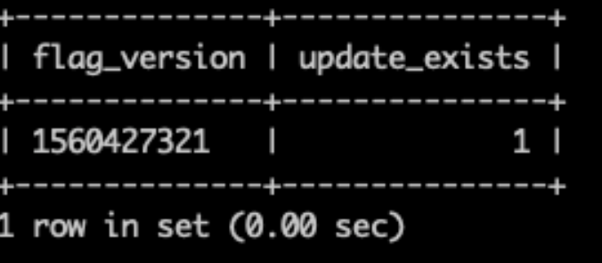

# コンテンツのステージングに関する問題が原因で、すべてのページでエラー 404 が発生する

この記事では、Adobe Commerce オンプレミスおよびAdobe Commerce on cloud infrastructure の問題を修正します。これらの問題が発生した場合、ストアフロントページまたは [!UICONTROL Commerce Admin] ージへのアクセス時に 404 エラーが発生します。

## 影響を受ける製品とバージョン

* Adobe Commerce オンプレミス 2.2.x、2.3.x
* クラウドインフラストラクチャー上のAdobe Commerce 2.2.x、2.3.x

## 問題

>[!NOTE]
>
>この記事は、[ ステージング更新のプレビュー ](https://experienceleague.adobe.com/en/docs/commerce-admin/content-design/guide-overview#preview-the-scheduled-change) を試みると 404 エラーが発生する状況には適用されません。 その問題が発生した場合は、[ サポートチケット ](https://experienceleague.adobe.com/en/docs/commerce-knowledge-base/kb/help-center-guide/magento-help-center-user-guide#support-case) を開いてください。

[ コンテンツのステージング ](https://experienceleague.adobe.com/docs/commerce-admin/content-design/staging/content-staging.html) を使用してストアコンテンツアセットのスケジュールされた更新で操作を実行した後（2&rbrace;Magento\_Staging モジュールを使用してスケジュールされたストアコンテンツアセットの更新）、ストアフロントページまたは管理者にアクセスすると、404 エラー（「Whoops, our bad..」ページ）が発生 [ ます。 ](https://developer.adobe.com/commerce/php/module-reference/)例えば、スケジュールされた更新を含む製品を削除した場合や、スケジュールされた更新の終了日を削除した場合などです。

ストアのコンテンツアセットには、次のものが含まれます。

* 製品
* カテゴリ
* カタログ価格ルール
* 買い物かご価格ルール
* CMSページ
* CMSブロック
* ウィジェット

一部のシナリオについては、以下の原因の節で説明します。

## 原因：

データベース （DB）の `flag` テーブルに、`staging_update` テーブルへの無効なリンクが含まれています。

問題はコンテンツのステージングに関連しています。 次に、2 つの具体的な状況を示します。この問題をトリガーとする状況が他にもある可能性があることに注意してください。

**シナリオ 1:** 次のようなストアコンテンツアセットを削除します。

* コンテンツのステージングで更新がスケジュールされています
* 更新には終了日（更新されたアセットが以前のバージョンに戻る有効期限）があります
* 更新の終了日が過去の日付です

同時に、削除されたアセットにスケジュールされた更新の終了日がない場合、問題が発生しない可能性があります。

**シナリオ 2:** スケジュールされた更新の終了日時の削除。

### イシューが関連しているかどうかを特定する

発生している問題がこの記事で説明した問題であるかどうかを識別するには、次の DB クエリを実行します。

```sql
   SELECT f.flag_data >'$.current_version' as flag_version, (su.id IS NOT NULL) as update_exists
   -> FROM flag f
   -> LEFT JOIN staging_update su
   -> ON su.id = f.flag_data >'$.current_version'
   -> WHERE flag_code = 'staging';
```

クエリが値「0」のテーブル `update_exists` 返す場合、`staging_update` のテーブルへの無効なリンクがデータベースに存在し、[ 解決策 ](#solution) で説明している手順が問題の解決に役立ちます。 次に、値が「0」に等しいクエリ結果 `update_exists` 例を示します。


クエリが、値が「1」 `update_exists` あるテーブルまたは空の結果を返す場合は、イシューがステージングの更新に関連していないことを意味します。 次に、値が「1」に等しいクエリ結果 `update_exists` 例を示します。



この場合、トラブルシューティングのアイデアについては、[ サイトのダウンのトラブルシューティング ](https://experienceleague.adobe.com/en/docs/experience-cloud-kcs/kbarticles/ka-27152) を参照してください。

## 解決策

1. 次のクエリを実行して、`staging_update` テーブルへの無効なリンクを削除します。

   ```sql
   DELETE FROM flag WHERE flag_code = 'staging';
   ```

1. [!DNL cron] ジョブが実行されるまで（適切に設定されている場合は最大 5 分以内に実行されます）待つか、設定されていない場合は手動で実行 [!DNL cron] ます。

無効なリンクを修正した後、問題を直ちに解決する必要があります。 問題が解決しない場合は、[ サポートチケットを送信 ](https://experienceleague.adobe.com/en/docs/commerce-knowledge-base/kb/help-center-guide/magento-help-center-user-guide#support-case) してください。

## 関連資料

Commerce実装プレイブックの [ データベーステーブルを変更する際のベストプラクティス ](https://experienceleague.adobe.com/en/docs/commerce-operations/implementation-playbook/best-practices/development/modifying-core-and-third-party-tables#why-adobe-recommends-avoiding-modifications)
