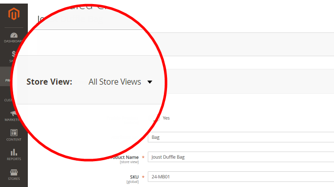

# 製品編集画像の役割にもかかわらず、製品画像が表示されない

この記事では、製品の編集ページで画像の役割が設定されているにもかかわらず、製品画像がストアフロントに表示されない場合の解決策について説明します。

**原因：** 複数のストアを持つAdobe Commerce インスタンスでは、一部の商品画像に image role 属性 `image`、`small_image`、`thumbnail`、`swatch` の `no_selection` 値が含まれる場合があります。 このような `no_selection` 値は、製品イメージの役割が特定のストアのスコープではなく、グローバルなすべてのストアのスコープで設定される場合（つまり、特定の **ストア表示** ではなく、**すべてのストア表示**）に出現します。 これがあなたのケースかどうかを理解するには、以下の **原因** セクションから SQL スクリプトを実行してください。

**解決策：** 次の「解決策」セクションの SQL スクリプトを使用して、このような画像の `no_selection` 値を持つ行を削除します。

## 影響を受けるバージョン

* Adobe Commerce オンプレミス 2.X.X
* クラウドインフラストラクチャー 2.X.X 上のAdobe Commerce

## 問題

管理パネルの製品ページで画像の役割（ベース、小、サムネール、スウォッチ）が正しく設定されていても、製品画像がストアフロントに表示されない場合があります。

**ストア表示** を **すべてのストア表示** に設定した製品ページを確認すると、**画像の詳細** 画面で役割が設定された画像になります。




ただし、ストアフロントでは画像は表示されません。特定のストアレベルで製品ページを確認すると（**ストア表示** を切り替えると）、画像は表示されますが、役割は設定されません。


## 原因：

（複数のストアを含む）マルチストアAdobe Commerceインスタンスでは、一部の商品画像に、属性 `image`、`small_image`、`thumbnail`、`swatch` の `no_selection` 値が設定される場合があります（これらの属性は画像ロールに対応しています）。 このような `no_selection` 値は、製品イメージの役割が特定のストアのスコープではなく、グローバルなすべてのストアのスコープで設定される場合（つまり、特定の **ストア表示** ではなく、**すべてのストア表示**）に出現します。

技術的には、`store_id=0` （Adobe Commerce インスタンス上のすべてのストアに対するグローバル設定を保持する）では、product image roles が設定される場合があります。これは、属性 `image`、`small_image`、`thumbnail`、`swatch` に有効な値（image へのパス）があることを意味します。 同時に、`store_id=1` （特定のストア表現）では、これらの属性の値は `no_selection` になります。

### これが問題であることを確認する方法

次の SQL クエリを実行します。

```sql
SELECT `cpev_s`.*, `cpev_0`.`value` AS `store_value` FROM `catalog_product_entity_varchar` `cpev_s` JOIN `eav_attribute` `ea` ON `cpev_s`.`attribute_id` = `ea`.`attribute_id` LEFT JOIN `catalog_product_entity_varchar` `cpev_0` ON `cpev_0`.`row_id` = `cpev_s`.`row_id` AND `cpev_0`.`attribute_id` = `cpev_s`.`attribute_id` AND `cpev_0`.`store_id` = 0 WHERE `cpev_s`.`value` = 'no_selection' AND `ea`.`attribute_code` IN ('image', 'small_image', 'thumbnail') AND `cpev_s`.`store_id` > 0 AND `cpev_s`.`value` != `cpev_0`.`value` AND `cpev_s`.`value` = 'no_selection';
```

クエリが次のような結果を返す場合は、この記事に記載されている問題を処理しています。

```sql
+----------+--------------+----------+--------+--------------+----------------------------+
| value_id | attribute_id | store_id | row_id | value        | store_value                |
+----------+--------------+----------+--------+--------------+----------------------------+
|    67722 |           87 |        1 |    481 | no_selection | /3/5/355sss1_main.jpg      |
|    67723 |           88 |        1 |    481 | no_selection | /3/5/355sss1_main.jpg      |
|    67724 |           89 |        1 |    481 | no_selection | /3/5/355sss1_main.jpg      |
|    67814 |           87 |        1 |    503 | no_selection | /s/k/skb2031_main.jpg      |
|     6769 |           87 |        2 |    503 | no_selection | /s/k/skb2031_main.jpg      |
|    67815 |           88 |        1 |    503 | no_selection | /s/k/skb2031_main.jpg      |
|     6770 |           88 |        2 |    503 | no_selection | /s/k/skb2031_main.jpg      |
|    67816 |           89 |        1 |    503 | no_selection | /s/k/skb2031_main.jpg      |
|     6771 |           89 |        2 |    503 | no_selection | /s/k/skb2031_main.jpg      |
+----------+--------------+----------+--------+--------------+----------------------------+
9 rows in set (0.06 sec)
```

### なぜこれが起こるのですか？

Adobe Commerce アプリケーションに複数のストアがある場合、特定のストアとグローバルストア設定の間でデータが同期されない場合があります。

`store_id=1` の値は、デフォルト（グローバル）ストア（`store_id=0`）よりも優先されます。 したがって、アプリケーションは画像を表示する際に、グローバル画像設定を無視して、ストアスコープ設定（画像の役割属性の `no_selection`）を使用する場合があります。

## 解決策 {#solution}

次の SQL スクリプトを使用して、`no_selection` の値を持つ属性を削除します。

```
DELETE `cpev_s`.* FROM `catalog_product_entity_varchar` `cpev_s` JOIN `eav_attribute` `ea` ON `cpev_s`.`attribute_id` = `ea`.`attribute_id` LEFT JOIN `catalog_product_entity_varchar` `cpev_0` ON `cpev_0`.`row_id` = `cpev_s`.`row_id` AND `cpev_0`.`attribute_id` = `cpev_s`.`attribute_id` AND `cpev_0`.`store_id` = 0 WHERE `cpev_s`.`value` = 'no_selection' AND `ea`.`attribute_code` IN ('image', 'small_image', 'thumbnail') AND `cpev_s`.`store_id` > 0 AND `cpev_s`.`value` != `cpev_0`.`value` AND `cpev_s`.`value` = 'no_selection';
```

これらの属性が削除されると、特定のストアの役割が設定され、ストアフロントに画像が表示されます。

## 追加の詳細

Adobe Commerce インスタンスでフルページキャッシュが有効になっている場合、すぐに修正結果を確認することはできません。

変更を表示するには、管理パネルの **キャッシュ管理** メニューを使用して、ページキャッシュを更新します。

## 詳細情報

### ストアと範囲

ユーザーガイドの [ ストアとストアの範囲 ](/docs/commerce-admin/stores-sales/site-store/stores.html)

### 画像

ユーザーガイドの [ 製品画像のアップロード ](/docs/commerce-admin/catalog/products/digital-assets/product-image.html#upload-an-image)

### キャッシュ

* ユーザー管理システムガイドの [ キャッシュ管理 ](/docs/commerce-admin/systems/tools/cache-management.html)。
* 開発者向けドキュメントの [ キャッシュの管理 ](/docs/commerce-operations/configuration-guide/cli/manage-cache.html)