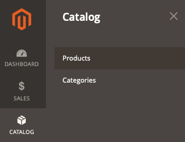

# 製品がストアフロントに表示されない

この記事では、製品がストアフロントに表示されない場合のソリューションを提供します。

## 影響を受ける製品とバージョン

* Adobe Commerce オンプレミス X.X.X
* クラウドインフラストラクチャー X.X.X 上のAdobe Commerce

## 問題

<u>再現手順</u>:

1. Commerce Admin にログインします。
1. に移動 **カタログ** > **製品**.

   

1. クリック **製品を追加** 製品作成プロセスを実行します。 または、CSV ファイルから製品を読み込みます。

<u>期待される結果</u>:

商品はストアフロントに表示されます。

<u>実際の結果</u>:

製品が表示されない。

## 原因：

この問題は、様々な理由で発生する可能性があります。 以下の手順に従って、問題の特定と解決に役立つ主なポイントを確認してください。

## 解決策

この問題は、次の各点で解決される可能性があります。

* 管理画面で製品設定を確認します。 に移動 **カタログ** > **製品**&#x200B;をクリックして製品ページを開き、次のフィールドが正しく設定されていることを確認します。
   * **製品を有効にする** = *はい。*
   * **在庫ステータス**: *在庫あり*. または *在庫切れ* が正しい値である場合、次のことを確認してください **在庫切れ商品の表示** （**ストア** > **設定** > **設定** > **カタログ** > **在庫** > **在庫オプション** > **在庫切れ商品を表示**）に設定されています。 *はい* （グローバルレベルで設定）。
   * **カテゴリ**：カテゴリページで製品を見つけようとする場合は、製品がカテゴリに割り当てられていることを確認します。 トラブルシューティングを簡単にするには、現在のページから新しいカテゴリを作成し、それに製品を割り当てます。
   * **可視性** = *カタログ、検索。*
   * が含まれる **Web サイト内の製品** セクションで、製品が正しい web サイトに割り当てられていることを確認します。
   * スコープセレクターをストアフロントで製品を見つけようとするストア表示に切り替え、同じ設定を確認します。
* を実行して、完全な再インデックスを実行します。 `bin/magento indexer:reindex` コンソールから、管理画面の次の場所にあるすべてのキャッシュをフラッシュします **システム** > **ツール** > **キャッシュ管理**&#x200B;または、次を実行してコンソールから `bin/magento cache:clean`.
* 上記の方法でも問題が解決しない場合は、のログを確認して、さらに調査を開始できます。 `var/log` ディレクトリ。

## サポートナレッジベースの関連資料

* [Pro アーキテクチャのログの場所（ディレクトリ）](/help/how-to/general/log-locations-directories-for-pro-plan-integration-staging-production.md)
* [スターターアーキテクチャのログの場所（ディレクトリ）](/help/how-to/general/log-locations-directories-for-starter-plan.md)
