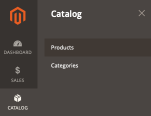

# ストアフロントに商品が表示されない

この記事では、ストアフロントに商品が表示されない場合の解決策を提供します。

## 影響を受ける製品とバージョン

* Adobe Commerce オンプレミス X.X.X
* Adobe Commerce on cloud infrastructure X.X.X

## イシュー

<u>複製する手順</u>:

1. Commerce Adminにログインします。
1. **カタログ** > **製品**&#x200B;に移動します。

   

1. 「**製品を追加**」をクリックし、製品作成プロセスを実行します。 CSV ファイルから商品をインポートすることもできます。

<u>期待される結果</u>:

商品はストアフロントに表示されます。

<u>実際の結果</u>:

製品は表示されません。

## 原因

これは、いくつかの理由によって引き起こされる可能性があります。 問題の特定と解決に役立つ主なポイントを確認するには、次の手順に従ってください。

## Solution

次のそれぞれの点で問題が解決する可能性があります。

* 管理画面で製品設定を確認します。 **カタログ** > **製品**&#x200B;に移動し、製品ページを開いて、次のフィールドが正しく設定されていることを確認します。
   * **製品を有効にする** = *はい。*
   * **在庫状況**: *在庫*。 または、*在庫切れ*&#x200B;が正しい値である場合は、**在庫切れ商品を表示** （**店舗** > **設定** > **設定** > **カタログ** > **在庫** > **在庫オプション** > **在庫切れ商品を表示**）が&#x200B;*はい*&#x200B;に設定されていることを確認してください（グローバルレベルレベルで）。
   * **カテゴリ**: カテゴリーページで製品を検索する場合は、製品がカテゴリに割り当てられていることを確認します。 トラブルシューティングを簡単にするには、現在のページから新しいカテゴリを作成し、それに製品を割り当てます。
   * **表示** = *カタログ、検索。*
   * 「**Web サイトの製品**」セクションで、製品が正しいWeb サイトに割り当てられていることを確認します。
   * スコープセレクターをストアフロントで商品を検索するストアビューに切り替え、同じ設定を確認します。
* コンソールから`bin/magento indexer:reindex`を実行して完全なインデックス再作成を実行し、**システム** > **ツール** > **キャッシュ管理**&#x200B;の下にある管理者内のすべてのキャッシュをフラッシュするか、`bin/magento cache:clean`を実行してコンソールからフラッシュします。
* 上記の方法で問題が解決しない場合は、`var/log` ディレクトリのログを確認して、さらに調査を開始できます。

